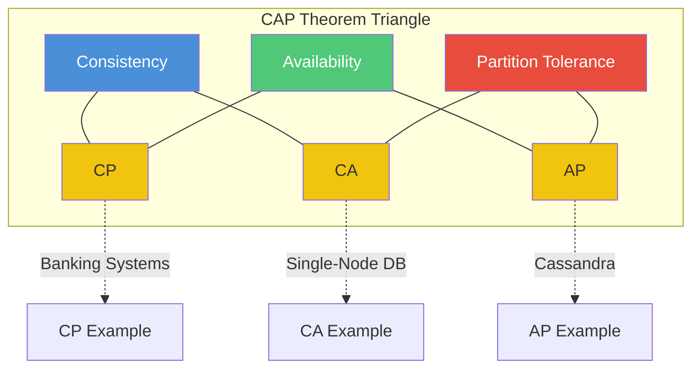
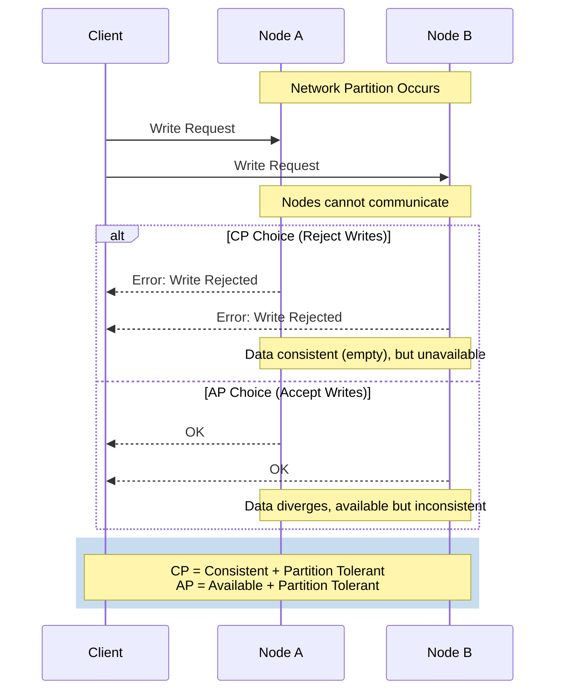

# CAP Theorem

## Definition
The CAP Theorem (Brewer's Theorem) states that a distributed data store can only provide **two** of the following three guarantees simultaneously:

- **C**onsistency — Every read receives the most recent write or an error
- **A**vailability — Every request receives a (non-error) response, without guarantee that it contains the most recent write
- **P**artition Tolerance — The system continues to operate despite network partitions (messages being lost or delayed between nodes)

## Real-World Example

| System | CAP Choice | Why |
|--------|-----------|-----|
| **Banking Systems** | CP | Consistency is critical — you must see the correct balance |
| **DNS** | AP | Availability matters more — serving a stale DNS record is better than no record |
| **Cassandra** | AP | Prioritizes availability and partition tolerance over strong consistency |
| **MongoDB (default)** | CP | Prioritizes consistency — writes fail if they can't be replicated to the primary |
| **E-Commerce Cart** | AP | Better to let users add items (eventually consistent) than block them |

## The Tradeoff Triangle

## Common Misconceptions

> "You can have all three if you design your system correctly."

**False.** The CAP theorem is a mathematical proof. You can only guarantee two out of three during a network partition.

> "You must pick one and stick with it."

**False.** Modern systems are configurable. Cassandra lets you choose consistency level per query (ONE, QUORUM, ALL).

## Advantages of Each Choice

### CP (Consistency + Partition Tolerance)
- Strong data guarantees
- No conflicting writes
- Easier to reason about

### AP (Availability + Partition Tolerance)  
- 100% uptime possible
- No blocking on failures
- Better user experience during partitions

### CA (Consistency + Availability)
- Only possible in non-distributed (single-node) systems
- Not realistic for distributed systems

## Disadvantages

### CP
- Can reject writes during partitions
- Reduced availability
- Higher latency for quorum reads

### AP
- Stale reads possible
- Conflict resolution needed
- Complex merge logic

## When to Use

| Use CP When | Use AP When | Use CA When |
|-------------|-------------|-------------|
| Financial transactions | Social media feeds | Single-node databases |
| Inventory management | Content delivery | Local-only applications |
| User authentication | DNS lookups | Prototypes/MVPs |
| Locking services | E-commerce browsing | Systems without distribution |

## Partition Scenario

## Related Topics
- [Consistency Models](../01-Fundamentals/11-consistency.md) — Strong vs eventual consistency
- [ACID Properties](../03-Databases/12-acid.md) — ACID guarantees in databases
- [BASE Properties](../03-Databases/13-base.md) — BASE: the AP alternative to ACID
- [Replication](../03-Databases/10-replication.md) — How data is replicated across nodes

## Interview Questions
1. Explain CAP theorem with a real-world example
2. Why can't you have all three guarantees in a distributed system?
3. How does Cassandra handle CAP tradeoffs?
4. Is the CA choice ever valid in a distributed system?
5. How would you design a system that needs strong consistency but also high availability?
