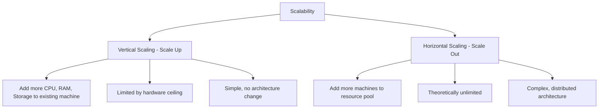

# Scalability

## Definition
Scalability is the ability of a system to handle a growing amount of work by adding resources. A scalable system can accommodate increased load without degrading performance.



## Real-World Example
**Netflix**: Grew from 1 million DVD subscribers in 2000 to 260+ million streaming subscribers in 2023. Their architecture evolved from a monolithic application to a microservices-based system running on AWS, handling 1+ billion hours of streaming per month.

## Types of Scalability

### Vertical Scaling (Scale Up)
Adding more power to an existing machine (CPU, RAM, disk).

### Horizontal Scaling (Scale Out)
Adding more machines to a pool of resources.

## Measuring Scalability

| Metric | What It Measures |
|--------|-----------------|
| **Response Time** | How fast the system responds under load |
| **Throughput** | Transactions per second (TPS) |
| **Resource Utilization** | CPU, memory, network usage |
| **Cost Per Request** | Infrastructure cost per user action |

## The Scalability Sweet Spot

```
Performance
    ▲
    │                          ● (Optimal)
    │                     ●
    │                ●
    │           ●
    │      ●
    │ ●  (Without scaling)
    └──────────────────────────► Load
    
    Linear scaling = Ideal
    Sublinear scaling = Typical real-world
    Superlinear scaling = Rare (caching benefits)
```

## Advantages
- Handles business growth
- Improves user experience
- Enables global reach
- Increases revenue potential

## Disadvantages
- Adds architectural complexity
- Increases operational cost
- Requires monitoring and automation
- New failure modes emerge

## When to Scale

1. **Proactive**: Before predicted traffic spikes (Black Friday, product launches)
2. **Reactive**: When performance metrics cross thresholds (CPU > 80%, latency > 500ms)
3. **Predictive**: Based on growth trends (user growth, data growth)

## The Scale Pyramid

```
                     ┌──────┐
                     │  1B  │  Global Scale
                    ├──────┤
                    │ 100M │  Major Platform
                   ├──────┤
                   │  10M │  Growth Stage
                  ├──────┤
                  │  1M  │  Scaling Begins
                 ├──────┤
                 │ 100K │  MVP
                ├──────┤
                │ 10K  │  Prototype
               └──────┘
```

## Related Topics
- [Horizontal Scaling](../01-Fundamentals/04-horizontal-scaling.md) — Adding more machines
- [Vertical Scaling](../01-Fundamentals/05-vertical-scaling.md) — Adding more power to existing machines
- [Partitioning/Sharding](../01-Fundamentals/13-partitioning.md) — Splitting data across nodes

## Interview Questions
1. Design a system that can scale from 1K to 1M users
2. What are the limits of vertical scaling?
3. How do you decide between horizontal and vertical scaling?
4. What does it mean for a system to scale linearly?
5. How does database sharding help with scalability?
