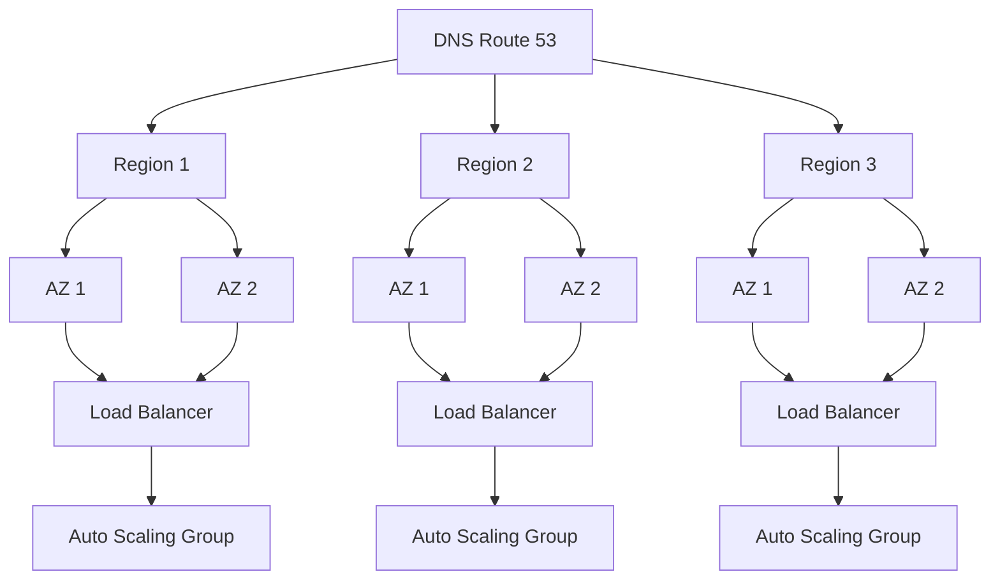

# Availability

## Definition
Availability is the proportion of time a system is functional and accessible, typically measured as a percentage of uptime over a period. It's a measure of a system's resilience to failure.



## Real-World Example
**Google Search**: Targets 99.99% availability (four nines). This means less than 53 minutes of downtime per year. Any downtime directly impacts revenue, user trust, and the company's reputation.

## The Nines of Availability

| Availability Level | Downtime/Year | Downtime/Month | Downtime/Week |
|-------------------|---------------|----------------|---------------|
| 90% (one nine) | 36.5 days | 73 hours | 17 hours |
| 99% (two nines) | 3.65 days | 7.3 hours | 1.7 hours |
| 99.9% (three nines) | 8.76 hours | 43.8 min | 10.1 min |
| 99.99% (four nines) | 52.6 min | 4.38 min | 1.01 min |
| 99.999% (five nines) | 5.26 min | 26.3 sec | 6.05 sec |
| 99.9999% (six nines) | 31.5 sec | 2.63 sec | 0.605 sec |

## Calculating Availability

```
Availability = Uptime / (Uptime + Downtime) × 100%

Example:
  Total time in a year = 525,600 minutes
  Downtime = 52.6 minutes
  Availability = (525,600 - 52.6) / 525,600 × 100% = 99.99%
```

## Causes of Downtime

| Category | Examples |
|----------|----------|
| **Hardware failures** | Disk failure, power outage, network switch failure |
| **Software bugs** | Memory leaks, race conditions, deployment errors |
| **Human error** | Misconfiguration, accidental deletion, bad deploy |
| **Capacity issues** | Traffic spikes exceeding capacity, DDoS attacks |
| **External dependencies** | Cloud provider outage, DNS failure, third-party API down |

## Achieving High Availability

### Redundancy

```
┌─────────┐     ┌─────────┐     ┌─────────┐
│ Region 1 │     │ Region 2 │     │ Region 3 │
│ ┌─────┐  │     │ ┌─────┐  │     │ ┌─────┐  │
│ │  AZ1 │──┼─────┼│  AZ1 │──┼─────┼│  AZ1 │  │
│ ├─────┤  │     │ ├─────┤  │     │ ├─────┤  │
│ │  AZ2 │  │     │ │  AZ2 │  │     │ │  AZ2 │  │
│ └─────┘  │     │ └─────┘  │     │ └─────┘  │
└─────────┘     └─────────┘     └─────────┘
```

### Key Strategies
1. **Eliminate single points of failure** (SPOF)
2. **Use load balancers** with health checks
3. **Deploy across multiple availability zones**
4. **Database replication** (sync/async)
5. **Graceful degradation** under stress
6. **Automated failover** with minimal downtime

## Availability Patterns

| Pattern | Description |
|---------|-------------|
| **Active-Passive** | Standby takes over when primary fails |
| **Active-Active** | All nodes serve traffic simultaneously |
| **N+1 Redundancy** | One extra instance beyond what's needed |
| **N+2 Redundancy** | Two extra for maintenance + failures |
| **Cold Standby** | Spare powered off, activated on failure |
| **Warm Standby** | Spare running but not serving traffic |
| **Hot Standby** | Spare running and serving traffic |

## Diagram: High Availability Architecture

```
                     ┌──────────────┐
                     │   Route 53   │
                     │  (DNS + HC)  │
                     └──────┬───────┘
                            │
              ┌─────────────┼─────────────┐
              │             │             │
              ▼             ▼             ▼
        ┌──────────┐ ┌──────────┐ ┌──────────┐
        │  Region  │ │  Region  │ │  Region  │
        │  us-east │ │  eu-west │ │  ap-south│
        └────┬─────┘ └────┬─────┘ └────┬─────┘
             │            │            │
        ┌────┴────┐ ┌────┴────┐ ┌────┴────┐
        │ ALB x 2 │ │ ALB x 2 │ │ ALB x 2 │
        └────┬────┘ └────┬────┘ └────┬────┘
             │            │            │
        ┌────┴────┐ ┌────┴────┐ ┌────┴────┐
        │ ASG x N │ │ ASG x N │ │ ASG x N │
        └────┬────┘ └────┬────┘ └────┬────┘
             │            │            │
        ┌────┴────┐ ┌────┴────┐ ┌────┴────┐
        │ DB      │ │ DB      │ │ DB      │
        │ Primary │ │ Primary │ │ Primary │
        └─────────┘ └─────────┘ └─────────┘
```

## Related Topics
- [CAP Theorem](../01-Computer-Science-Fundamentals/02-cap-theorem.md) — Availability vs consistency tradeoff
- [Fault Tolerance](../01-Computer-Science-Fundamentals/10-fault-tolerance.md) — Techniques to maintain availability during failures
- [Reliability](../01-Computer-Science-Fundamentals/07-reliability.md) — How availability differs from reliability

## Interview Questions
1. How would you design a system with 99.999% availability?
2. What's the cost difference between 99.9% and 99.999% availability?
3. How does availability differ from reliability?
4. Design a multi-region active-active architecture
5. What strategies can you use to maintain availability during a deployment?
