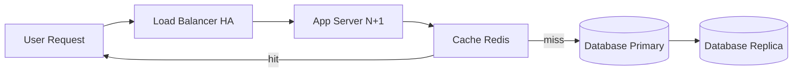

# Reliability

## Definition
Reliability is the probability that a system will perform its intended function without failure for a specified period under stated conditions. Unlike availability (uptime), reliability measures correctness of operation.



## Real-World Example
**Amazon DynamoDB**: Guarantees 99.99% availability and 99.999% durability. Data is synchronously replicated across three availability zones in a region. Every write is confirmed by multiple nodes before acknowledgment.

## Reliability vs Availability

| Aspect | Reliability | Availability |
|--------|-------------|--------------|
| **Focus** | Correctness | Uptime |
| **Question** | "Is the answer right?" | "Is the system reachable?" |
| **Failure** | Silent data corruption | Server down |
| **Metric** | Error rate, data loss | Uptime percentage |
| **Example** | Bank shows wrong balance | Bank website is down |

## Key Reliability Concepts

### Failure Modes
| Mode | Description | Example |
|------|-------------|---------|
| **Fail-stop** | Component stops completely | Server crash |
| **Fail-slow** | Component degrades gradually | Memory leak, disk filling |
| **Byzantine** | Component behaves arbitrarily | Corrupted data, malicious actor |
| **Omission** | Component doesn't respond | Network timeout |
| **Timing** | Response too early or late | Slow query |

### Reliability Metrics

| Metric | Definition |
|--------|------------|
| **MTBF** (Mean Time Between Failures) | Average time between failures |
| **MTTR** (Mean Time To Recover) | Average time to restore after failure |
| **MTTF** (Mean Time To Failure) | Average time until first failure |
| **Failure Rate** | Failures per unit time |
| **Error Budget** | Acceptable error rate over time (1 - availability target) |

## Achieving Reliability

```
┌─────────────────────────────────────────────────────┐
│              Reliability Strategies                  │
├─────────────────────────────────────────────────────┤
│                                                      │
│  Redundancy ◄────► Testing ◄────► Monitoring        │
│     │                    │              │            │
│     ▼                    ▼              ▼            │
│  Multiple          Chaos          Alerts +          │
│  replicas          engineering    dashboards         │
│                                                      │
│  Graceful ◄──────────────────► Disaster              │
│  degradation               recovery                  │
│                                                      │
└─────────────────────────────────────────────────────┘
```

### 1. Redundancy
- Multiple replicas of data and services
- Active-active or active-passive failover

### 2. Testing
- Unit, integration, and end-to-end tests
- Chaos engineering (Netflix Chaos Monkey)

### 3. Monitoring
- Track error budgets, latency, throughput
- Alert on anomalies before users notice

### 4. Graceful Degradation
- Disable non-critical features under stress
- Return cached/stale data when backend is unavailable

### 5. Disaster Recovery
- RPO (Recovery Point Objective): Max acceptable data loss
- RTO (Recovery Time Objective): Max acceptable downtime

## Diagram: Reliability Chain

```
User Request
    │
    ▼
┌──────────┐     ┌──────────┐     ┌──────────┐
│  LB      │────►│  App Svr │────►│  Cache   │
│  (HA)    │     │  (N+1)   │     │  (Redis) │
└──────────┘     └──────────┘     └────┬─────┘
                                        │ miss
                                        ▼
                                  ┌──────────┐
                                  │  DB      │
                                  │  (Primary)│
                                  └────┬─────┘
                                       │
                                  ┌────┴─────┐
                                  │  DB      │
                                  │  (Replica)│
                                  └──────────┘
```

## Interview Questions
1. How is reliability different from availability?
2. Design a system that can detect and recover from silent data corruption
3. What's the relationship between reliability and complexity?
4. How do you calculate error budgets for a system?
5. How does Netflix's Chaos Monkey improve reliability?
