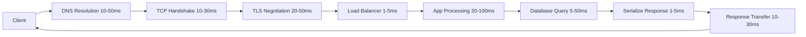

# Latency

## Definition
Latency is the time taken for a request to travel from the sender to the receiver and back (round-trip time), or the time taken to process a single operation. In system design, it's usually measured as the delay between initiating an operation and seeing the result.



## Real-World Example
**Google Search**: Aims for sub-100ms search results. Every 100ms of latency costs 1% in user engagement. Amazon found that every 100ms of latency costs 1% in sales.

## Types of Latency

| Type | Description | Typical Range |
|------|-------------|---------------|
| **Network Latency** | Data travel time across network | 0.5ms (same rack) to 300ms (intercontinental) |
| **Disk Latency** | Time to read/write to disk | 0.1ms (SSD) to 10ms (HDD) |
| **Memory Latency** | Time to access RAM | 50-100ns |
| **Processing Latency** | CPU computation time | Microseconds to seconds |
| **Queueing Latency** | Time waiting for resources | Variable |
| **Serialization Latency** | Time to encode/decode data | Microseconds |

## Human Perception Thresholds

| Latency | Perception |
|---------|------------|
| < 100ms | Instant |
| 100-300ms | Noticeable but acceptable |
| 300-1000ms | Slow — user may lose focus |
| 1-3s | Frustrating — task switching |
| 3-10s | Very frustrating — abandonment likely |
| > 10s | User will leave |

## Network Latency by Distance

```
Same Rack:       0.5ms
Same Datacenter: 1ms
Same Region:     5-10ms
Cross-Country:   20-50ms
Cross-Continent: 100-200ms
Satellite:       500-700ms
```

## The Latency Ladder

```
1  Second =  1,000,000  μs  (microseconds) ─── DNS Lookup
100  ms  =    100,000  μs  ─── Round trip (US-Europe)
10   ms  =     10,000  μs  ─── HDD seek time
1    ms  =      1,000  μs  ─── SSD read
100  μs  =        100  μs  ─── Network round trip (same DC)
10   μs  =         10  μs  ─── RAM access
1    μs  =          1  μs  ─── L1 cache hit
```

## Reducing Latency

### Strategy 1: Caching
```
Client ───► CDN ───► App Server ───► Cache ───► Database
               │                       │            │
          Hit in 5ms              Hit in 1ms      Miss:
                                                  50ms
```

### Strategy 2: CDN
- Static assets served from edge locations
- Reduces latency by geographic proximity

### Strategy 3: Connection Pooling
- Reuse database connections
- Avoid TCP handshake overhead

### Strategy 4: Compression
- Gzip, Brotli for text
- WebP for images

### Strategy 5: Prefetching
- Predict and load resources before needed
- Speculative execution

### Strategy 6: Edge Computing
- Run computation close to users
- AWS Lambda@Edge, Cloudflare Workers

## Diagram: Latency Sources

```
┌─────────────────────────────────────────────────────────┐
│              Full Request Latency Breakdown             │
├─────────────────────────────────────────────────────────┤
│                                                          │
│ Client                                                  │
│   ├─ DNS Resolution:       10-50ms                      │
│   ├─ TCP Handshake:        10-30ms                      │
│   ├─ TLS Negotiation:      20-50ms                      │
│   ├─ Request Send:         1-5ms                        │
│   ├─ Load Balancer:        1-5ms                        │
│   ├─ App Processing:       20-100ms                     │
│   ├─ Database Query:       5-50ms                       │
│   ├─ Response Serialize:   1-5ms                        │
│   └─ Response Transfer:    10-30ms                      │
│                                                          │
│   Total: ~80-325ms                                       │
└─────────────────────────────────────────────────────────┘
```

## P99, P95, P50 Latency

```
Percentile    Meaning
P50 (Median):  Half of requests are faster than this
P95:           95% of requests are faster than this
P99:           99% of requests are faster than this
P999:          99.9% of requests are faster than this

Monitoring only P50 hides the long tail of slow requests.
Always track P99 to catch outliers.
```

## Interview Questions
1. How would you debug a latency spike in production?
2. What causes the "long tail" of latency in distributed systems?
3. Design a global system with < 200ms P99 latency
4. How do you reduce latency between microservices?
5. Why is P99 latency more important than average latency?
