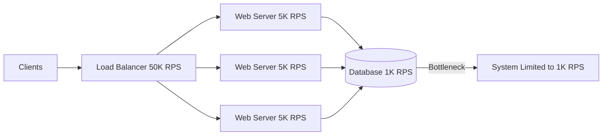

# Throughput

## Definition
Throughput is the rate at which a system processes work, usually measured as operations per second (ops/s), requests per second (RPS), transactions per second (TPS), or data volume per second (MB/s, Gbps).



## Real-World Example
**Twitter**: Processes ~6,000 tweets per second (peak ~150K TPS during major events). The feed delivery system must fan out tweets to millions of followers with low latency.

## Throughput vs Latency

```
     High Throughput
         ▲
         │           Ideal region
         │     ┌───────┐
         │     │       │
         │     │  Good │
         │     │       │
         │     └───────┘
         │
         │                    Saturation
         │              ┌────────────┐
         │              │   System   │
         │              │  overload  │
         │              └────────────┘
         └──────────────────────────────────► Latency
```

**Little's Law**: `L = λ × W`
- L = number of items in system (concurrency)
- λ = throughput (arrival rate)
- W = average latency (time in system)

If you double throughput without increasing concurrency, latency stays the same. If you double throughput at fixed concurrency, latency doubles.

## Throughput Benchmarks

| System | Typical Throughput |
|--------|-------------------|
| Single web server (nginx) | 10K-50K RPS |
| PostgreSQL (single node) | 1K-10K TPS |
| Redis (single node) | 100K-1M ops/s |
| Kafka (single partition) | 100K-1M msg/s |
| NGINX (single core) | 10K-50K RPS |
| Memcached | 500K-1M ops/s |

## Factors Affecting Throughput

| Factor | Impact |
|--------|--------|
| **CPU** | Compute-intensive operations limit processing rate |
| **Memory** | Available RAM affects cache hit rates |
| **Disk I/O** | Sequential vs random access speed |
| **Network bandwidth** | Data transfer capacity |
| **Concurrency model** | Threads, async, event loop |
| **Lock contention** | Mutexes, database row locks |
| **Serialization format** | JSON vs Protobuf vs Avro |

## Improving Throughput

### 1. Batch Processing
```
Instead of:  INSERT INTO items VALUES (1);
             INSERT INTO items VALUES (2);
             INSERT INTO items VALUES (3);
             -- 3 network round trips, 3 transactions

Do:          INSERT INTO items VALUES (1), (2), (3);
             -- 1 network round trip, 1 transaction
```

### 2. Connection Pooling
```
Without pool:    New connection per request ──► TCP handshake each time
With pool:       Reuse connections ──► No handshake overhead
```

### 3. Asynchronous Processing
```
Synchronous: Request ──► Process ──► Response  (blocking)
Async:       Request ──► Queue ──► Ack quickly
                         │
                         ▼
                    Worker processes (background)
```

### 4. Parallelism
```
Single thread: [██████████████████████████]   1x throughput
Multiple threads: [████] [████] [████] [████]  4x throughput
                   Thread 1  Thread 2  Thread 3  Thread 4
```

### 5. Caching
```
Cache hit:   ──► 1ms ──► 100K RPS
Cache miss:  ──► 50ms ──► 2K RPS
```

## Diagram: Throughput Bottlenecks

```
Clients ──► Load Balancer ──► Web Servers ──► Database
  │               │                │              │
  │               │           ┌────┴────┐    ┌────┴────┐
  │               │           │  CPU    │    │ Connection limit │
  │               │           │  bound  │    │ 100 connections  │
  │               │           │  at 80% │    │                   │
  │               │           │         │    │ Max throughput:   │
  │               │           │ Max:    │    │ 1K RPS            │
  │               │           │ 5K RPS  │    └───────────────────┘
  │               │           └─────────┘
  │          ┌────┴────┐
  │          │ Max     │
  │          │ 50K RPS │
  │          └─────────┘
```

**Bottleneck**: Database at 1K RPS limits throughput to 1K RPS, even though other layers can handle more.

## Interview Questions
1. How would you increase the throughput of a database?
2. What's the relationship between throughput and latency?
3. Design a system that can handle 100K writes per second
4. How does batch processing improve throughput?
5. What throughput can you expect from a typical web application?
