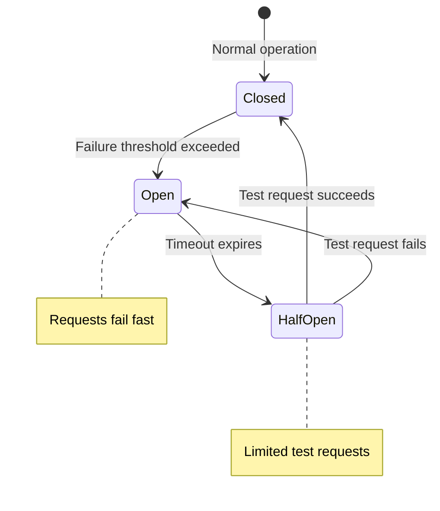

# Fault Tolerance

## Definition
Fault tolerance is the ability of a system to continue operating properly in the event of a failure of some of its components. A fault-tolerant system can detect failures and gracefully handle them without complete system outage.



## Real-World Example
**AWS S3**: Designed for 99.999999999% (11 nines) durability. Data is automatically replicated across multiple availability zones. If one AZ fails, S3 continues serving from another AZ without data loss.

## Types of Faults

| Fault Type | Description | Example |
|------------|-------------|---------|
| **Hardware** | Physical component failure | Disk crash, power supply failure |
| **Software** | Bug in code or configuration | Memory leak, race condition |
| **Network** | Communication failure | Packet loss, partition |
| **Human** | Operator error | Accidental deletion, misconfiguration |
| **Environmental** | External factors | Power outage, earthquake, fire |
| **Malicious** | Security attack | DDoS, data corruption |

## Fault Tolerance Strategies

### 1. Redundancy
```
┌──────────┐
│ Primary  │  ──► Fails ──►
│ Server A │                  ┌──────────┐
└──────────┘                  │ Standby  │
                              │ Server B │
┌──────────┐                  └──────────┘
│ Primary  │  ──► Fails ──►
│ Server B │
└──────────┘
```

### 2. Failover Mechanisms

| Mechanism | Recovery Time | Complexity | Cost |
|-----------|--------------|------------|------|
| **Cold failover** | Minutes | Low | Low |
| **Warm failover** | Seconds | Medium | Medium |
| **Hot failover** | Milliseconds | High | High |

### 3. Circuit Breaker
```
Normal:     Request ──► Service ──► Response
Failure:    Request ──► Circuit Open ──► Fallback Response
Recovery:   Circuit Half-Open ──► Test Request ──► Close if OK
```

### 4. Bulkhead Pattern
Isolate resources so failure in one part doesn't cascade.

```
Without bulkhead:
  ┌──────────────────────────┐
  │    Shared Thread Pool    │
  │ [Service A] [Service B]  │  ──► B blocks, A starves too
  └──────────────────────────┘

With bulkhead:
  ┌──────────────────┐ ┌──────────────────┐
  │  Thread Pool A   │ │  Thread Pool B   │
  │  [Service A]     │ │  [Service B]     │  ──► B fails, A continues
  └──────────────────┘ └──────────────────┘
```

### 5. Retry with Backoff
```
Request ──► Fail ──► Wait 100ms ──► Retry ──► Fail ──► Wait 200ms ──► Retry
  ──► Fail ──► Wait 400ms ──► Retry ──► Fail ──► Give up (exponential backoff)
```

## Fault Tolerance Patterns

| Pattern | Description |
|---------|-------------|
| **Health checks** | Periodic pings to verify component health |
| **Heartbeats** | Regular signals from components indicating liveness |
| **Watchdog timer** | Timer that triggers recovery if not reset in time |
| **Graceful degradation** | Reduce functionality rather than crash |
| **Checkpointing** | Save state periodically for rollback |
| **Replication** | Copy data across multiple nodes |
| **Quorum** | Require majority consensus for operations |
| **Timeouts** | Limit wait time for responses |

## Diagram: Fault Tolerance Pattern

```
                    ┌──────────────┐
                    │   Client     │
                    └──────┬───────┘
                           │
                    ┌──────▼───────┐
                    │  Circuit     │
                    │  Breaker     │
                    └──────┬───────┘
                           │
              ┌────────────┼────────────┐
              │            │            │
              ▼            ▼            ▼
        ┌──────────┐ ┌──────────┐ ┌──────────┐
        │ Service  │ │ Service  │ │ Service  │  (Active-Active)
        │ Node 1   │ │ Node 2   │ │ Node 3   │
        └──────────┘ └──────────┘ └──────────┘
              │            │            │
              └────────────┼────────────┘
                           │
                    ┌──────▼───────┐
                    │  Health      │
                    │  Check       │
                    └──────┬───────┘
                           │
                    ┌──────▼───────┐
                    │  Auto-       │
                    │  Recovery    │
                    └──────────────┘
```

## Interview Questions
1. How does a circuit breaker improve fault tolerance?
2. Design a fault-tolerant payment system
3. What's the difference between fault tolerance and high availability?
4. How do you prevent cascading failures in a microservice architecture?
5. Explain the bulkhead pattern with a real-world analogy
