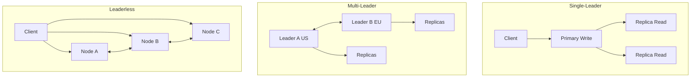

# Replication

## Definition
Replication is the process of copying and maintaining data across multiple nodes (servers) to ensure redundancy, fault tolerance, and high availability. Replicated data can be used for read scaling, disaster recovery, and geographic distribution.



## Real-World Example
**Google Docs**: Uses operational transformation (OT) for real-time collaborative replication. When you type, your changes are replicated to Google's servers and then to all other collaborators' devices within milliseconds, with conflict resolution handled automatically.

## Replication Topologies

### 1. Single-Leader (Primary-Replica)
```
Write ──► Primary ──► Replica 1
                   ──► Replica 2
                   ──► Replica 3
```
- All writes go to leader
- Followers replicate asynchronously or synchronously
- Read scalability: followers serve reads

### 2. Multi-Leader
```
┌──────────┐         ┌──────────┐
│ Leader A │◄───────►│ Leader B │
│ (US)     │         │ (EU)     │
└──────────┘         └──────────┘
       │                    │
       ▼                    ▼
   Replicas              Replicas
```
- Multiple leaders accept writes
- Leaders replicate to each other
- Cross-region low-latency writes

### 3. Leaderless
```
Write ──► [Node A] [Node B] [Node C] [Node D]
                │        │        │        │
                 ─────────────────────
                         │
                   Read repair or
                   Anti-entropy
```
- Any node accepts reads/writes
- Quorum-based consistency
- Example: Cassandra, DynamoDB

## Synchronous vs Asynchronous Replication

| Aspect | Synchronous | Asynchronous |
|--------|-------------|--------------|
| **Data loss risk** | None | Some (window) |
| **Write latency** | Higher (wait for replicas) | Lower (ack immediately) |
| **Consistency** | Strong | Eventual |
| **Availability impact** | Replica failure blocks writes | No impact |
| **Use case** | Financial transactions | Social media |

## Replication Strategies

### Statement-Based Replication
```sql
-- Primary executes UPDATE, sends SQL statement to replicas
UPDATE users SET balance = 100 WHERE id = 5;
```
**Problem**: Non-deterministic functions (NOW(), RAND()) produce different results.

### WAL-Based Replication
```
Primary writes: [WAL entry: UPDATE users SET balance = 100]
Replicas apply: [Same WAL entry]
```
**Example**: PostgreSQL streaming replication.

### Logical Replication
```
Primary:     Capture row changes → decode to logical format
Publisher:   Send changes to subscriber
Subscriber:  Apply changes
```
**Example**: PostgreSQL logical replication, MySQL binlog.

## Consistency vs Performance Tradeoff

```
Synchronous (N=3, W=3):
  Write ──► [P] ──► [R1] ──► [R2] ──► Ack
  │          1ms    1ms     1ms
  └──────── Total: 3ms ──────────────────►

Synchronous (N=3, W=2):
  Write ──► [P] ──► [R1] ──► Ack (don't wait for R2)
  │          1ms    1ms
  └──────── Total: 2ms ──────────────────►

Asynchronous (N=3, W=1):
  Write ──► [P] ──► Ack (async to replicas)
  │          1ms
  └──────── Total: 1ms ──────────────────►
```

## Diagram: Replication Topologies

```
Single-Leader:
  ┌──────────┐
  │  Client  │
  └────┬─────┘
       │
  ┌────▼─────┐     ┌──────────┐
  │  Primary  │────►│ Replica  │
  │  (write)  │     │  (read)  │
  └───────────┘     └──────────┘

Multi-Leader:
  ┌──────────┐     ┌──────────┐
  │  DC1     │◄───►│  DC2     │
  │  Leader  │     │  Leader  │
  └────┬─────┘     └────┬─────┘
       │                │
  ┌────▼─────┐     ┌────▼─────┐
  │ Replicas │     │ Replicas │
  └──────────┘     └──────────┘

Leaderless:
     ┌─────────────┐
     │   Client    │
     └──┬──┬──┬───┘
        │  │  │
   ┌────┘  │  └────┐
   ▼       ▼       ▼
┌──────┐┌──────┐┌──────┐
│Node A││Node B││Node C│
└──────┘└──────┘└──────┘
```

## Interview Questions
1. Compare synchronous and asynchronous replication
2. Design a multi-region replication strategy for a global app
3. How does PostgreSQL handle streaming replication?
4. What consistency guarantees does leaderless replication provide?
5. How do you handle write conflicts in multi-leader replication?
