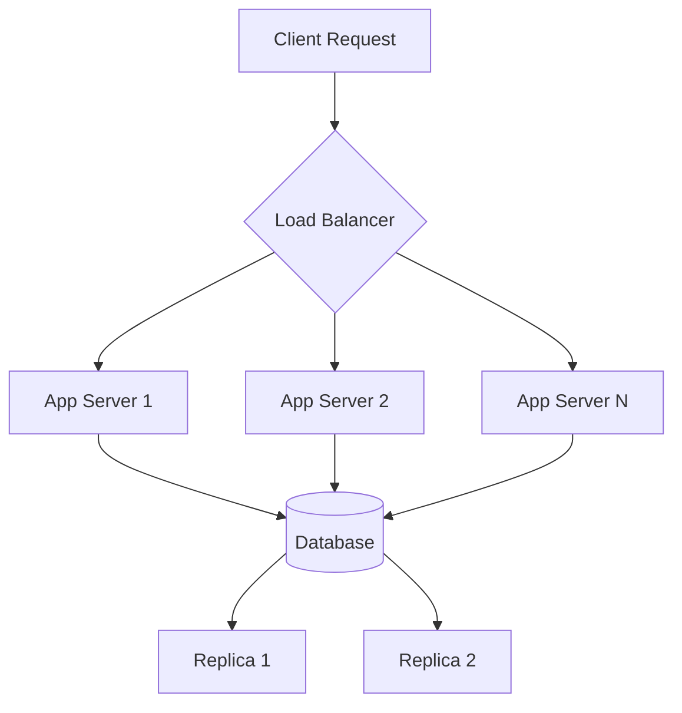

# 01 — Fundamentals

> The foundation of every distributed system. Master these concepts before moving on.

## Topics

| # | Topic | Description |
|---|-------|-------------|
| 1 | [What is System Design](01-what-is-system-design.md) | Definition, scope, and importance |
| 2 | [CAP Theorem](02-cap-theorem.md) | Consistency, Availability, Partition Tolerance |
| 3 | [Scalability](03-scalability.md) | Ability to handle growth |
| 4 | [Horizontal Scaling](04-horizontal-scaling.md) | Adding more machines |
| 5 | [Vertical Scaling](05-vertical-scaling.md) | Adding more power to a machine |
| 6 | [Availability](06-availability.md) | Uptime and fault tolerance |
| 7 | [Reliability](07-reliability.md) | Correctness and consistency |
| 8 | [Latency](08-latency.md) | Time taken for a request |
| 9 | [Throughput](09-throughput.md) | Requests processed per unit time |
| 10 | [Fault Tolerance](10-fault-tolerance.md) | Graceful degradation under failure |
| 11 | [Consistency](11-consistency.md) | Strong vs eventual consistency |
| 12 | [Durability](12-durability.md) | Data persistence guarantees |
| 13 | [Partitioning](13-partitioning.md) | Splitting data across nodes |
| 14 | [Replication](14-replication.md) | Copying data for redundancy |

## Format

Every topic follows this structure:

```
┌─────────────────────────────────┐
│ Definition                     │
│ Real-World Example             │
│ Advantages                     │
│ Disadvantages                  │
│ When to Use                    │
│ Diagram                        │
│ Interview Questions            │
└─────────────────────────────────┘
```

## Quick Reference

```
CAP Theorem:         Pick 2 of 3 (C, A, P)
Scalability:        Horizontal > Vertical for most cases
Latency vs Throughput:  Inverse relationship
Consistency Models:  Strong > Eventual > Weak
Partitioning:       Horizontal (sharding) > Vertical
Replication:        Leader-Follower > Leaderless
```

## Interview Questions

1. Design a system that is highly available but can tolerate eventual consistency
2. How would you scale a read-heavy database?
3. Explain the tradeoffs between consistency and availability in a partitioned system
4. A user reports slow response times — how do you diagnose?
5. Design a system that can handle 10x traffic spike

## Mermaid Diagram



---

Next: [02 — Networking](../02-Networking/README.md)
