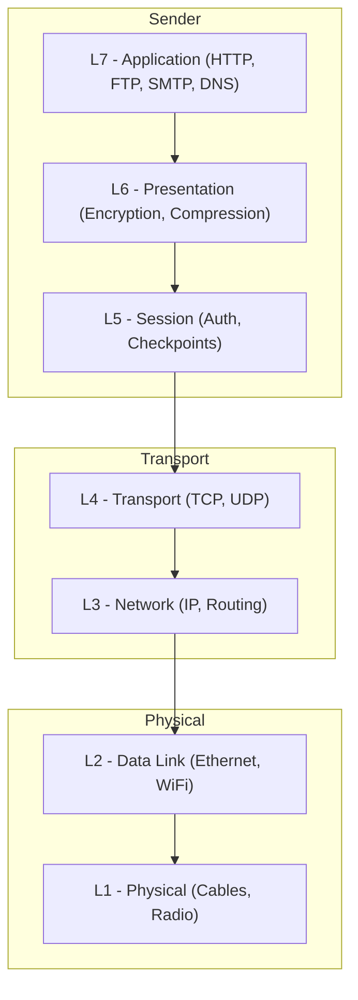

# OSI Model

## Definition
The Open Systems Interconnection (OSI) model is a conceptual framework that standardizes the functions of a communication system into seven abstraction layers. Each layer serves its upper layer and is served by its lower layer.



## The 7 Layers

```
Layer  ┌─────────────────────────────────────────────────────────────┐
  7    │  Application Layer                                          │
       │  (HTTP, FTP, SMTP, DNS, gRPC)                               │
       ├─────────────────────────────────────────────────────────────┤
  6    │  Presentation Layer                                         │
       │  (Encryption, Compression, Serialization)                   │
       ├─────────────────────────────────────────────────────────────┤
  5    │  Session Layer                                              │
       │  (Connection establishment, authentication, checkpoints)    │
       ├─────────────────────────────────────────────────────────────┤
  4    │  Transport Layer                                            │
       │  (TCP, UDP — segmentation, reliability, flow control)       │
       ├─────────────────────────────────────────────────────────────┤
  3    │  Network Layer                                              │
       │  (IP, routing, packet forwarding)                           │
       ├─────────────────────────────────────────────────────────────┤
  2    │  Data Link Layer                                            │
       │  (Ethernet, WiFi — framing, MAC addresses, error detection) │
       ├─────────────────────────────────────────────────────────────┤
  1    │  Physical Layer                                             │
       │  (Cables, fiber, radio, electrical signals)                 │
       └─────────────────────────────────────────────────────────────┘
```

## Real-World Example: Sending an Email

```
L7:  User writes email in Outlook (Application)
L6:  Email body is encoded/encrypted (Presentation)
L5:  Outlook opens SMTP session to server (Session)
L4:  TCP splits message into segments, adds port (Transport)
L3:  IP adds source/destination IP addresses (Network)
L2:  Ethernet frame adds MAC addresses (Data Link)
L1:  Electrical signal sent over cable (Physical)
```

## Layer Details

### Layer 7 — Application
- Closest to the end user
- Protocols: HTTP, HTTPS, FTP, SMTP, DNS, SSH, WebSocket
- Data unit: **Message**

### Layer 6 — Presentation
- Translation between application and network formats
- Encryption/decryption, compression, data serialization
- Examples: SSL/TLS, JPEG, GIF, MPEG

### Layer 5 — Session
- Manages sessions between applications
- Authentication, reconnection, checkpointing
- Examples: NetBIOS, RPC, PPTP

### Layer 4 — Transport
- End-to-end communication, reliability, flow control
- **TCP**: Reliable, ordered, error-checked
- **UDP**: Unreliable, unordered, fast
- Data unit: **Segment** (TCP) or **Datagram** (UDP)

### Layer 3 — Network
- Logical addressing and routing
- Determines best path through network
- Protocols: IP (IPv4, IPv6), ICMP, OSPF, BGP
- Data unit: **Packet**

### Layer 2 — Data Link
- Node-to-node data transfer
- MAC addressing, error detection, framing
- Protocols: Ethernet, WiFi (802.11), PPP
- Data unit: **Frame**

### Layer 1 — Physical
- Raw bit stream transmission
- Electrical signals, light pulses, radio waves
- Media: Copper wire, fiber optic, wireless
- Data unit: **Bit**

## Data Flow

```
Sender                                          Receiver
  │                                               ▲
  ▼                                               │
┌───────────────────┐           ┌───────────────────┐
│   Application     │           │   Application     │
├───────────────────┤           ├───────────────────┤
│   Presentation    │           │   Presentation    │
├───────────────────┤           ├───────────────────┤
│   Session         │           │   Session         │
├───────────────────┤           ├───────────────────┤
│   Transport       │─ ─ ─ ─ ─ │   Transport       │
├───────────────────┤  virtual  ├───────────────────┤
│   Network         │─ ─ ─ ─ ─ │   Network         │
├───────────────────┤  circuit  ├───────────────────┤
│   Data Link       │─ ─ ─ ─ ─ │   Data Link       │
├───────────────────┤           ├───────────────────┤
│   Physical        │───────────│   Physical        │
└───────────────────┘  physical └───────────────────┘
```

## Advantages
- **Standardization**: Universal framework for network communication
- **Modularity**: Each layer can evolve independently
- **Troubleshooting**: Isolate issues to specific layers
- **Interoperability**: Different vendors can implement layers independently

## Disadvantages
- **Complexity**: 7 layers can be overwhelming
- **Overhead**: Strict layering can cause redundancy
- **Real-world mismatch**: TCP/IP model is more practical

## TCP/IP vs OSI

| OSI Model | TCP/IP Model |
|-----------|--------------|
| 7 layers | 4 layers |
| Conceptual | Practical |
| Application | Application |
| Presentation | (merged with Application) |
| Session | (merged with Application) |
| Transport | Transport |
| Network | Internet |
| Data Link | Network Access |
| Physical | Network Access |

## Interview Questions
1. Explain the OSI model layer by layer
2. How does data encapsulation work across OSI layers?
3. What's the difference between the OSI and TCP/IP models?
4. At which layer does a router operate? A switch? A load balancer?
5. How does encryption fit into the OSI model (TLS at which layer)?
