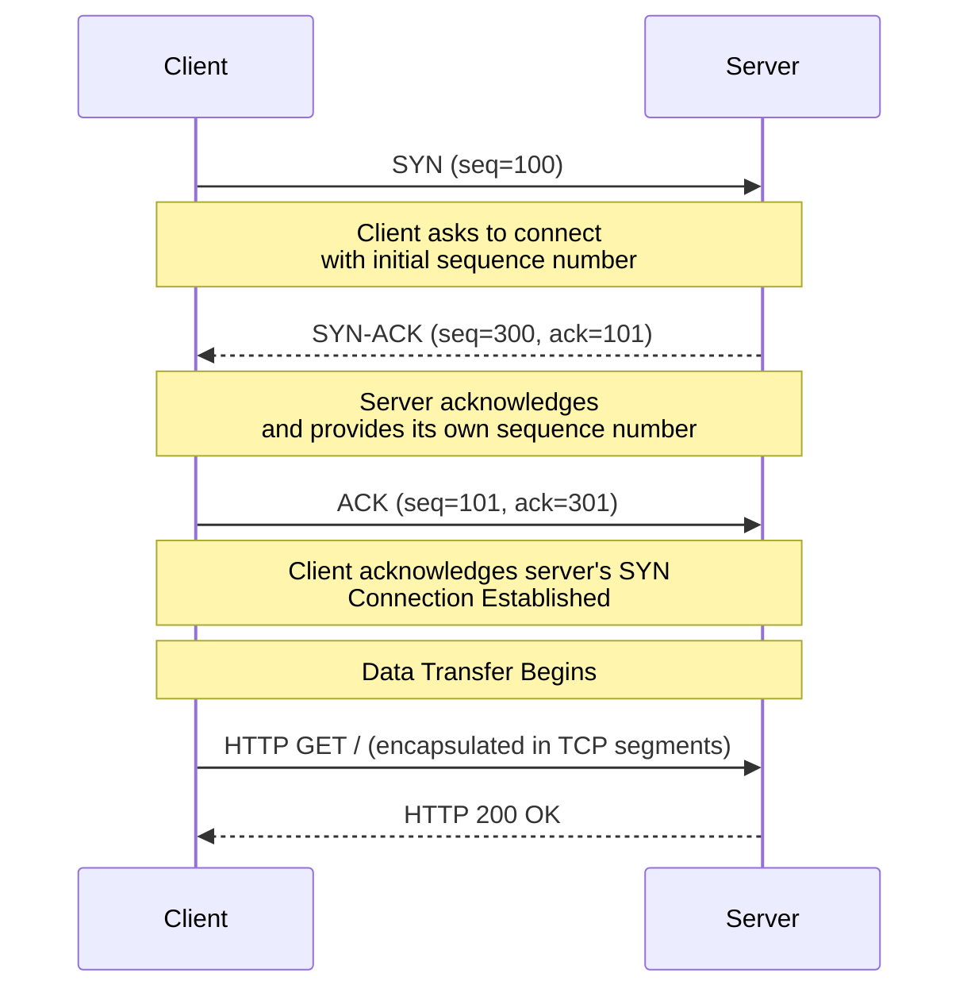

# TCP (Transmission Control Protocol)

## Definition
TCP is a connection-oriented, reliable transport protocol that provides ordered, error-checked delivery of a stream of bytes between applications running on hosts communicating over an IP network.

## Real-World Example
**Web browsing (HTTP/HTTPS)**: Every time you load a webpage, TCP establishes a connection between your browser and the web server. It ensures all HTML, CSS, JS, and image bytes arrive in the correct order, without corruption.

## TCP Segment Structure

```
 0                   1                   2                   3
 0 1 2 3 4 5 6 7 8 9 0 1 2 3 4 5 6 7 8 9 0 1 2 3 4 5 6 7 8 9 0 1
├─────────────────────────────────────────────────────────────────┤
│        Source Port (16)         │      Destination Port (16)    │
├─────────────────────────────────────────────────────────────────┤
│                       Sequence Number (32)                      │
├─────────────────────────────────────────────────────────────────┤
│                    Acknowledgment Number (32)                    │
├──────┬──┬──┬──┬──┬──┬──┬──┬────────────────────────────────────┤
│ Data │   │   │   │   │   │ U │ A │ P │ R │ S │ F │              │
│Offset│ R │ E │   │ C │ K │ R │ C │ S │ S │ Y │ I │   Window    │
│ (4)  │ S │ S │   │ W │ H │ T │ K │ S │ T │ N │ N │   Size (16) │
│      │ V │   │   │ R │   │   │   │   │   │   │   │              │
├──────┼──┼──┼──┼──┼──┼──┼──┴──┴──┴──┴──┴──────────────────────┤
│           Checksum (16)          │        Urgent Pointer (16)   │
├─────────────────────────────────────────────────────────────────┤
│                    Options (variable)                           │
├─────────────────────────────────────────────────────────────────┤
│                        Data (variable)                          │
└─────────────────────────────────────────────────────────────────┘
```

## The Three-Way Handshake



## Connection Termination

```
Client                          Server
  │                                │
  │       FIN (seq=150)           │
  │──────────────────────────────>│
  │                                │
  │       ACK (ack=151)           │
  │<──────────────────────────────│
  │                                │
  │       FIN (seq=400)           │
  │<──────────────────────────────│
  │                                │
  │       ACK (ack=401)           │
  │──────────────────────────────>│
  │                                │
  │====== Connection Closed ======│
```

## TCP Features

### Flow Control (Sliding Window)

```
Sender                      Receiver
  │                            │
  │ Window size = 64KB        │
  │══════════════════════════>│
  │ Send 64KB without waiting │
  │                            │
  │       ACK (window=32KB)   │
  │<──────────────────────────│ (Receiver slowing down)
  │ Now send 32KB             │
```

### Congestion Control

Algorithms:
1. **Slow Start**: Double window each RTT until threshold
2. **Congestion Avoidance**: Linear increase after threshold
3. **Fast Retransmit**: Retransmit after 3 duplicate ACKs
4. **Fast Recovery**: Reduce window by half, then linear increase

```
Window Size
    ▲
    │
    │  Slow Start        Congestion Avoidance
    │  (exponential)     (linear)
    │      ◄────────────►
    │  ┌──┐
    │  │  │──┐                  ┌── Threshold
    │  │  │  │──┐         ──────┤
    │  │  │  │  │──┐     ┌      │
    │  │  │  │  │  │─────┤      │
    │  │  │  │  │  │  ┌──┤      │
    │  │  │  │  │  │  │  │      │
    └──┴──┴──┴──┴──┴──┴──┴──────► Time
```

## TCP vs UDP

| Feature | TCP | UDP |
|---------|-----|-----|
| Connection | Connection-oriented | Connectionless |
| Reliability | Guaranteed delivery | No guarantee |
| Ordering | Ordered | Unordered |
| Error checking | Yes (checksum + ACK) | Yes (checksum only) |
| Flow control | Yes (sliding window) | No |
| Congestion control | Yes | No |
| Header size | 20-60 bytes | 8 bytes |
| Speed | Slower | Faster |
| Use cases | Web, email, file transfer | Video streaming, VoIP, games |

## Advantages
- Reliable data delivery
- In-order delivery
- Error detection and correction
- Congestion avoidance
- Flow control

## Disadvantages
- Higher overhead than UDP
- Slower due to handshake and ACKs
- Head-of-line blocking
- Not suitable for real-time applications

## Diagram: TCP in a Distributed System

```
                    ┌──────────────────────────┐
                    │   Application (HTTP)     │
                    └──────────┬───────────────┘
                               │
                    ┌──────────▼───────────────┐
                    │   TCP Layer              │
                    │   - Segment data         │
                    │   - Add ports            │
                    │   - Sequence numbers     │
                    └──────────┬───────────────┘
                               │
                    ┌──────────▼───────────────┐
                    │   IP Layer               │
                    │   - Add IP addresses     │
                    │   - Route packets        │
                    └──────────┬───────────────┘
                               │
              ┌────────────────┼────────────────┐
              │                │                │
         ┌────▼────┐     ┌────▼────┐     ┌────▼────┐
         │ Router  │     │ Router  │     │ Router  │
         └─────────┘     └─────────┘     └─────────┘
                               │
                    ┌──────────▼───────────────┐
                    │   Destination Server     │
                    └──────────────────────────┘
```

## Interview Questions
1. Explain the TCP three-way handshake
2. How does TCP handle packet loss?
3. What is TCP congestion control and how does it work?
4. Compare TCP and UDP with use cases
5. What is the TCP head-of-line blocking problem?
