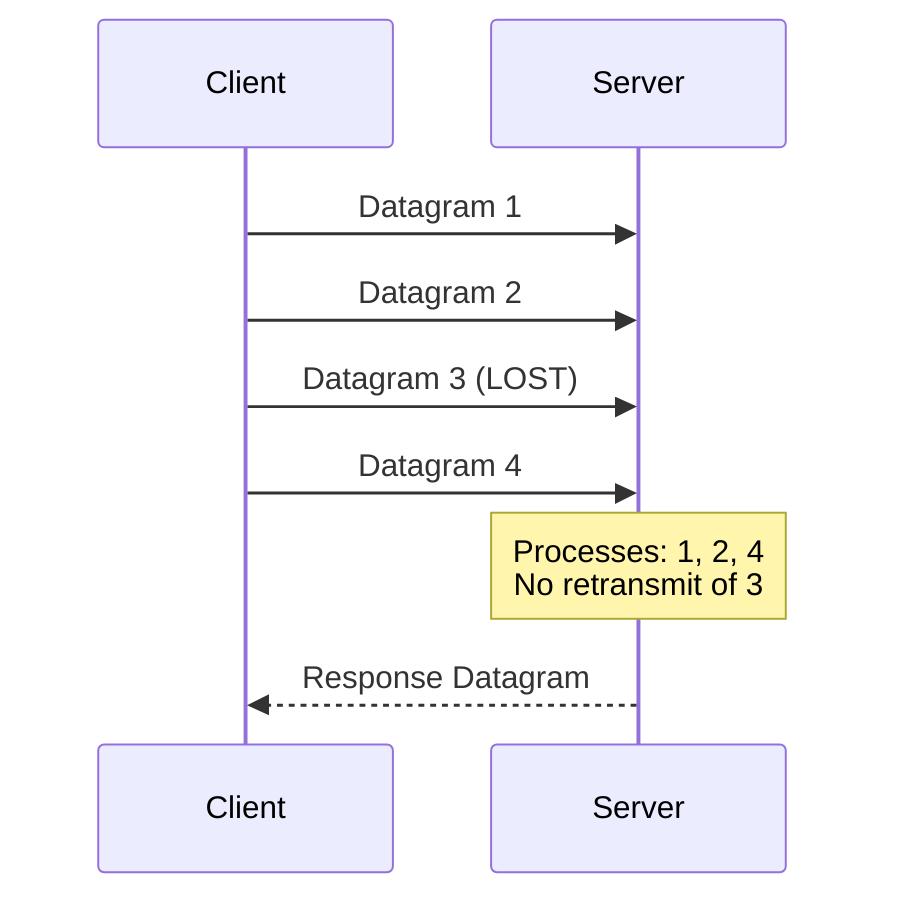

# UDP (User Datagram Protocol)

## Definition
UDP is a connectionless, lightweight transport protocol that provides minimal, unreliable data transfer between applications. It has no handshake, no ordering guarantees, and no retransmission — just fire and forget.



## Real-World Example
**Live video streaming (YouTube Live)**: Uses UDP to deliver video frames. If a frame is lost, there's no retransmission — the next frame arrives milliseconds later. A brief glitch is far better than buffering while TCP retransmits.

## UDP Datagram Structure

```
 0                   1                   2                   3
 0 1 2 3 4 5 6 7 8 9 0 1 2 3 4 5 6 7 8 9 0 1 2 3 4 5 6 7 8 9 0 1
├─────────────────────────────────────────────────────────────────┤
│        Source Port (16)         │      Destination Port (16)    │
├─────────────────────────────────────────────────────────────────┤
│            Length (16)          │           Checksum (16)       │
├─────────────────────────────────────────────────────────────────┤
│                        Data (variable)                          │
└─────────────────────────────────────────────────────────────────┘
```

Header is only **8 bytes** (compared to TCP's 20-60 bytes).

## Common UDP Applications

| Application | Protocol | Why UDP? |
|-------------|----------|----------|
| DNS queries | DNS over UDP | Single request-response, fast |
| Video streaming | RTSP, RTP, WebRTC | Tolerates loss, needs low latency |
| Voice calls | VoIP (SIP/RTP) | Real-time, loss > delay |
| Online gaming | Custom UDP | Fast action, lag is worse than loss |
| DHCP | DHCP | Initial broadcast, no connection yet |
| NTP | NTP | Timing precision, minimal overhead |

## UDP vs TCP Deep Dive

```
TCP:                    UDP:
┌──────────┐           ┌──────────┐
│ Handshake │           │ No setup │
│ (3-way)   │           │          │
├──────────┤           ├──────────┤
│ Ack each  │           │ Fire and │
│ packet    │           │ forget   │
├──────────┤           ├──────────┤
│ Retransmit│           │ Lost =   │
│ on loss   │           │ gone     │
├──────────┤           ├──────────┤
│ In order  │           │ Out of   │
│ delivery  │           │ order OK │
├──────────┤           ├──────────┤
│ 20-60     │           │ 8 bytes  │
│ byte hdr  │           │ header   │
└──────────┘           └──────────┘
```

## Advantages
- **Low latency** — No handshake, no ACK wait
- **Low overhead** — 8-byte header vs 20-60 bytes for TCP
- **No head-of-line blocking** — Each datagram is independent
- **Broadcast/multicast support** — Send to many recipients
- **Simple** — Minimal protocol logic

## Disadvantages
- **No delivery guarantee** — Packets can be lost silently
- **No ordering** — Packets may arrive out of order
- **No congestion control** — Can flood the network
- **No flow control** — Sender can overwhelm receiver
- **Size limit** — Maximum datagram ~65KB (usually 1500 bytes with IP)

## When to Use UDP

```
Low Latency Required?
    │
    ├── Yes ──► Can tolerate loss?
    │              │
    │              ├── Yes ──► UDP (gaming, VoIP, video)
    │              │
    │              └── No ───► TCP with optimization
    │
    └── No ────► TCP (web, email, file transfer)
```

## UDP in Modern Protocols

### QUIC (HTTP/3)
UDP-based protocol that adds TCP-like reliability at the application layer:
- 0-RTT connection establishment
- Multiplexed streams (no head-of-line blocking)
- Built-in encryption (TLS 1.3)
- Connection migration (survives IP changes)

### WebRTC
UDP-based real-time communication:
- Media streams over SRTP (Secure RTP)
- Data channels over SCTP over UDP
- NAT traversal via ICE/STUN/TURN

## Diagram: UDP in a Distributed System

```
Client                          Server
  │                                │
  │   Datagram 1 (seq=1)          │
  │──────────────────────────────>│
  │   Datagram 2 (seq=2)          │
  │──────────────────────────────>│
  │   Datagram 3 (seq=3)          │
  │─── LOST ──────────────────────│
  │   Datagram 4 (seq=4)          │
  │──────────────────────────────>│
  │                                │
  │   Server processes: 1, 2, 4   │
  │   (no retransmit of 3)        │
  │                                │
  │   Response Datagram           │
  │<──────────────────────────────│
```

## Interview Questions
1. Compare UDP and TCP for video streaming
2. Why does DNS use UDP for most queries?
3. How does QUIC (HTTP/3) improve on TCP using UDP?
4. What are the security considerations of using UDP?
5. How do applications handle reliability on top of UDP?
