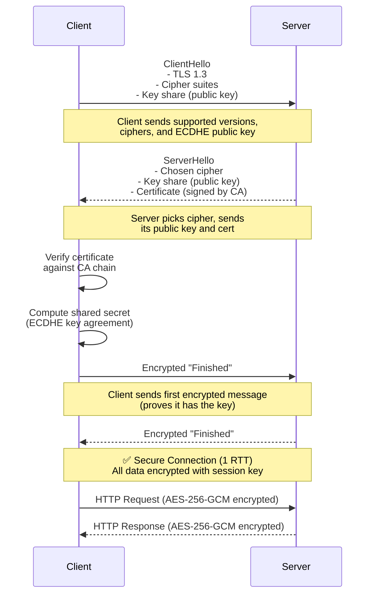

# HTTPS & TLS

## Definition
HTTPS (HTTP Secure) is HTTP over TLS (Transport Layer Security). It encrypts all communication between client and server, ensuring confidentiality, integrity, and authentication.

## Real-World Example
**Online banking**: When you log into your bank's website, HTTPS ensures that your credentials, account numbers, and transaction data cannot be intercepted or modified by attackers.

## TLS Handshake (1.3)



TLS 1.3 reduces handshake from 2 RTT (TLS 1.2) to **1 RTT**, or **0 RTT** for resumed connections.

## Certificate Authority (CA) Chain

```
                     Root CA
                  (self-signed)
                       │
                       │ Signs
                       ▼
                 Intermediate CA
                       │
                       │ Signs
                       ▼
                Server Certificate
              (yourdomain.com)
                       │
                       │ Presented to
                       ▼
                    Client
                  (browser)
```

## How Certificate Validation Works

```
1. Browser gets server's certificate + intermediates
2. Checks certificate is not expired
3. Verifies signature using CA's public key
4. Checks domain name matches certificate's CN/SAN
5. Checks revocation status via CRL or OCSP
6. ✅ Green padlock
```

## TLS 1.2 vs 1.3

| Feature | TLS 1.2 | TLS 1.3 |
|---------|---------|---------|
| Handshake | 2 RTT | 1 RTT (0 RTT resume) |
| Cipher suites | Many (some weak) | Simplified (AEAD only) |
| Forward secrecy | Optional | Required |
| 0-RTT | ❌ | ✅ |
| Removal | — | Removed static RSA, RC4, 3DES |
| Supported since | 2008 | 2018 |

## HTTPS Performance Considerations

### Overhead
- **CPU**: ~1-5% overhead for modern AES-NI hardware
- **Latency**: One extra RTT for initial handshake
- **Bandwidth**: ~5-10% increase from headers

### Optimizations
```
1. Session resumption (session IDs or tickets)
2. OCSP stapling (don't let browser check revocation)
3. HTTP/2 multiplexing (single TLS connection)
4. TLS 1.3 0-RTT for repeat visitors
5. HSTS (force HTTPS, skip 301 redirects)
6. Certificate compression
```

## Advantages
- **Confidentiality**: Data encrypted in transit
- **Integrity**: Data cannot be modified without detection
- **Authentication**: Server is who it claims to be
- **SEO**: Google ranks HTTPS sites higher
- **Compliance**: Required for PCI-DSS, HIPAA, GDPR

## Disadvantages
- **Performance**: Handshake adds latency
- **Cost**: Certificate costs (Let's Encrypt is free)
- **Complexity**: Certificate management, renewal
- **TLS termination**: Extra configuration for load balancers

## Diagram: HTTPS in a Distributed System

```
Client ─── HTTPS ───► Load Balancer ─── HTTP ──► App Server
  │                     │                            │
  │                  TLS Term.                    Internal
  │                  Public Cert                  Self-signed
  │                                             or HTTP-only
  │                                              (faster)
  │
  End-to-end encryption: Client to LB
  Internal encryption: Optional (mTLS)
```

## Interview Questions
1. How does TLS handshake work step by step?
2. What's the difference between TLS 1.2 and TLS 1.3?
3. How does HTTPS affect system performance?
4. What is a certificate chain and why is it used?
5. How would you terminate TLS at a load balancer vs application server?
