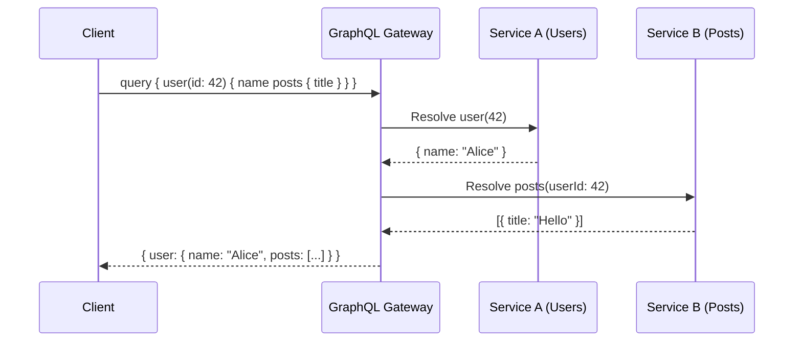

# GraphQL

## Definition
GraphQL is a query language for APIs that allows clients to request exactly the data they need, nothing more and nothing less. It provides a single endpoint and a strongly-typed schema.



## Real-World Example
**GitHub GraphQL API**: Instead of fetching user profile and repos with multiple REST calls, a single GraphQL query gets everything: `query { user(login: "torvalds") { name, email, repositories(first: 10) { nodes { name, stars } } } }`

## Schema-First Design

```graphql
type User {
  id: ID!
  name: String!
  email: String!
  avatar: String
  posts: [Post!]!
  createdAt: DateTime!
}

type Post {
  id: ID!
  title: String!
  body: String!
  author: User!
  comments: [Comment!]!
  likes: Int!
}

type Comment {
  id: ID!
  text: String!
  author: User!
}

type Query {
  user(id: ID!): User
  users(limit: Int, offset: Int): [User!]!
  posts(search: String): [Post!]!
}

type Mutation {
  createPost(title: String!, body: String!): Post!
  deletePost(id: ID!): Boolean!
  likePost(id: ID!): Post!
}
```

## REST vs GraphQL: Data Fetching

```
REST:
  GET /users/42          ──► { id, name, email }
  GET /users/42/posts    ──► [{ id, title }, ...]
  GET /users/42/posts/5/comments ──► [{ id, text }, ...]
  Three round trips, over-fetching on each.

GraphQL:
  query {
    user(id: 42) {
      name
      email
      posts {
        title
        comments {
          text
        }
      }
    }
  }
  One round trip, exactly the data needed.
```

## Resolvers

```
Schema:                   Resolver Functions:
  type Query {              Query: {
    user(id: ID!): User       user(parent, args, context) {
  }                               return db.findUser(args.id)
                              }
                            }

Resolver receives: (parent, args, context, info)
- parent: Parent resolver's result
- args: Query arguments
- context: Request context (auth, DB, etc.)
- info: Query metadata
```

## N+1 Problem

```
Query:
  query {
    users {
      posts { title }   ← For each user, fetch posts
    }
  }

Without batching:
  SELECT * FROM users           → 1 query
  SELECT * FROM posts WHERE user_id = 1 → N queries
  SELECT * FROM posts WHERE user_id = 2 → N queries
  SELECT * FROM posts WHERE user_id = 3 → N queries

With DataLoader (batching):
  SELECT * FROM users           → 1 query
  SELECT * FROM posts WHERE user_id IN (1,2,3) → 1 query
```

## Advantages

- **Exact data fetching** — No over-fetching or under-fetching
- **Single endpoint** — `/graphql` for everything
- **Strongly typed schema** — Self-documenting
- **Rapid frontend iteration** — Frontend controls data shape
- **Introspection** — Tools like GraphiQL auto-generate docs
- **Subscriptions** — Real-time via WebSocket

## Disadvantages

- **Complex caching** — No HTTP caching (POST requests, dynamic queries)
- **Query complexity** — Clients can write expensive nested queries
- **Rate limiting** — Harder than REST (depends on query cost)
- **Server complexity** — Resolvers, loaders, batching
- **Uploads** — File upload is non-trivial
- **Learning curve** — Schema, resolvers, subscriptions

## GraphQL in Distributed Systems

```
Client ──► GraphQL Gateway ──► Service A (users)
                    │            Service B (posts)
                    │            Service C (comments)
                    │            Service D (notifications)
                    
Gateway stitches schemas from multiple services
into a single unified graph.
```

## Interview Questions
1. Compare GraphQL and REST for a social media API
2. What is the N+1 problem in GraphQL and how do you solve it?
3. How do you handle authentication and authorization in GraphQL?
4. Design a GraphQL schema for an e-commerce platform
5. How do you implement pagination in GraphQL?
