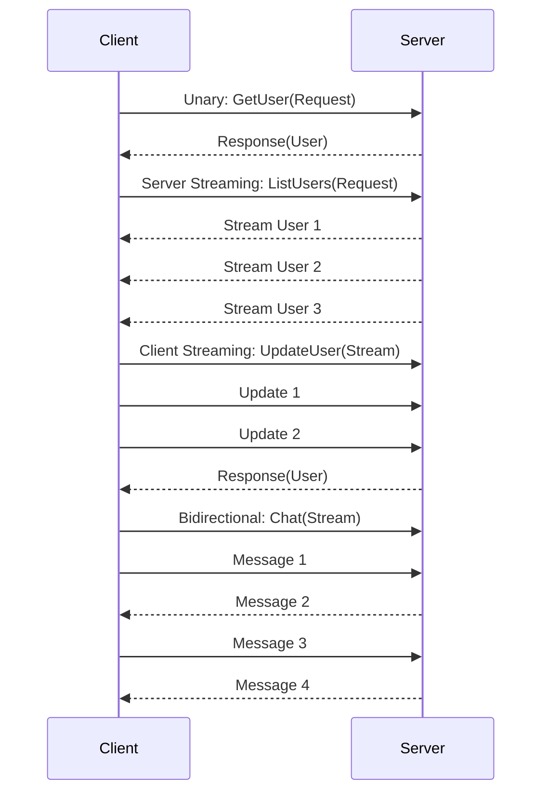

# gRPC

## Definition
gRPC is a high-performance, open-source RPC (Remote Procedure Call) framework developed by Google. It uses Protocol Buffers for serialization and HTTP/2 for transport, enabling efficient communication between services.



## Real-World Example
**Netflix**: Uses gRPC for internal microservices communication. Over 500+ services communicate via gRPC, handling billions of requests per day with low latency and high throughput.

## How gRPC Works

```
Client                         Server
  │                               │
  │  Stub (generated)            │
  │  calls SayHello(name)        │
  │                               │
  │  Protobuf serialization      │
  │  ┌─────────────────┐        │
  │  │ service Greeter  │        │
  │  │ { SayHello() }   │        │
  │  └─────────────────┘        │
  │       │                      │
  │       ▼ HTTP/2 Stream       │
  │  ┌─────────────────┐        │
  │  │ Headers         │        │
  │  │ Data (binary)   │        │
  │  │ Trailers        │        │
  │  └─────────────────┘        │
  │─────────────────────────────►│
  │                               │
  │◄─────────────────────────────│
  │  Response (binary)           │
  │                               │
  │  Stub deserializes           │
  │  returns HelloResponse       │
  │                               │
```

## Protocol Buffers

```protobuf
syntax = "proto3";

service UserService {
  rpc GetUser (GetUserRequest) returns (User);
  rpc ListUsers (ListUsersRequest) returns (stream User);
  rpc UpdateUser (stream UpdateUserRequest) returns (User);
  rpc Chat (stream ChatMessage) returns (stream ChatMessage);
}

message GetUserRequest {
  string user_id = 1;
}

message User {
  string id = 1;
  string name = 2;
  string email = 3;
  int32 age = 4;
  repeated string tags = 5;
  Address address = 6;
}
```

## gRPC Communication Patterns

### Unary RPC
```
Client ──► Request ──► Server
Client ◄── Response ◄── Server
```

### Server Streaming
```
Client ──► Request ──► Server
Client ◄── Stream ◄──── Server
Client ◄── Stream ◄──── Server
Client ◄── Stream ◄──── Server
```

### Client Streaming
```
Client ──► Stream ──► Server
Client ──► Stream ──► Server
Client ──► Stream ──► Server
Client ◄── Response ◄── Server
```

### Bidirectional Streaming
```
Client ──► Stream ──► Server
Client ◄── Stream ◄── Server
Client ──► Stream ──► Server
Client ◄── Stream ◄── Server
```

## gRPC vs REST

| Feature | gRPC | REST |
|---------|------|------|
| Protocol | HTTP/2 | HTTP/1.1+ |
| Serialization | Protobuf (binary) | JSON (text) |
| Payload size | ~30% smaller | Larger |
| Speed | 7-10x faster | Slower |
| Schema | Required (.proto) | Optional (OpenAPI) |
| Code generation | Built-in | Tool-dependent |
| Streaming | Native (all 4 types) | Manual (SSE) |
| Browser support | Via gRPC-web | Native |
| Caching | Not built-in | Excellent |
| Human readable | No (binary) | Yes (JSON) |

## Advantages
- **Performance** — Binary, small, fast
- **Strong typing** — Generated code, compile-time safety
- **Streaming** — Bidirectional, real-time
- **Polyglot** — 11+ languages supported
- **HTTP/2** — Multiplexing, header compression
- **Deadline/timeout** — Per-RPC cancellation
- **Load balancing** — Client-side LB built-in

## Disadvantages
- **Limited browser support** — gRPC-web required
- **No human-readable debugging** — Need tools (grpcurl, grpcui)
- **Complex load balancing** — L7 LB required for streaming
- **Schema coupling** — Both sides must share proto files
- **Ecosystem maturity** — Smaller than REST

## gRPC in Microservices

```
                   ┌──────────────────┐
                   │  API Gateway     │
                   │  (REST → gRPC)   │
                   └────────┬─────────┘
                            │
        ┌───────────────────┼────────────────────┐
        │                   │                    │
        ▼                   ▼                    ▼
┌──────────────┐   ┌──────────────┐   ┌──────────────┐
│  User        │   │  Order       │   │  Payment     │
│  Service     │───│  Service     │───│  Service     │
│  (gRPC)      │   │  (gRPC)      │   │  (gRPC)      │
└──────────────┘   └──────────────┘   └──────────────┘
        │                   │                    │
        └───────────────────┼────────────────────┘
                            │
                    ┌───────▼───────┐
                    │  Inventory    │
                    │  Service      │
                    │  (gRPC)       │
                    └───────────────┘
```

## Interview Questions
1. Compare gRPC and REST for microservices communication
2. What are the four types of gRPC streaming?
3. How does Protocol Buffers compare to JSON?
4. When would you choose gRPC over REST or GraphQL?
5. How do you handle gRPC errors and deadlines?
