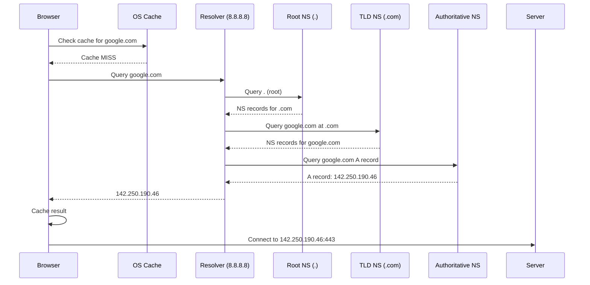

# DNS (Domain Name System)

## Definition
DNS is the phonebook of the internet. It translates human-readable domain names (like `google.com`) into machine-readable IP addresses (like `142.250.190.46`).

## Real-World Example
**Every internet request**: When you visit youtube.com, your browser performs a DNS lookup to find YouTube's server IP. Without DNS, you'd need to memorize IP addresses for every website.

## DNS Resolution: Step by Step



## DNS Record Types

| Type | Name | Purpose | Example |
|------|------|---------|---------|
| A | Address | Maps domain to IPv4 | `google.com → 142.250.190.46` |
| AAAA | Address | Maps domain to IPv6 | `google.com → 2607:f8b0:...` |
| CNAME | Canonical Name | Domain alias | `www.google.com → google.com` |
| MX | Mail Exchange | Email server | `@ → mail.google.com` |
| NS | Nameserver | DNS server for domain | `→ ns1.google.com` |
| TXT | Text | Arbitrary text (SPF, DKIM) | `v=spf1 include:_spf.google.com` |
| SOA | Start of Authority | Zone metadata | Admin email, refresh interval |
| SRV | Service | Specific service location | `_sip._tcp.example.com` |

## DNS Caching Hierarchy

```
Browser Cache
  Duration: ~60s (can be configured)
  Size: ~100 entries

OS (Stub Resolver) Cache
  Duration: TTL from DNS record

Local Network (Router) Cache
  Duration: TTL

ISP Resolver Cache
  Duration: TTL (may override)

Anycast Edge (CDN) Cache
  Duration: TTL
```

## DNS Load Balancing Strategies

### Round Robin
```
A example.com 192.0.2.1
A example.com 192.0.2.2
A example.com 192.0.2.3
```

Each DNS response rotates through available IPs.

### Weighted Round Robin
```
A example.com 192.0.2.1 weight=3  (30%)
A example.com 192.0.2.2 weight=5  (50%)
A example.com 192.0.2.3 weight=2  (20%)
```

### Geographic (GeoDNS)
```
US users → 192.0.2.1 (us-east)
EU users → 203.0.113.1 (eu-west)
APAC users → 198.51.100.1 (ap-southeast)
```

### Latency-Based
Route users to the region with lowest measured latency.

## DNS in Distributed Systems

```
┌─────────────────────────────────────────────────────────────┐
│                    Global Traffic Manager                    │
├─────────────────────────────────────────────────────────────┤
│                                                              │
│  Route 53 / Cloud DNS / Azure DNS                            │
│                                                              │
│  ┌──────────┐  ┌──────────┐  ┌──────────┐  ┌──────────┐   │
│  │ Health   │  │ Latency  │  │ Weighted │  │ Geoloc   │   │
│  │ Check    │  │ Routing  │  │ Routing  │  │ Routing  │   │
│  └──────────┘  └──────────┘  └──────────┘  └──────────┘   │
│                                                              │
│  ┌──────────────────────────────────────────────────────┐   │
│  │                   Traffic Steering                   │   │
│  └──────────────────────────────────────────────────────┘   │
└─────────────────────────────────────────────────────────────┘
```

## Advantages
- Human-readable naming
- Decouples users from infrastructure
- Global distribution (anycast roots)
- Load balancing at the DNS level
- Highly resilient (13 root clusters, DDoS-resistant)

## Disadvantages
- Caching causes propagation delays (TTL)
- DNS spoofing/poisoning risks
- DNSSEC complexity
- UDP limitations (512 bytes, fallback to TCP)
- Dependency chain (multiple lookups)

## DNS Security Extensions (DNSSEC)

```
Without DNSSEC:
  Attacker can spoof DNS response
  User redirected to phishing site

With DNSSEC:
  Each response is cryptographically signed
  Browser verifies the signature chain
  Tampered responses are rejected
```

## Related Topics
- [CDN](../02-Networking/10-cdn.md) — CDNs rely on DNS for geographic routing
- [How Browser Loads Google](../02-Networking/14-how-browser-loads-google.md) — Full DNS + TCP + TLS + HTTP in action
- [Load Balancing](../07-Cloud-Architecture/02-ec2.md) — DNS-based load balancing with Route53

## Interview Questions
1. Walk through DNS resolution for google.com
2. How does DNS load balancing work?
3. What is DNS caching and how does TTL affect it?
4. How does DNSSEC protect against DNS spoofing?
5. Design a DNS-based global traffic management system
