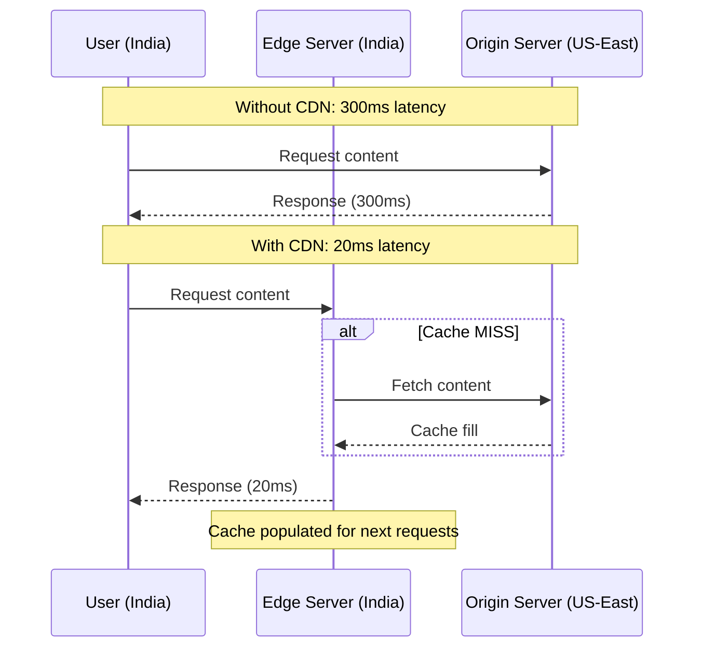
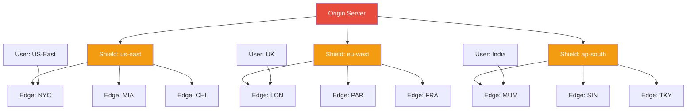

# CDN (Content Delivery Network)

## Definition
A CDN is a geographically distributed network of servers that delivers web content (static assets, video, API responses) to users based on their location, the origin server, and the content type. It reduces latency and offloads traffic from origin servers.

## Real-World Example
**Netflix**: Serves 15% of global internet traffic. Netflix's Open Connect CDN places caching appliances directly inside ISP networks. Users stream from a server in their local ISP rather than from Netflix's origin data centers.

## How a CDN Works



## CDN Request Flow

```
1. User requests image.jpg
2. DNS resolves to nearest CDN edge
3. Edge checks its cache
   ├── HIT:  Return cached content (fast)
   └── MISS: Edge requests from origin
             Edge caches response
             Return to user
4. Subsequent requests → HIT
```

## Content Types

| Content Type | CDN Benefit | Example |
|-------------|-------------|---------|
| **Static assets** | Reduce origin load | JS, CSS, images, fonts |
| **Video streaming** | Low-latency playback | HLS, DASH segments |
| **API responses** | Faster dynamic content | Edge caching strategies |
| **Software downloads** | Fast global distribution | .exe, .dmg, .apk |
| **Live streaming** | Global broadcast | WebRTC, RTMP ingest |

## CDN Caching Strategies

### Time-To-Live (TTL)
```
Cache image.jpg for 1 year    → Cache-Control: max-age=31536000
Cache index.html for 5 min    → Cache-Control: max-age=300
Never cache user profile      → Cache-Control: no-cache
```

### Cache Invalidation
```
Explicit:  Purge URL by API call
           curl -X PURGE https://cdn.example.com/image.jpg

Versioned: URL changes when content changes
           /static/js/app.v2.js
           /static/img/logo.a1b2c3.png

Surrogate: Cache tags for group invalidation
           Surrogate-Key: home-page product-123
```

### Cache at Edge vs Shield

```
User ──► Edge Pop ──► Shield ──► Origin
                               
Edge:    Many locations, smaller caches, first request
Shield:  Fewer locations, larger caches, absorbs origin traffic
Origin:  Only sees shield misses (dramatic load reduction)
```

## CDN Architecture



## Major CDN Providers

| Provider | Global Presence | Key Features |
|----------|----------------|--------------|
| **CloudFront** (AWS) | 450+ PoPs | Lambda@Edge, origin shield |
| **Cloudflare** | 310+ cities | DDoS protection, Workers |
| **Akamai** | 4100+ PoPs | Enterprise, media delivery |
| **Fastly** | 80+ PoPs | Instant purge, VCL config |
| **Azure CDN** | 130+ PoPs | Microsoft integration |

## Advantages
- **Reduced latency** — Content from nearest edge
- **Origin offload** — 90%+ cache hit rate
- **DDoS protection** — Distributes attack traffic
- **Global reach** — Serve users everywhere
- **Cost savings** — Reduce bandwidth costs
- **Resilience** — Edge absorbs traffic spikes

## Disadvantages
- **Cost** — CDN charges for bandwidth and requests
- **Cache invalidation** — Stale content until TTL expires
- **Cold start** — First request is slow (cache miss)
- **Complexity** — Multiple origins, dynamic content
- **SSL/TLS** — Certificate management across edges

## Dynamic Content Acceleration

```
Request:  API call that varies per user
├── Traditional: Go to origin, long TTL? Can't
└── With DCA:
    ├── Route optimization (best path to origin)
    ├── TCP optimizations (fast open, keep alive)
    ├── Connection reuse across requests
    └── Edge compute (Lambda@Edge) to customize
```

## Interview Questions
1. How does a CDN reduce latency for global users?
2. Design a CDN caching strategy for a news website
3. How do you handle cache invalidation for dynamic content?
4. Compare CDN providers (CloudFront vs Cloudflare vs Akamai)
5. How does a CDN protect against DDoS attacks?
