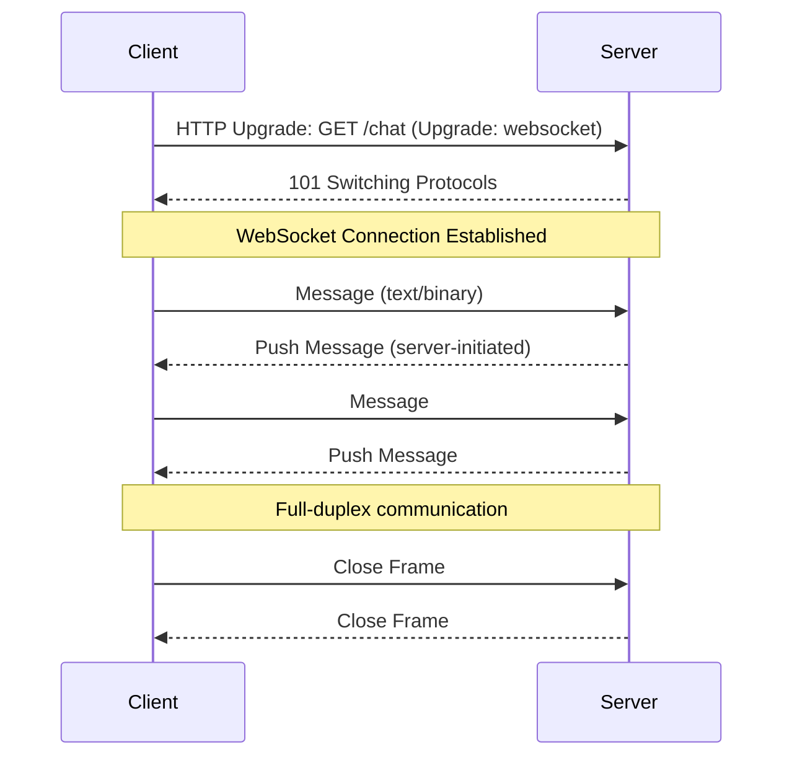

# WebSocket

## Definition
WebSocket is a protocol that provides full-duplex, bidirectional communication over a single TCP connection. Unlike HTTP's request-response cycle, WebSocket allows the server to push data to the client at any time.



## Real-World Example
**Slack**: Uses WebSocket for real-time messaging. When a colleague sends a message, Slack's server pushes it to your browser instantly without you refreshing or polling. The WebSocket connection remains open for your entire session.

## WebSocket vs HTTP

```
HTTP:
  Client ──► Request ──► Server
  Client ◄── Response ◄── Server
  Client ──► Request ──► Server
  Client ◄── Response ◄── Server
  (Each request/response is separate)

WebSocket:
  Client ◄═══════════════► Server
  Client ◄══ Message ◄══ Server (push)
  Client ══ Message ──► Server
  Client ◄══ Message ◄══ Server (push)
  (Single persistent connection, full duplex)
```

## WebSocket Handshake

```
Client                                          Server
  │                                                │
  │  HTTP Upgrade Request                         │
  │  GET /chat HTTP/1.1                           │
  │  Host: example.com                            │
  │  Upgrade: websocket                           │
  │  Connection: Upgrade                          │
  │  Sec-WebSocket-Key: dGhlIHNhbXBsZSBub25jZQ== │
  │  Sec-WebSocket-Version: 13                   │
  │──────────────────────────────────────────────►│
  │                                                │
  │  HTTP 101 Switching Protocols                  │
  │  Upgrade: websocket                           │
  │  Connection: Upgrade                          │
  │  Sec-WebSocket-Accept: s3pPLMBiTxaQ9kYGzzhZ  │
  │◄──────────────────────────────────────────────│
  │                                                │
  │  ═══ WebSocket Connection Established ═══     │
  │  Bidirectional messages over same TCP socket  │
  │                                                │
```

## WebSocket Frame Structure

```
 0                   1                   2                   3
 0 1 2 3 4 5 6 7 8 9 0 1 2 3 4 5 6 7 8 9 0 1 2 3 4 5 6 7 8 9 0 1
├──────┬─────┬──────┬──────────┬───────────────────────────────────┤
│FIN   │RSV  │OPCODE│ MASK    │          Payload Length           │
│(1)   │(3)  │(4)   │ (1)     │           (7/7+16/7+64)          │
├──────┴─────┴──────┴──────────┴──────────────────────────────────┤
│                   Masking Key (0 or 4 bytes)                    │
├─────────────────────────────────────────────────────────────────┤
│                   Payload Data                                   │
└─────────────────────────────────────────────────────────────────┘

Opcodes:
  0x0: Continuation Frame
  0x1: Text Frame (UTF-8)
  0x2: Binary Frame
  0x8: Connection Close
  0x9: Ping
  0xA: Pong
```

## WebSocket in Distributed Systems

```
                   ┌────────────────────┐
                   │   Load Balancer    │
                   │  (sticky sessions) │
                   └─────────┬──────────┘
                             │
        ┌────────────────────┼────────────────────┐
        │                    │                    │
   ┌────▼────┐         ┌────▼────┐         ┌────▼────┐
   │  WS     │         │  WS     │         │  WS     │
   │ Server  │         │ Server  │         │ Server  │
   │ 1       │         │ 2       │         │ 3       │
   └────┬────┘         └────┬────┘         └────┬────┘
        │                   │                    │
        │    Pub/Sub        │                    │
        └───────────────────┼────────────────────┘
                            │
                     ┌──────▼──────┐
                     │   Redis     │
                     │  Pub/Sub    │
                     └─────────────┘
```

## Use Cases

| Use Case | Why WebSocket | Example |
|----------|--------------|---------|
| **Chat** | Real-time message delivery | Slack, WhatsApp Web |
| **Live feeds** | Server pushes updates | Twitter timeline, stock prices |
| **Collaboration** | Real-time editing | Google Docs, Figma |
| **Gaming** | Low-latency state sync | Browser games |
| **IoT dashboards** | Live sensor data | Grafana, Datadog |
| **Notifications** | Push without polling | Email, alerts |

## Scaling WebSocket Connections

### Challenge
WebSocket connections are long-lived and stateful. A single server can handle ~10K-100K concurrent connections, but horizontal scaling requires sticky sessions or shared state.

### Strategies

1. **Sticky sessions** — Load balancer routes same user to same server
2. **Redis Pub/Sub** — Broadcast messages across instances
3. **Message Queue** — Kafka/RabbitMQ for cross-server events
4. **Shared state** — Session data in Redis instead of in-memory

## Advantages
- **Real-time** — Server pushes data instantly
- **Low overhead** — No HTTP headers per message (~2 bytes overhead)
- **Full duplex** — Both sides send independently
- **Persistent** — No reconnection overhead per message

## Disadvantages
- **Stateful** — Harder to scale horizontally
- **Resource intensive** — Long-lived connections consume memory
- **Firewall issues** — Corporate firewalls may block WebSocket
- **No automatic reconnection** — Must implement manually
- **Complex debugging** — Harder to inspect than HTTP

## Interview Questions
1. How does a WebSocket connection start?
2. Compare WebSocket and HTTP long-polling
3. How do you scale WebSocket servers horizontally?
4. Design a real-time chat system using WebSocket
5. What happens when a WebSocket connection drops?
