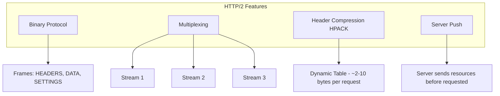

# HTTP/2

## Definition
HTTP/2 is a major revision of HTTP that improves performance by enabling multiplexed streams, header compression, server push, and binary framing — all over a single TCP connection.



## Real-World Example
**Google Search**: Was an early adopter. HTTP/2 reduced page load times by 15-50% by eliminating multiple TCP connections and enabling concurrent requests over one connection.

## Key Features

### 1. Binary Protocol
```
HTTP/1.1 (text):                    HTTP/2 (binary):
GET /index.html HTTP/1.1            ┌─────────────────┐
Host: example.com                   │  Frame Header   │
User-Agent: curl/7.0                │  Length: 52     │
Accept: */*                         │  Type: HEADERS  │
                                    │  Stream ID: 1   │
                                    │  Flags: END_HEAD│
                                    │  Pad Length: 0  │
                                    ├─────────────────┤
                                    │  Fragment:       │
                                    │  :method: GET    │
                                    │  :path: /index   │
                                    └─────────────────┘
```

### 2. Multiplexing
```
HTTP/1.1 (serial):
┌────────┐  ┌────────┐  ┌────────┐
│ Req 1  │  │ Req 2  │  │ Req 3  │  → sequential
└────────┘  └────────┘  └────────┘

HTTP/2 (multiplexed):
┌────────┐
│ Stream │── Req 1 (partial)
│ 1      │
├────────┤
│ Stream │── Req 2
│ 3      │
├────────┤
│ Stream │── Req 1 (rest)
│ 1      │
├────────┤
│ Stream │── Req 3
│ 5      │
└────────┘
```

### 3. Header Compression (HPACK)
```
HTTP/1.1 (per request):
  GET /1 HTTP/1.1
  Host: example.com
  User-Agent: Mozilla/5.0
  Accept: text/html
  Accept-Language: en
  Cookie: session=abc
  (~200-500 bytes)

HTTP/2 (after first request):
  ┌─────────────────────────────┐
  │  Static Table: methods,     │
  │  status codes, common hdrs  │
  ├─────────────────────────────┤
  │  Dynamic Table: Host,       │
  │  Cookie values, etc.        │
  ├─────────────────────────────┤
  │  Subsequent requests send   │
  │  only changed headers       │
  │  (~2-10 bytes)              │
  └─────────────────────────────┘
```

### 4. Server Push
```
Client                              Server
  │                                    │
  │  Request: GET /index.html          │
  │──────────────────────────────────►│
  │                                    │
  │  Push: /styles.css (before asked) │
  │◄──────────────────────────────────│
  │  Push: /app.js (before asked)     │
  │◄──────────────────────────────────│
  │  Response: INDEX.HTML             │
  │◄──────────────────────────────────│
  │                                    │
  │  (Client already has CSS + JS!)   │
```

## HTTP/1.1 vs HTTP/2

| Feature | HTTP/1.1 | HTTP/2 |
|---------|----------|--------|
| Protocol | Text | Binary |
| Multiplexing | ❌ (1 req/conn) | ✅ |
| Head-of-line blocking | ✅ TCP level | ✅ TCP level |
| Header compression | ❌ | ✅ (HPACK) |
| Server push | ❌ | ✅ |
| Stream priority | ❌ | ✅ |
| Connections per page | 6-30 | 1-2 |
| Handshake | Same | +TLS optional |

## Performance Impact

```
Metric          HTTP/1.1    HTTP/2    Improvement
Page load (3G)   7.8s       5.1s       35%
Requests/sec     1,200      5,800      383%
Bandwidth        0.9 Mbps   3.5 Mbps   289%
```

## HTTP/2 in Practice

### Connection Management
```
HTTP/1.1 approach:
  Load 100 resources → open 6 TCP connections
  → parallel but connection-limited

HTTP/2 approach:
  Load 100 resources → 1 TCP connection
  → 100 streams multiplexed
  → stream prioritization for critical resources
```

### Deployment Considerations
```
Requirements:
  - TLS (mandatory in practice, though optional in spec)
  - Server config (nginx: http2 on;)
  - Load balancer support (ALB, HAProxy)
  - CDN support (CloudFront, Cloudflare)

Gotchas:
  - Server push is often overused
  - TCP HOL blocking still exists (HTTP/3 fixes this)
  - Some old proxies strip HTTP/2
```

## Advantages
- Reduced page load time
- Fewer TCP connections (less overhead)
- Efficient multiplexing
- Header compression saves bandwidth
- Server push eliminates round trips

## Disadvantages
- TCP head-of-line blocking remains
- Requires TLS (in practice)
- Complex server push management
- Higher CPU overhead for compression
- Some proxies/networks block or degrade it

## Interview Questions
1. How does HTTP/2 multiplexing work?
2. What problem does HTTP/2 header compression solve?
3. Compare HTTP/1.1 and HTTP/2 performance
4. What is the head-of-line blocking problem in HTTP/2?
5. When would you use HTTP/2 server push?
