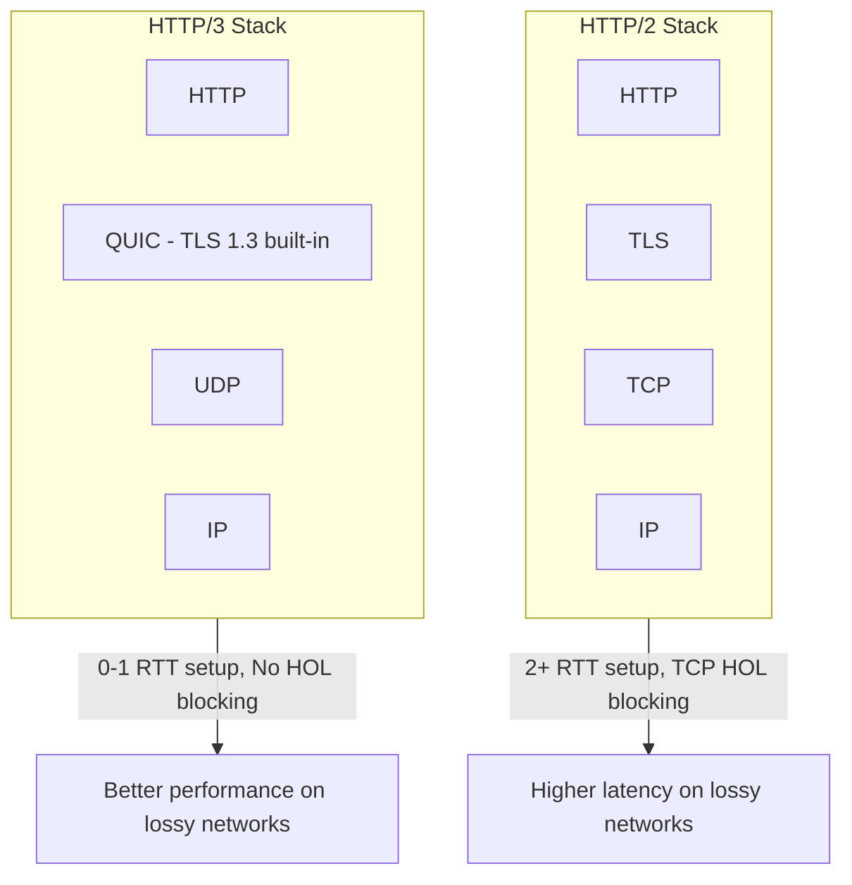

# HTTP/3

## Definition
HTTP/3 is the third major version of HTTP, built on QUIC (Quick UDP Internet Connections) instead of TCP. It eliminates head-of-line blocking, reduces connection establishment latency, and improves performance on lossy networks.



## Real-World Example
**Google YouTube**: Uses QUIC/HTTP/3 for video streaming. On lossy networks (mobile, WiFi), QUIC provides 20-30% better video quality by avoiding TCP's head-of-line blocking and faster recovery from packet loss.

## Protocol Stack Comparison

```
HTTP/1.1 & HTTP/2:          HTTP/3:
┌──────────────────┐       ┌──────────────────┐
│      HTTP        │       │      HTTP        │
├──────────────────┤       ├──────────────────┤
│      TLS         │       │      QUIC        │
├──────────────────┤       │  (TLS 1.3 built  │
│      TCP         │       │      in)         │
├──────────────────┤       ├──────────────────┤
│      IP          │       │      UDP         │
└──────────────────┘       ├──────────────────┤
                            │      IP          │
                            └──────────────────┘
```

## Key Features

### 1. 0-RTT Connection Establishment
```
TCP + TLS 1.3 (HTTP/2):
  ┌──┐  ┌──┐  ┌──┐  ┌──┐
  │SYN│  │ACK│  │   │  │
  │──►│  │◄─│  │   │  │
  │   │  │   │  │C/H│  │
  │   │  │   │──►│   │
  │   │  │   │   │S/H│
  │   │  │   │◄──│   │
  └──┘  └──┘  └──┘  └──┘
  1 RTT  1 RTT = 2 RTT total

QUIC (HTTP/3) first connection:
  ┌──┐  ┌──┐
  │   │  │   │
  │   │  │   │
  │C/H│  │S/H│
  │──►│  │◄──│
  └──┘  └──┘
  1 RTT total

QUIC (HTTP/3) resumed:
  ┌──┐  ┌──┐
  │   │  │   │  Data in first
  │   │  │   │  packet!
  │0-R│  │D+A│
  │TT │──►│   │
  └──┘  └──┘
  0 RTT!
```

### 2. No Head-of-Line Blocking
```
HTTP/2 over TCP:
  Stream 1: [  data 1  ]
  Stream 2: [  data 2  ]  ← LOST PACKET
  Stream 3: [  data 3  ]
  
  All streams BLOCKED waiting for Stream 2 retransmit
  ──► Head-of-line blocking

HTTP/3 over QUIC:
  Stream 1: [  data 1  ]
  Stream 2: [  data 2  ]  ← LOST PACKET
  Stream 3: [  data 3  ]
  
  Stream 1: ✓  Stream 2: ⏳  Stream 3: ✓
  Only Stream 2 blocks — Streams 1 and 3 proceed!
```

### 3. Connection Migration
```
TCP:
  IP: 192.168.1.5 ──► Connection Dies
  Phone switches from WiFi to 5G
  All TCP connections break ──► Re-establish everything

QUIC:
  Connection ID: ABC123 ──► Survives
  IP changes but Connection ID stays the same
  ──► Seamless handover, no interruption
```

### 4. Improved Loss Recovery
```
TCP:
  Retransmit timeout (RTO): minimum 200ms
  Losing one packet = 200ms+ delay

QUIC:
  Faster loss detection (monotonic packet numbers)
  More accurate RTT calculation
  No ambiguity from retransmission
  ~50% faster recovery than TCP
```

## HTTP/2 vs HTTP/3

| Feature | HTTP/2 | HTTP/3 |
|---------|--------|--------|
| Transport | TCP | QUIC (UDP) |
| HOL blocking | Yes (TCP level) | No |
| Connection setup | 2+ RTT | 0-1 RTT |
| Connection migration | No | Yes |
| Encryption | Optional (TLS) | Mandatory (built-in) |
| Loss recovery | TCP RTO | Improved QUIC |
| Stream multiplexing | Yes | Yes (better) |
| Adoption | 40%+ of web | 30%+ and growing |

## QUIC Details

### Packet Format
```
┌──────────────────────────────────────────────┐
│              QUIC Packet                      │
├──────────────────────────────────────────────┤
│  Header (Flag + Version + DCID + SCID)       │
├──────────────────────────────────────────────┤
│  Frame 1: Stream Data (Stream ID + Offset)   │
│  Frame 2: ACK (Largest Acked + Delay)        │
│  Frame 3: Stream Data (Stream ID + Offset)   │
│  ...                                          │
├──────────────────────────────────────────────┤
│  Authentication Tag (AEAD)                   │
└──────────────────────────────────────────────┘
```

### QUIC Frames
| Frame Type | Purpose |
|------------|---------|
| STREAM | Application data on a stream |
| ACK | Acknowledgment of received packets |
| CRYPTO | TLS handshake data |
| NEW_CONNECTION_ID | Connection migration |
| PING | Liveness check |
| HANDSHAKE_DONE | Handshake completion |

## Advantages
- Eliminates TCP-level HOL blocking
- 0-RTT connection establishment
- Connection migration across networks
- Better performance on lossy networks
- Built-in encryption (always-on)
- Faster loss detection and recovery

## Disadvantages
- UDP-based (firewalls may block)
- Higher CPU usage (encryption in userspace)
- Less mature ecosystem
- Debugging/tooling less mature
- NAT issues with connection migration

## Adoption Status (2024)

| Entity | HTTP/3 Support |
|--------|---------------|
| Google Services | ✅ (YouTube, Search, Gmail) |
| Facebook/Meta | ✅ |
| Cloudflare | ✅ (default) |
| Fastly | ✅ |
| Nginx | ✅ (since 1.25) |
| CDNs | ✅ (CloudFront, Cloudflare) |
| ~30% of top websites | ✅ Enabled |

## Interview Questions
1. How does QUIC solve TCP's head-of-line blocking?
2. Compare HTTP/2 and HTTP/3 performance on mobile networks
3. How does 0-RTT connection establishment work in HTTP/3?
4. What is connection migration and why is it useful?
5. Why did Google choose UDP as the basis for QUIC?
