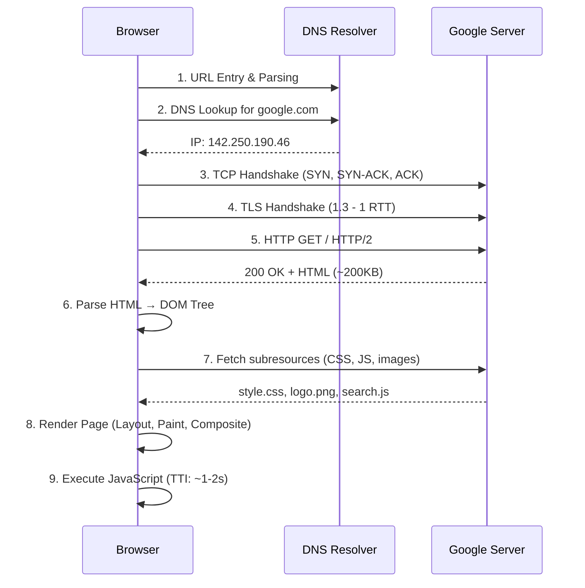

# How a Browser Loads Google.com

> A complete step-by-step walkthrough of what happens when you type "google.com" and press Enter.

## Overview



## Step 1: URL Entry & Parsing

```
┌─────────┐   ┌─────────┐   ┌─────────┐   ┌─────────┐   ┌─────────┐
│  URL    │──►│  DNS    │──►│  TCP    │──►│  TLS    │──►│  HTTP   │
│  Entry  │   │  Lookup │   │  Connect│   │  Hand   │   │  Req/Res│
│         │   │         │   │         │   │  Shake  │   │         │
└─────────┘   └─────────┘   └─────────┘   └─────────┘   └─────────┘

┌─────────┐   ┌─────────┐   ┌─────────┐
│  Parse  │──►│  Render │──►│  Done!  │
│  HTML   │   │  Page   │   │         │
└─────────┘   └─────────┘   └─────────┘
```

## Step 1: URL Entry & Parsing

```
1. User types "google.com" in address bar
2. Browser parses:
   - Protocol: https
   - Host:     google.com
   - Port:     443 (default for HTTPS)
   - Path:     /
3. Browser checks for HSTS preload list
   → google.com is on it → MUST use HTTPS
```

## Step 2: DNS Resolution

```
Browser calls: getaddrinfo("google.com", "443")

1. Browser Cache Check:
   - Has "google.com" been resolved recently?
   - If yes: use cached IP (fastest path)
   - If no: continue

2. OS Cache Check:
   - Windows: ipconfig /displaydns
   - Linux/macOS: nscd or systemd-resolved
   - If no: continue

3. Router Cache:
   - Some routers cache DNS
   - If no: continue

4. ISP Resolver (Recursive Resolver):
   - Typically: ISP's DNS server
   - Or: 8.8.8.8 (Google), 1.1.1.1 (Cloudflare)
   - If no cache: start recursion

5. DNS Recursion (Resolved Query):
   a. Root Server (.) ── "who manages .com?"
      → Returns .com TLD server addresses

   b. TLD Server (.com) ── "who manages google.com?"
      → Returns google.com authoritative nameservers
      → ns1.google.com, ns2.google.com, ns3.google.com, ns4.google.com
   
   c. Authoritative Nameserver (ns1.google.com):
      → Returns A record: 142.250.190.46 (IPv4)
      → Also returns AAAA record (IPv6)

6. Response travels back:
   ns1.google.com → ISP Resolver → Router → OS → Browser

   Total: 50-200ms (if nothing cached)
```

## Step 3: TCP Connection (3-Way Handshake)

```
Browser (192.0.2.1:54321)  ↔  Server (142.250.190.46:443)

1. SYN:
   Browser sends TCP SYN packet
   ──► "I want to connect, sequence=1000"

2. SYN-ACK:
   Server responds
   ◄── "Okay, sequence=5000, ack=1001"

3. ACK:
   Browser sends ACK
   ──► "ack=5001, connection established!"

   Duration: ~1 RTT (10-50ms)
```

## Step 4: TLS Handshake

```
1. ClientHello:
   Browser sends:
   - TLS version (1.3)
   - Cipher suites (TLS_AES_128_GCM_SHA256, etc.)
   - Key share (public key for key exchange)

2. ServerHello:
   Google's server responds:
   - Chosen cipher suite
   - Key share
   - Certificate chain (google.com → GTS CA → GlobalSign Root)
   - Certificate verify

3. Certificate Validation:
   Browser checks:
   - Not expired ❓
   - Signed by trusted CA ❓
   - Domain matches google.com ❓
   - Not revoked (OCSP or CRL) ❓
   
   ✓ Green padlock

4. Key Exchange:
   - Browser computes shared secret
   - Both derive session keys
   - "Finished" messages exchanged (encrypted)

5. Secure Connection:
   Duration: 1 RTT (TLS 1.3)
   Now all data is encrypted
```

## Step 5: HTTP Request & Response

```
1. HTTP Request:
   :method = GET
   :path = /
   :authority = google.com
   :scheme = https
   accept = text/html
   user-agent = Mozilla/5.0
   cookie = ...

2. Google's Frontend Load Balancer (GFE):
   - Terminates TLS
   - Routes to appropriate backend
   - May add/remove headers
   - Rate limiting, WAF checks

3. Response:
   :status = 200
   content-type = text/html; charset=UTF-8
   cache-control = private, max-age=0
   set-cookie = ...
   transfers-encoding = chunked
   
   Body: ~200KB of HTML (gzipped)
```

## Step 6: Parse HTML

```
Browser receives HTML and begins parsing:

1. Builds DOM Tree:
   <html>
     <head>
       <title>Google</title>
       <link rel="stylesheet" href="/style.css">
     </head>
     <body>
       
       <input type="text" name="q">
       <script src="/search.js"></script>
     </body>
   </html>

2. Encounter <link rel="stylesheet"> → Fetch /style.css
3. Encounter  → Fetch /logo.png
4. Encounter <script> → Fetch /search.js
```

## Step 7: Subresource Loading

```
Browser discovers and fetches additional resources:

Resource              Size     Priority
HTML (google.com)     ~200KB  Highest
/style.css            ~20KB   High (render-blocking)
/logo.png             ~15KB   Medium
/favicon.ico          ~5KB    Low
/search.js            ~50KB   Low (deferred)
/analytics.js         ~30KB   Low

Each fetch may go through:
- Service Worker (if registered)
- Browser cache → If cached, skip network
- HTTP/2 multiplexing (single connection)
- CDN edge for cached assets
```

## Step 8: Render Page

```
1. CSSOM (CSS Object Model):
   - Parse /style.css into CSS rules
   - Apply cascade, specificity, inheritance

2. Render Tree:
   - Combine DOM + CSSOM
   - Only visible elements
   - Compute styles for each node

3. Layout (Reflow):
   - Calculate positions and sizes
   - "Where does the search box go?"
   - "How big is the logo?"

4. Paint:
   - Convert to pixels
   - Layers, text, colors, images

5. Compositing:
   - Combine layers
   - GPU acceleration
   - Display on screen

   First paint: ~300-500ms from navigation start
   First contentful paint: ~500-800ms
   Fully loaded: ~1-2s
```

## Step 9: JavaScript Execution

```
1. Parse /search.js
2. Execute:
   - Setup event listeners (keypress, click)
   - Autocomplete initialization
   - Analytics tracking
   - Search suggestions
   
3. Deferred/async scripts execute after page load

4. Page is fully interactive:
   Time to Interactive (TTI): ~1-2s
```

## Complete Timeline

```
Event                              Time (ms)
─────────────────────────────────────────────
User presses Enter                       0
DNS lookup                         50-200
TCP handshake                       10-50
TLS handshake                       20-50
HTTP request                        1-5
Server processing                   50-200
Response download                  50-200
HTML parsing                        20-50
CSS fetch + parse                   30-80
Image fetch                         50-100
JS fetch + execute                 100-300
First paint                        300-500
Fully loaded                      1000-2000

Total: ~1-2 seconds (varies by network speed)
```

## Network Diagram

```
┌──────────┐    ┌──────────┐    ┌──────────┐
│  Browser  │───►│  ISP     │───►│  Root    │
│  (Client) │    │  Router  │    │  Server  │
└─────┬─────┘    └──────────┘    └──────────┘
      │                                   
      │  ┌──────────────────────────────┐
      │  │       Google Infrastructure  │
      ├──┤                              │
      │  │  GFE (Load Balancer)         │
      │  │         │                    │
      │  │    Google Frontend           │
      │  │         │                    │
      │  │  ┌──────┴──────┐            │
      │  │  │ Search      │ Index      │
      │  │  │ Backend     │ Servers    │
      │  │  └─────────────┘            │
      │  │                              │
      └──┤                              │
         └──────────────────────────────┘
```

## Interview Questions
1. Walk through the full process from URL entry to page render
2. What happens first: DNS lookup or TCP connection?
3. How does the browser know to use HTTPS for google.com?
4. What causes the most delay in page loading?
5. How would you optimize this process for faster loading?
