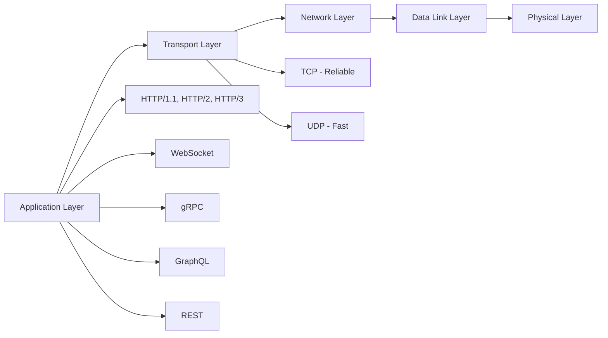

# 02 — Networking

> The backbone of distributed systems. Understand how data moves across the internet.

## Topics

| # | Topic | Description |
|---|-------|-------------|
| 1 | [OSI Model](01-osi-model.md) | 7-layer network architecture |
| 2 | [TCP](02-tcp.md) | Reliable, connection-oriented protocol |
| 3 | [UDP](03-udp.md) | Lightweight, connectionless protocol |
| 4 | [HTTP](04-http.md) | The foundation of web communication |
| 5 | [HTTPS & TLS](05-https-tls.md) | Encrypted web communication |
| 6 | [REST](06-rest.md) | Architectural style for APIs |
| 7 | [GraphQL](07-graphql.md) | Query language for APIs |
| 8 | [gRPC](08-grpc.md) | High-performance RPC framework |
| 9 | [DNS](09-dns.md) | Translating domains to IP addresses |
| 10 | [CDN](10-cdn.md) | Content delivery at the edge |
| 11 | [WebSocket](11-websocket.md) | Real-time bidirectional communication |
| 12 | [HTTP/2](12-http2.md) | Modern HTTP improvements |
| 13 | [HTTP/3](13-http3.md) | The future of HTTP over QUIC |
| 14 | [How Browser Loads Google.com](14-how-browser-loads-google.md) | Step-by-step deep dive |

## Quick Reference



```
OSI Layers:       Physical → Data Link → Network → Transport → Session → Presentation → Application
TCP:              Connection-oriented, reliable, ordered
UDP:              Connectionless, fast, loss-tolerant
HTTP Methods:     GET, POST, PUT, DELETE, PATCH, HEAD, OPTIONS
Status Codes:     1xx Info, 2xx Success, 3xx Redirect, 4xx Client Error, 5xx Server Error
DNS Record Types: A, AAAA, CNAME, MX, NS, TXT
```

## Key Comparisons

| Protocol | Transport | Use Case |
|----------|-----------|----------|
| HTTP/1.1 | TCP | Traditional web |
| HTTP/2 | TCP | Modern web, multiplexed |
| HTTP/3 | QUIC (UDP) | Low-latency streaming |
| gRPC | HTTP/2 | Microservices communication |
| WebSocket | TCP | Real-time apps |
| GraphQL | HTTP | Flexible data fetching |

## Interview Questions

1. Walk through what happens when you type google.com in a browser
2. Compare TCP and UDP with use cases
3. How does TLS handshake work?
4. What problems does HTTP/2 solve vs HTTP/1.1?
5. How does DNS resolution work step by step?

---

Previous: [01 — Computer Science Fundamentals](../01-Computer-Science-Fundamentals/README.md)
Next: [03 — Linux](../03-Linux/README.md)
