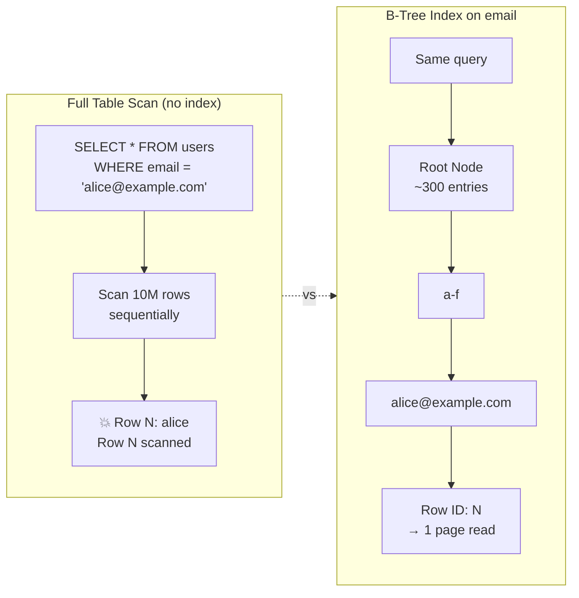

# Indexing

## Definition
Indexing is a data structure technique that improves the speed of data retrieval operations on a database. An index creates a separate lookup structure that allows the database to find rows without scanning the entire table.

## Real-World Example
**Amazon's product search**: Without indexes, searching for "wireless headphones" would scan millions of products row by row. With a B-tree index on product name and category, Amazon finds matching products in milliseconds.

## How Indexes Work



## Index Types

### B-Tree Index (Default)
```
Default for most relational databases.
Balanced tree structure for equality and range queries.

Properties:
  - O(log N) search, insert, delete
  - Good for small to large ranges
  - Handles duplicates
  - Stores values in order
```

### Hash Index
```
Hash(key) → bucket → row pointer

Properties:
  - O(1) for equality lookups
  - No range query support
  - No ordering
  - Collision handling needed
```

### Bitmap Index
```
Gender:
  M: [1,0,0,1,0,1,0,0,1,1,...]
  F: [0,1,1,0,1,0,1,1,0,0,...]

Properties:
  - Very efficient for low-cardinality columns
  - Fast AND/OR operations
  - Used in data warehouses
```

### GiST/GIN Indexes (PostgreSQL)
```
GiST: Geospatial, full-text, range types
GIN: Arrays, JSONB, full-text search
```

## Clustered vs Non-Clustered

```
Clustered Index (InnoDB):
  Data is physically ordered by index key.
  Only one per table.
  
  [Primary key index stores entire row]
  id=1: [Alice, alice@x.com, ...]
  id=2: [Bob, bob@x.com, ...]
  id=3: [Charlie, charlie@x.com, ...]

Non-Clustered Index (most indexes):
  Index stores key + pointer to row.
  Many per table.
  
  [email index stores {email, pointer to row}]
  alice@x.com → id=1
  bob@x.com → id=2
  charlie@x.com → id=3
```

## Composite Index

```sql
-- Index on (country, status, created_at)
CREATE INDEX idx_orders_lookup 
ON orders (country, status, created_at);

-- Good queries (leftmost prefix):
WHERE country = 'US' AND status = 'active'
WHERE country = 'US' AND status = 'active' AND created_at > '2023-01-01'
WHERE country = 'US'

-- Bad queries (missing leftmost column):
WHERE status = 'active'  -- can't use the index!
WHERE created_at > '2023-01-01'  -- can't use the index!
```

## Indexing Best Practices

| Do | Don't |
|----|-------|
| Index columns used in WHERE | Index every column blindly |
| Index foreign keys (joins) | Index low-selectivity columns (boolean, gender) |
| Cover frequently used queries | Index columns rarely queried |
| Use composite indexes for multi-column queries | Over-index (slows writes) |
| Monitor index usage (pg_stat_user_indexes) | Create redundant indexes |
| Consider partial indexes for subsets | Index very large text columns |

## Index Maintenance

```
PostgreSQL: VACUUM, ANALYZE, REINDEX
MySQL:      OPTIMIZE TABLE, ALTER TABLE ... DROP/ADD INDEX
MongoDB:    createIndex(), dropIndex(), reIndex()

Monitor:
  - Index size vs table size
  - Index hit rate
  - Unused indexes
  - Bloat (fragmentation)
```

## Diagram: Index Impact

```
Query Performance vs Table Size
Time
 ▲
 │  Full Table Scan: O(N)
 │              ◄───►
 │     Indexed: O(log N)
 │    ◄──────►
 │
 └──────────────────────► Table Size

Full scan degrades linearly.
Index scan stays near constant.
```

## Interview Questions
1. How does a B-tree index work internally?
2. What is the leftmost prefix rule for composite indexes?
3. When would an index not be used by the query planner?
4. What's the difference between clustered and non-clustered indexes?
5. How do you monitor and analyze index performance?
