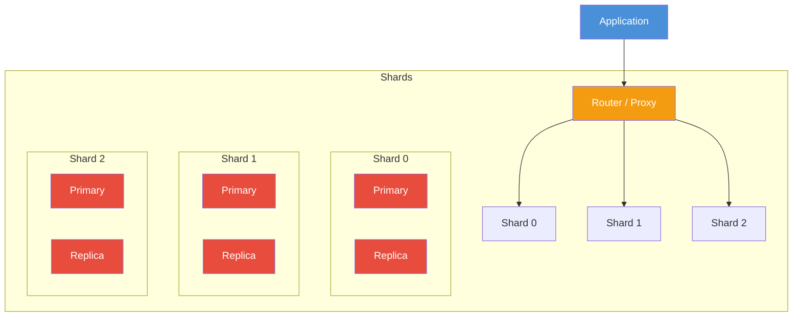

# Sharding

## Definition
Sharding is a database architecture pattern that horizontally partitions data across multiple database instances. Each shard holds a subset of the data and operates as an independent database.

## Real-World Example
**Pinterest**: Sharded their MySQL database across thousands of servers to handle 400M+ monthly active users. Each shard handles a range of user IDs, allowing the platform to scale linearly by adding more shards.

## Sharding Strategies

### 1. Key-Based (Hash) Sharding
```
shard_id = hash(shard_key) % N

hash("user_12345") % 4 = 2 → Shard 2
hash("user_67890") % 4 = 0 → Shard 0

Pros:  Even distribution
Cons:  Resharding requires rehashing
```

### 2. Range-Based Sharding
```
Shard 0: user_id 1-1,000,000
Shard 1: user_id 1,000,001-2,000,000
Shard 2: user_id 2,000,001-3,000,000

Pros:  Range queries efficient, easy to add shards
Cons:  Hotspots (new users → last shard)
```

### 3. Directory-Based Sharding
```
Lookup table: shard_key → shard_id

user_12345 → Shard 3
user_67890 → Shard 1

Pros:  Flexible, can move data
Cons:  Single point of failure (directory)
```

### 4. Geographic Sharding
```
US users → Shard in us-east-1
EU users → Shard in eu-west-1
APAC users → Shard in ap-south-1

Pros:  Data locality, compliance
Cons:  Cross-region queries slow
```

## Sharding Architecture



## Implementation Approaches

### Application-Level
```python
def get_shard(user_id):
    shard_id = hash(user_id) % NUM_SHARDS
    return shard_connections[shard_id]

# Route query to correct shard
shard = get_shard(user_id)
results = shard.query("SELECT * FROM users WHERE id = ?", user_id)
```

### Proxy-Based (Vitess, ProxySQL)
```
Application → MySQL Protocol → Vitess → Shard 0
                                    → Shard 1
                                    → Shard 2
```

### Database-Native (MongoDB, Cassandra)
```
MongoDB: mongos routes to correct shard
Cassandra: Driver token-aware routing
```

## Challenges

| Challenge | Description | Mitigation |
|-----------|-------------|------------|
| **Resharding** | Changing number of shards | Consistent hashing, live migration |
| **Cross-shard queries** | JOIN/aggregate across shards | Scatter-gather, avoid joins |
| **Transactions** | ACID across shards | Distributed transactions, 2PC |
| **Shard key selection** | Hotspots from poor key choice | Composite keys, hash sharding |
| **Backup/recovery** | Per-shard backup complexity | Individual shard backups |
| **Auto-increment** | Global unique IDs across shards | Snowflake IDs, UUIDs |

## Consistent Hashing

```mermaid
graph LR
    subgraph Ring["Consistent Hash Ring [0, 2^32 - 1]"]
        A[Node A] --> B[Node B]
        B --> C[Node C]
        C --> A
        
        K1[Key K1] -.->|hash(K1)=nearest| B
        K2[Key K2] -.->|hash(K2)=nearest| C
        K3[Key K3] -.->|hash(K3)=nearest| A
        
        ND[New Node D] -.->|inserted between C and A| Ring
        NO[Keys between C and D<br/>move to D, rest stay] -.-> ND
    end
    
    style A fill:#4a90d9,color:#fff
    style B fill:#50c878,color:#fff
    style C fill:#e74c3c,color:#fff
    style ND fill:#f1c40f,color:#333
```

## Sharding Key Selection

| Criterion | Good | Bad |
|-----------|------|-----|
| **Cardinality** | High (user_id, order_id) | Low (country, status) |
| **Distribution** | Even (hash of ID) | Skewed (celebrity user) |
| **Access pattern** | Matches common queries | Doesn't match queries |
| **Immutable** | User ID (never changes) | Email (changes allowed) |
| **Join-friendly** | Same key joins across tables | Different keys per table |

## Interview Questions
1. How do you choose a sharding key?
2. What problems occur with cross-shard queries?
3. How do you reshard a database with zero downtime?
4. Compare application-level sharding vs proxy-based sharding
5. How does consistent hashing help with shard rebalancing?
