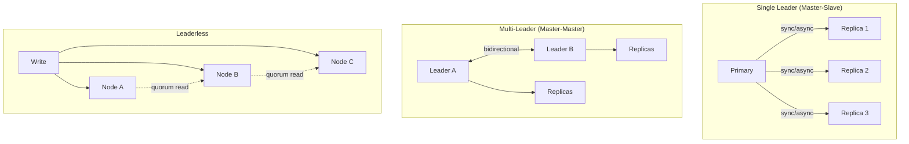

# Database Replication

## Definition
Database replication is the process of copying data from one database server to another to ensure redundancy, improve read performance, and provide disaster recovery.

## Real-World Example
**Amazon RDS Multi-AZ**: Automatically creates and maintains a synchronous standby replica in a different Availability Zone. If the primary fails, Amazon automatically fails over to the standby with minimal downtime.

## Replication Topologies



## Sync vs Async

```
Synchronous:
  Write ──► Primary ──► Replica 1 ──ack─► Commit
  │  Data guaranteed on both nodes         │
  └── Higher latency, stronger consistency ┘

Asynchronous:
  Write ──► Primary ──► Commit ──► Client
              │ (background)
              ▼
           Replica 1 (may be behind)

  ┌── Lower latency, eventual consistency ──┘
```

## Replication Methods

| Method | How It Works | Example |
|--------|-------------|---------|
| **Statement-based** | Replicate SQL statements | MySQL (SBR) |
| **WAL shipping** | Replicate write-ahead log | PostgreSQL |
| **Logical replication** | Decode WAL to row changes | PostgreSQL, MySQL |
| **Trigger-based** | Custom triggers capture changes | Slony, Londiste |
| **Log-based** | Read DB transaction logs | Oracle GoldenGate |

## Diagram: Streaming Replication (PostgreSQL)

```
Primary                            Standby
┌──────────────┐                  ┌──────────────┐
│  WAL Writer   │──WAL record──►│  WAL Receiver │
└──────────────┘                  └──────┬───────┘
                                         │
                                    ┌────▼───────┐
                                    │  WAL Apply  │
                                    └────────────┘
```

## Interview Questions
1. Compare synchronous and asynchronous replication
2. How does multi-leader replication handle write conflicts?
3. What replication strategy would you use for a global payment system?
4. How does replication lag affect read-your-writes consistency?
5. Design a replication strategy for a multi-region database
