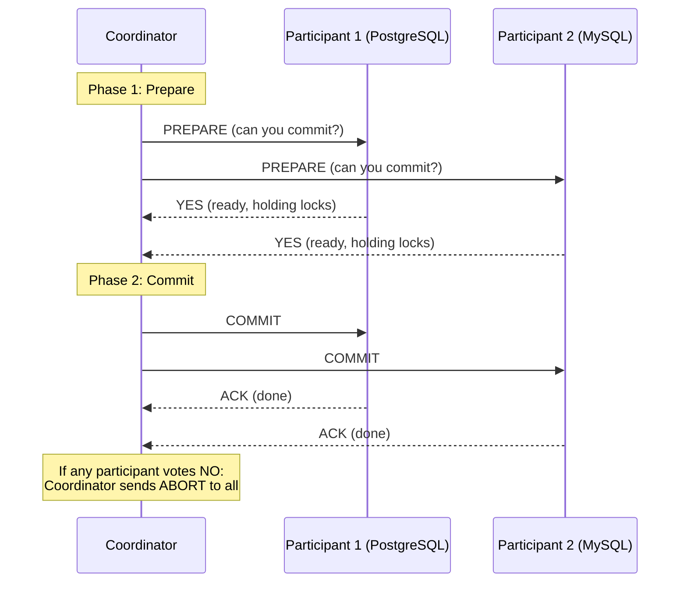

# Transactions

## Definition
A transaction is a sequence of database operations treated as a single logical unit of work. Either all operations complete successfully (commit) or none are applied (rollback).

## Real-World Example
**Bank transfer**: Transferring $100 from Account A to Account B requires:
1. Debit $100 from Account A
2. Credit $100 to Account B

If step 1 succeeds but step 2 fails, the transaction rolls back both operations.

## Transaction Example

```sql
BEGIN;
  UPDATE accounts SET balance = balance - 100 WHERE id = 1;
  UPDATE accounts SET balance = balance + 100 WHERE id = 2;
COMMIT;

-- If error occurs before COMMIT:
ROLLBACK;  -- Both changes undone
```

## ACID Properties

| Property | Description |
|----------|-------------|
| **Atomicity** | All or nothing — transaction completes fully or not at all |
| **Consistency** | Transaction brings database from valid state to valid state |
| **Isolation** | Concurrent transactions don't interfere with each other |
| **Durability** | Committed transactions survive system failures |

## Isolation Levels

| Level | Dirty Read | Non-repeatable Read | Phantom Read |
|-------|-----------|---------------------|--------------|
| **Read Uncommitted** | Possible | Possible | Possible |
| **Read Committed** | Prevented | Possible | Possible |
| **Repeatable Read** | Prevented | Prevented | Possible |
| **Serializable** | Prevented | Prevented | Prevented |

### Phenomena Explained

```
Dirty Read:
  Transaction A: UPDATE balance = 200 WHERE id = 1
  Transaction B: SELECT balance FROM accounts WHERE id = 1  → reads 200
  Transaction A: ROLLBACK
  -- B read uncommitted data that never existed!

Non-repeatable Read:
  Transaction A: SELECT balance FROM accounts WHERE id = 1  → reads 100
  Transaction B: UPDATE balance = 200 WHERE id = 1; COMMIT
  Transaction A: SELECT balance FROM accounts WHERE id = 1  → reads 200 (different!)
  -- A read different values in same transaction

Phantom Read:
  Transaction A: SELECT * FROM accounts WHERE balance > 100  → 5 rows
  Transaction B: INSERT INTO accounts (balance) VALUES (150); COMMIT
  Transaction A: SELECT * FROM accounts WHERE balance > 100  → 6 rows (phantom!)
  -- New rows appeared in A's second read
```

## Distributed Transactions

### Two-Phase Commit (2PC)


```

### Saga Pattern
```
Order Service ──► Create Order ──► OK
Payment Service ──► Process Payment ──► OK
Inventory Service ──► Reserve Item ──► Failed!
                    │
                    ▼
              Compensating Actions:
              Payment Service ──► Refund
              Order Service ──► Cancel Order
```

## Concurrency Control

### Optimistic Locking
```sql
UPDATE accounts 
SET balance = 200, version = version + 1
WHERE id = 1 AND version = 5;

-- If version changed (concurrent update), 0 rows affected
-- Application retries
```

### Pessimistic Locking
```sql
BEGIN;
SELECT * FROM accounts WHERE id = 1 FOR UPDATE;
-- Lock held until COMMIT/ROLLBACK
UPDATE accounts SET balance = 200 WHERE id = 1;
COMMIT;
```

## Interview Questions
1. What are the ACID properties and why are they important?
2. Explain the differences between isolation levels
3. How does two-phase commit work and what are its drawbacks?
4. What is the Saga pattern and when would you use it?
5. Compare optimistic and pessimistic locking
