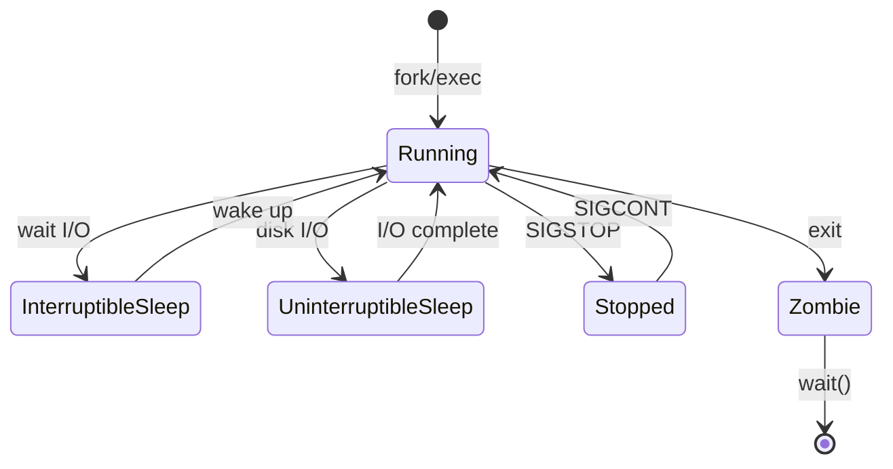

# 02 — Process Management

## What is it?

A **process** is an instance of a running program with its own address space, file descriptors, and execution context. A **thread** is a lightweight unit of execution within a process that shares the process's address space. Linux uses the `task_struct` kernel data structure to manage both.

## Why it matters for Cloud/DevOps

- Application servers (Nginx, Tomcat, uWSGI) are processes you must monitor and control
- Horizontal scaling decisions depend on per-process resource consumption
- Container runtimes create process trees; orphan/zombie processes waste resources
- systemd is the init system on nearly all modern Linux distributions — it manages services, which are the building blocks of cloud deployments



## Key Concepts

### Process States

| State | Meaning |
|-------|---------|
| R | Running or runnable (on run queue) |
| S | Interruptible sleep (waiting for event) |
| D | Uninterruptible sleep (usually I/O) |
| Z | Zombie (terminated, waiting for parent to reap) |
| T | Stopped (by SIGSTOP) |
| X | Dead (should not be visible) |

### Inspecting Processes

```bash
# ps — snapshot of processes
ps aux                       # All processes, BSD style
ps -ef                       # All processes, Unix style
ps -eo pid,ppid,cmd,%mem,%cpu --sort=-%mem  # Custom format, sorted by memory

# top / htop — interactive monitoring
top                          # Real-time view (press: M=sort by mem, P=sort by cpu, k=kill)
htop                         # Enhanced version with color, scroll, mouse support

# Process tree
pstree -p                    # Tree with PIDs
```

### Signals

```bash
kill -15 <PID>               # SIGTERM — graceful shutdown (default)
kill -9 <PID>                # SIGKILL — immediate kill (cannot be caught)
kill -2 <PID>                # SIGINT — interrupt (like Ctrl+C)
kill -1 <PID>                # SIGHUP — reload config / hangup
kill -3 <PID>                # SIGQUIT — quit with core dump
killall nginx                # Send signal to all nginx processes
pkill -f "python server"     # Kill by pattern matching command name
```

**Signal table:**

| Signal | Number | Action | Use case |
|--------|--------|--------|----------|
| SIGHUP | 1 | Term / reload | Daemons reload config |
| SIGINT | 2 | Term | Ctrl+C interrupt |
| SIGKILL | 9 | Term (force) | Kill unresponsive processes |
| SIGTERM | 15 | Term | Graceful shutdown |
| SIGSTOP | 19 | Stop | Pause a process |
| SIGCONT | 18 | Continue | Resume a stopped process |

### Process Priority (nice)

```bash
nice -n 10 ./slow-job       # Start with lower priority (higher niceness)
renice -n 5 -p 1234          # Change priority of running process
# Niceness range: -20 (highest priority) to 19 (lowest)
# Default: 0
```

### systemd (Service Manager)

```bash
# Service lifecycle
systemctl start nginx        # Start service
systemctl stop nginx         # Stop service
systemctl restart nginx      # Restart
systemctl reload nginx       # Reload config (SIGHUP)
systemctl enable nginx       # Start on boot
systemctl disable nginx      # Disable auto-start
systemctl status nginx       # Check status with logs

# Unit management
systemctl list-units --type=service  # List all services
systemctl daemon-reload               # Reload unit files after edit
systemctl cat nginx                   # Show unit file
systemctl edit nginx                  # Override unit config

# Journal (logging)
journalctl -u nginx          # Logs for nginx service
journalctl -u nginx -f       # Follow logs
journalctl -u nginx --since "1 hour ago"  # Time range
journalctl -p err -b         # All errors since last boot
```

### Zombie vs Orphan Processes

- **Zombie:** Process that has terminated but its parent has not called `wait()`. Shows as state `Z`. These are normal briefly; accumulating zombies indicates a buggy parent.
- **Orphan:** Process whose parent has exited. Adopted by init (PID 1 / systemd). Modern init systems reap orphans.

```bash
# Find zombies
ps aux | awk '$8=="Z"'
# Cannot kill zombies directly — fix the parent or restart it
```

## Commands Reference

| Command | What it does | Key flags |
|---------|-------------|-----------|
| `ps` | Process snapshot | `aux`, `-ef`, `-eo` |
| `top` | Interactive process monitor | `-u user`, `-p PID` |
| `htop` | Enhanced interactive monitor | Interactive mouse/keys |
| `kill` | Send signal to PID | `-9`, `-15`, `-1` |
| `killall` | Signal by name | `-r` regex |
| `pkill` | Signal by pattern | `-f` full cmd |
| `pgrep` | Find PID by name | `-u user`, `-x` exact |
| `nice` | Run with priority | `-n <value>` |
| `renice` | Change priority | `-n <value> -p <PID>` |
| `systemctl` | systemd control | `start`, `stop`, `status`, `enable`, `disable` |
| `journalctl` | Log viewer | `-u`, `-f`, `--since`, `-p` |
| `pstree` | Process tree | `-p` show PIDs, `-u` show uid changes |
| `strace` | Syscall trace | `-p PID`, `-e trace=network` |

## Interview Questions

**Q1:** What is the difference between SIGTERM and SIGKILL?  
**A:** SIGTERM (15) requests graceful termination — the process can catch it, clean up resources, save state, and exit. SIGKILL (9) is an immediate, uncatchable kill — the kernel terminates the process without giving it any chance to clean up. Always try SIGTERM first; only use SIGKILL for unresponsive processes.

**Q2:** What is a zombie process and how do you clean it up?  
**A:** A zombie is a terminated process whose exit status hasn't been read by its parent. It's already dead (consumes no memory/CPU) but still occupies a PID table entry. To clean: identify the parent with `ps -o ppid <zombie_pid>` and fix/restart the parent so it calls `wait()`. If the parent can't be fixed, restart it.

**Q3:** How does systemd improve over SysV init?  
**A:** systemd provides parallel service startup (vs sequential in SysV), dependency-based ordering, socket/timer activation (on-demand services), unified logging with journald, cgroup-based resource tracking, and declarative unit files instead of shell scripts.

**Q4:** What is PID 1 and why is it special?  
**A:** PID 1 is the init process (systemd or equivalent). It is the first process started by the kernel. It adopts orphaned processes. In containers, the process running as PID 1 must handle signals correctly — if it doesn't, `SIGTERM` may not propagate to child processes, causing slow shutdowns.

**Q5:** How does the OOM killer decide which process to kill?  
**A:** The kernel maintains an `oom_score` for each process, influenced by memory consumption (RSS, swap) and `oom_score_adj` (set by the admin). The process with the highest `oom_score` is killed. `/proc/<PID>/oom_score` and `/proc/<PID>/oom_score_adj` allow tuning.

## Cross-Links

- [03-memory-management.md](./03-memory-management.md) — OOM killer, RSS, virtual memory
- [09-containerization.md](./09-containerization.md) — PID namespaces, cgroups, signals in containers
- [08-Docker](../08-Docker/README.md) — Docker containers are processes with PID namespaces
- [15-SRE](../15-SRE/README.md) — Process monitoring, incident response
