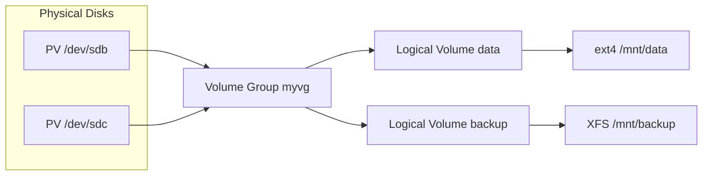

# 04 — File Systems

## What is it?

A file system controls how data is stored, organized, and retrieved on a storage device. The Linux Virtual File System (VFS) provides a common interface for multiple underlying file systems (ext4, XFS, Btrfs) so tools like `cp`, `mv`, and `ls` work uniformly regardless of the on-disk format.

## Why it matters for Cloud/DevOps

- Cloud volumes (EBS, persistent disks) sit atop file systems; choice affects performance and durability
- Backups, snapshots, and replication require understanding inodes and mount points
- LVM enables flexible volume management without downtime
- RAID provides data protection and/or performance — essential knowledge for storage engineering
- File system corruption recovery is a common production incident



## Key Concepts

### ext4 — The Default

ext4 is the default FS for most Linux distributions. It supports files up to 16 TB, volumes up to 1 exabyte, and introduces extents (contiguous block groups) for better performance.

```bash
# Create ext4
mkfs.ext4 /dev/sdb1

# Tune parameters
tune2fs -l /dev/sdb1         # View superblock info
tune2fs -m 1 /dev/sdb1       # Set reserved block % (default 5%)
dumpe2fs /dev/sdb1 | less    # Detailed group descriptors

# Check & repair
fsck.ext4 /dev/sdb1          # Filesystem check (unmount first!)
fsck -f /dev/sdb1            # Force check even if clean
```

### XFS — High Performance

XFS excels with large files and parallel I/O (used by RHEL/CentOS default). It supports online defragmentation and expanding.

```bash
mkfs.xfs /dev/sdc1
xfs_growfs /mount/point      # Grow filesystem (after LVM/partition expansion)
xfs_repair /dev/sdc1         # Repair (unmounted)
xfs_fsr /mount/point         # Online defrag
```

### Btrfs — Copy-on-Write

Btrfs offers snapshots, compression, checksumming, and self-healing (with RAID). Used by SUSE, optional on Ubuntu/Debian.

```bash
mkfs.btrfs /dev/sdd1

# Subvolumes & snapshots
btrfs subvolume create /mnt/data/@subvol
btrfs subvolume snapshot /mnt/data/@subvol /mnt/data/@snapshot

# Compression
mount -o compress=zstd /dev/sdd1 /mnt/data

# Scrub (verify data integrity)
btrfs scrub start /mnt/data
btrfs scrub status /mnt/data
```

### Inodes

An inode stores metadata about a file (permissions, ownership, timestamps, size, block pointers) but NOT its name. Directory entries map filenames to inodes.

```bash
stat file.txt                 # View inode metadata
ls -li                        # List with inode numbers
df -i /                       # Check inode usage (running out of inodes!)
find / -xdev -inum 123456     # Find file by inode number
```

### Hard Links vs Symbolic Links

```bash
ln file.txt hardlink.txt      # Hard link — same inode, same data
ln -s file.txt softlink.txt   # Symbolic link — points to path
```

| Feature | Hard Link | Symbolic Link |
|---------|-----------|---------------|
| Inode | Same as original | New inode |
| Cross-FS | No | Yes |
| Directories | No | Yes |
| Broken target | Data still exists | Dangling link |
| `ls -l` size | Same as original | Path string length |

### Mount Points

```bash
# Mount / unmount
mount /dev/sdb1 /mnt/data
mount -o ro /dev/sdb1 /mnt/data    # Read-only
umount /mnt/data                    # Unmount

# Persistent mount — edit /etc/fstab
echo "/dev/sdb1 /mnt/data ext4 defaults 0 2" >> /etc/fstab
mount -a                            # Mount all from fstab

# Bind mount (same FS, different path)
mount --bind /var/www /mnt/backup
```

### LVM — Logical Volume Manager

LVM adds a layer between physical disks and file systems, allowing resizing, snapshots, and striping without downtime.

```
Physical Volumes (PV) → Volume Group (VG) → Logical Volumes (LV) → FS
```

```bash
# Setup
pvcreate /dev/sdb /dev/sdc
vgcreate myvg /dev/sdb /dev/sdc
lvcreate -L 10G -n data myvg
mkfs.ext4 /dev/myvg/data
mount /dev/myvg/data /mnt/data

# Grow
lvextend -L +5G /dev/myvg/data              # +5 GB
resize2fs /dev/myvg/data                     # ext4 online grow
xfs_growfs /mnt/data                         # XFS grow

# Snapshots
lvcreate -L 1G -s -n data-snap /dev/myvg/data

# Striping
lvcreate -L 20G -i 2 -I 64 myvg  # Striped across 2 PVs
```

### RAID — Redundant Array of Independent Disks

| Level | Min Disks | Read | Write | Protection |
|-------|-----------|------|-------|------------|
| 0 | 2 | Fast | Fast | None |
| 1 | 2 | Normal | Normal | Mirror (1 disk) |
| 5 | 3 | Fast | Slow (parity) | 1 disk |
| 6 | 4 | Fast | Slowest | 2 disks |
| 10 | 4 | Fast | Fast | 1 per stripe |

```bash
# Software RAID with mdadm
mdadm --create /dev/md0 --level=5 --raid-devices=3 /dev/sd{b,c,d}
mkfs.ext4 /dev/md0
mount /dev/md0 /mnt/raid

# Monitor
mdadm --detail /dev/md0
cat /proc/mdstat                    # Real-time RAID status
```

## Commands Reference

| Command | What it does | Key flags |
|---------|-------------|-----------|
| `df` | Disk free | `-h` human, `-i` inodes, `-T` type |
| `du` | Disk usage | `-h`, `-s` summary, `-d 1` depth |
| `lsblk` | List block devices | `-f` FS info, `-t` topology |
| `blkid` | Block device attributes | UUID, LABEL, TYPE |
| `mount` | Mount FS | `-o` options, `-a` all fstab, `--bind` |
| `umount` | Unmount | `-l` lazy, `-f` force |
| `fdisk` | Partition table editor | `-l` list |
| `parted` | GPT partition tool | `mklabel`, `mkpart` |
| `mkfs.ext4` | Create ext4 | `-L` label, `-m` reserved |
| `tune2fs` | ext4 tuning | `-l`, `-m`, `-O` features |
| `fsck` | FS check | `-f` force, `-y` auto-yes |
| `pvcreate` / `vgcreate` / `lvcreate` | LVM tools | Various |
| `mdadm` | Software RAID | `--create`, `--detail`, `--manage` |

## Interview Questions

**Q1:** What happens when a file system runs out of inodes?  
**A:** You can't create new files or directories even if there's free disk space. `df -i` shows inode usage. This often happens with mail spools, caches with tiny files, or Docker overlay storage. To fix: delete many small files or reformat with `-i` (bytes-per-inode) set lower.

**Q2:** What is the difference between ext4 and XFS?  
**A:** ext4 is mature, ubiquitous, supports shrinking, good for general-purpose (boot partitions, small files). XFS excels with large files and high concurrency, supports online defrag, but cannot be shrunk. XFS is the default on RHEL/CentOS, ext4 on Debian/Ubuntu.

**Q3:** How does LVM differ from using raw partitions?  
**A:** LVM provides flexibility: resize volumes dynamically, add/remove physical disks, create snapshots for backups, and stripe across disks — all without unmounting. Raw partitions are fixed-size and require manual repartitioning to change.

**Q4:** Explain RAID 0 vs RAID 1 vs RAID 10.  
**A:** RAID 0 (striping) combines disks for speed but has no redundancy — losing one disk loses all data. RAID 1 (mirroring) duplicates data, tolerating one disk failure but halves usable capacity. RAID 10 (striped mirrors) requires 4+ disks, combining speed and fault tolerance (lose up to 1 disk per mirror).

**Q5:** What is the difference between a physical mount and a bind mount?  
**A:** A physical mount attaches a block device (or network FS) to a directory. A bind mount makes an already-mounted directory tree accessible at another location — it's the same data, same FS, just a different access path. Used for chroot jails, container rootfs, and namespace isolation.

## Cross-Links

- [01-linux-basics.md](./01-linux-basics.md) — basic file operations, permissions
- [03-memory-management.md](./03-memory-management.md) — page cache interacts with FS
- [08-Docker](../08-Docker/README.md) — OverlayFS union mounts, volume mounts
- [09-Kubernetes](../09-Kubernetes/README.md) — persistent volumes, CSI, storage classes
- [04-Databases](../04-Databases/README.md) — DB performance depends on FS choice
