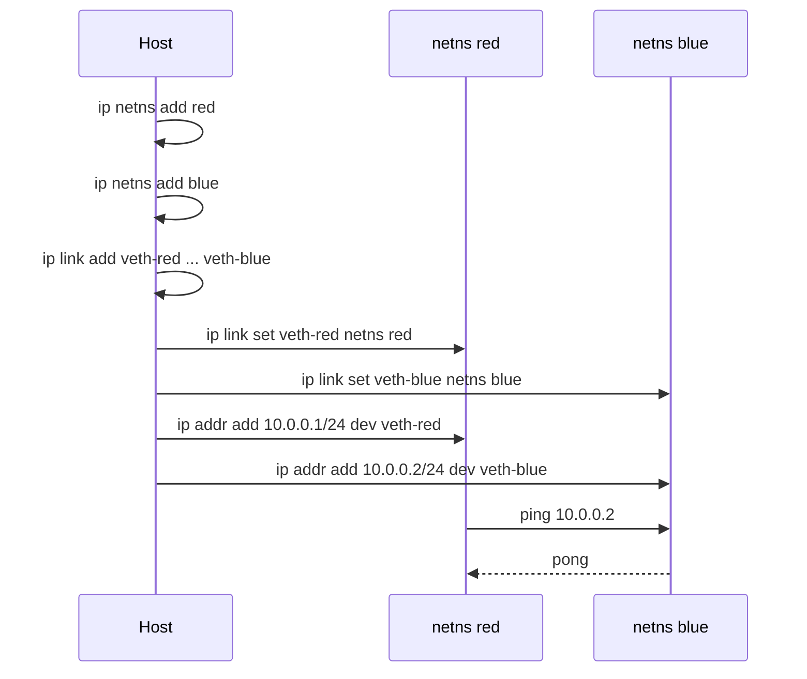

# 05 — Networking

## What is it?

Linux networking provides the TCP/IP stack, routing, firewalling, and virtualization (network namespaces, bridges, veth pairs) that underpin all cloud networking. The kernel handles packet processing, socket creation, and protocol implementation in the network stack.

## Why it matters for Cloud/DevOps

- Every service communicates over the network — diagnosing latency, drops, and errors requires CLI tools
- Firewall rules (iptables/nftables) are the first line of defense
- DNS resolution issues are a common cause of outages
- Network namespaces are the foundation of container networking (Docker, Kubernetes pods)
- Load balancers, service meshes, and SDN all extend Linux networking primitives



## Key Concepts

### Interface Configuration

```bash
# Legacy ifconfig (install net-tools)
ifconfig eth0
ifconfig eth0 192.168.1.10/24 up

# Modern ip command (iproute2)
ip addr show                  # All interfaces and addresses
ip addr add 192.168.1.10/24 dev eth0
ip link set eth0 up           # Bring interface up
ip link set eth0 down         # Bring interface down
ip route show                 # Routing table
ip route add default via 192.168.1.1
```

### Socket Statistics

```bash
# ss — modern replacement for netstat
ss -tulpn                     # All listening TCP/UDP sockets with process
ss -tua                       # All TCP and UDP connections
ss -i                         # TCP info (cwnd, rtt, etc.)
ss state time-wait            # Connections in TIME_WAIT

# Legacy netstat
netstat -tulpn
```

### Packet Capture

```bash
# tcpdump
tcpdump -i eth0               # Capture on interface
tcpdump -i eth0 port 80       # Filter by port
tcpdump -i eth0 host 10.0.0.1  # Filter by host
tcpdump -w capture.pcap       # Write to file for Wireshark
tcpdump -r capture.pcap       # Read from file
tcpdump -c 100                # Capture 100 packets then stop

# Filter expressions
tcpdump 'tcp[tcpflags] & tcp-syn != 0 and tcp[tcpflags] & tcp-ack == 0'  # SYN only
tcpdump 'icmp'                # ICMP (ping)
tcpdump 'port 53'             # DNS traffic
```

### Firewall (iptables/nftables)

```bash
# iptables
iptables -L -n -v             # List all rules
iptables -A INPUT -p tcp --dport 22 -j ACCEPT       # Allow SSH
iptables -A INPUT -p tcp --dport 80 -j ACCEPT       # Allow HTTP
iptables -P INPUT DROP        # Default policy: drop
iptables -A INPUT -m state --state ESTABLISHED,RELATED -j ACCEPT  # Allow established

# NAT (for containers / forwarding)
iptables -t nat -A POSTROUTING -o eth0 -j MASQUERADE  # SNAT for container traffic

# Modern nftables (replacement)
nft list ruleset
nft add rule inet filter input tcp dport 443 accept
```

### Connectivity Testing

```bash
# ping — basic reachability
ping -c 4 google.com

# nc — swiss-army knife for networking
nc -zv 10.0.0.1 22           # Port scan
nc -l -p 9000 > received      # Listen on port 9000, write to file
nc 10.0.0.1 9000 < file       # Send file

# curl — HTTP client
curl -v http://example.com    # Verbose with headers
curl -X POST -d '{"key":"val"}' -H "Content-Type: application/json" http://api.example.com
curl -o /dev/null -s -w "%{time_total}\n" http://example.com  # Response time

# mtr — traceroute + ping combined
mtr google.com
```

### DNS Resolution

```bash
# Resolution order
cat /etc/nsswitch.conf | grep hosts  # hosts: files dns
cat /etc/hosts                        # Static host definitions
cat /etc/resolv.conf                  # DNS resolver configuration

# `/etc/hosts` takes precedence over DNS by default
echo "127.0.0.1 myapp.local" >> /etc/hosts

# Check DNS resolution
host example.com
dig example.com
dig -x 8.8.8.8                  # Reverse DNS
nslookup example.com
```

### Network Namespaces

Network namespaces (netns) provide isolated network stacks — each namespace has its own interfaces, routes, firewall rules, and sockets. This is the foundation of container networking.

```bash
# Create namespaces
ip netns add red
ip netns add blue

# Create veth pair (virtual cable)
ip link add veth-red type veth peer name veth-blue

# Move ends into namespaces
ip link set veth-red netns red
ip link set veth-blue netns blue

# Configure inside namespaces
ip netns exec red ip addr add 10.0.0.1/24 dev veth-red
ip netns exec red ip link set veth-red up
ip netns exec blue ip addr add 10.0.0.2/24 dev veth-blue
ip netns exec blue ip link set veth-blue up

# Ping between namespaces
ip netns exec red ping 10.0.0.2

# Bridge (connect to host / external)
ip link add br0 type bridge
ip link set veth-red master br0   # Docker-style bridge networking
```

## Commands Reference

| Command | What it does | Key flags |
|---------|-------------|-----------|
| `ip` | Network config | `addr`, `link`, `route`, `netns` |
| `ss` | Socket stats | `-tulpn`, `-i`, `state` |
| `tcpdump` | Packet capture | `-i`, `-w`, `-r`, `-c` |
| `iptables` | Firewall | `-L -n -v`, `-A`, `-P`, `-t nat` |
| `nft` | Modern firewall | `list ruleset`, `add rule` |
| `nc` | Netcat | `-l`, `-z`, `-v` |
| `curl` | HTTP client | `-v`, `-X`, `-d`, `-o`, `-w` |
| `ping` | ICMP reachability | `-c`, `-i`, `-s` |
| `mtr` | Trace + ping | — |
| `dig` | DNS lookup | `+short`, `-x` reverse |
| `host` | DNS lookup | — |
| `arp` | ARP cache | `-a`, `-d` delete |
| `bridge` | Bridge management | `link`, `fdb` |
| `ethtool` | NIC driver info | `-i`, `-S` stats, `-k` offload |

## Interview Questions

**Q1:** What's the difference between `iptables` and `nftables`?  
**A:** `nftables` is the modern replacement for `iptables`. It uses a single framework (vs. separate tools for IPv4/IPv6/arp/bridge), compiles rules into a bytecode VM for better performance, supports sets and maps for efficient rule matching, and has a cleaner syntax. `iptables` is legacy but still widely used (and nftables provides an iptables-compat layer).

**Q2:** How does Docker use network namespaces and veth pairs?  
**A:** Each container gets its own network namespace. When Docker creates a container, it creates a veth pair — one end stays in the host (attached to `docker0` bridge), the other goes into the container's netns. Traffic flows: container eth0 ↔ veth-host ↔ docker0 bridge ↔ host iptables NAT ↔ physical network.

**Q3:** What is TIME_WAIT and when does it become a problem?  
**A:** TIME_WAIT is a TCP state that persists for 2×MSL (default ~60s) after closing a connection, ensuring delayed segments don't corrupt new connections. It becomes problematic on high-throughput servers (e.g., proxies, load balancers) handling millions of short-lived connections — each socket in TIME_WAIT consumes resources. Solutions: enable `net.ipv4.tcp_tw_reuse` for client sockets, or use connection pooling.

**Q4:** Explain the DNS resolution process step by step.  
**A:** Application calls `getaddrinfo()` → checks `/etc/nsswitch.conf` → reads `/etc/hosts` (if `files` listed before `dns`) → if no match, queries DNS resolver in `/etc/resolv.conf` → resolver queries root servers → TLD → authoritative → returns IP. Results are cached by nscd/systemd-resolved/dnsmasq.

**Q5:** How would you diagnose high network latency between two servers?  
**A:** Sequence: (1) `ping` for baseline RTT, (2) `mtr` to identify hop with latency/jump, (3) `ss -i` to check TCP retransmits and RTO, (4) `tcpdump` to capture and analyze packet timing/Wireshark, (5) `ethtool -S eth0 | grep error` for NIC errors, (6) check for packet drops with `ip -s link show`.

## Cross-Links

- [09-containerization.md](./09-containerization.md) — network namespaces, veth pairs
- [08-Docker](../08-Docker/README.md) — Docker bridge, overlay networks
- [09-Kubernetes](../09-Kubernetes/README.md) — CNI, pod networking, kube-proxy
- [15-SRE](../15-SRE/README.md) — network monitoring, incident diagnosis
