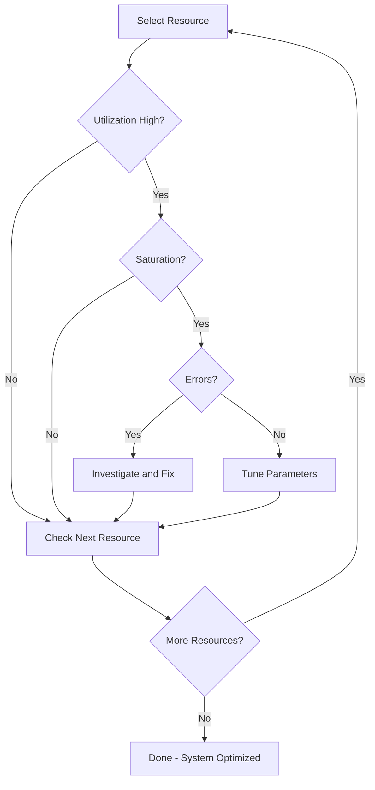

# 07 — Performance Tuning

## What is it?

Linux performance tuning involves adjusting kernel parameters, resource limits, and system settings to optimize throughput, latency, and resource utilization for specific workloads. It spans CPU scheduling, memory management, I/O subsystems, and network stack tuning.

## Why it matters for Cloud/DevOps

- Cloud instances have fixed resources; tuning maximizes what you get for your spend
- A single misconfigured kernel parameter (e.g., `net.core.somaxconn`) can cause production outages
- Performance regression analysis (sar, perf) is essential for post-mortems
- Database servers, web servers, and load balancers each require different tuning profiles
- Right-sizing EC2/GCP/Azure instances depends on understanding resource bottlenecks



## Key Concepts

### ulimit — User Limits

```bash
# View current limits
ulimit -a                     # All limits
ulimit -n                     # Open file descriptors
ulimit -u                     # Max user processes
ulimit -s                     # Stack size

# Set limits (soft/hard)
ulimit -n 65536               # Raise FD limit for current session

# Persistent — edit /etc/security/limits.conf
echo "* soft nofile 65536" >> /etc/security/limits.conf
echo "* hard nofile 65536" >> /etc/security/limits.conf

# System-wide FD limit
cat /proc/sys/fs/file-max     # Kernel max
echo 200000 > /proc/sys/fs/file-max
```

**Key limits for production workloads:**

| Limit | Default | Production | Why |
|-------|---------|------------|-----|
| `nofile` (FDs) | 1024 | 65536+ | Web servers open many sockets/files |
| `nproc` | unlimited | Depends | Prevent fork bombs |
| `stack` | 8192 KB | 8192 | Database threads may need more |
| `memlock` | 64 KB | unlimited | Required for huge pages (databases) |

### sysctl — Kernel Parameters

```bash
# View all parameters
sysctl -a

# Read specific parameter
sysctl net.core.somaxconn
cat /proc/sys/net/core/somaxconn

# Set temporarily
sysctl -w net.core.somaxconn=1024
sysctl -w vm.swappiness=10

# Persist — write to /etc/sysctl.conf or /etc/sysctl.d/
echo "net.core.somaxconn = 1024" >> /etc/sysctl.d/99-custom.conf
sysctl -p /etc/sysctl.d/99-custom.conf
```

**Essential tuning parameters:**

```bash
# Network — high-traffic web server
net.core.somaxconn = 1024              # Max listen backlog (default 128)
net.ipv4.tcp_tw_reuse = 1              # Reuse TIME_WAIT sockets (client side)
net.ipv4.tcp_fin_timeout = 15          # Reduce FIN-WAIT-2 timeout
net.core.rmem_max = 16777216           # Max receive buffer (16 MB)
net.core.wmem_max = 16777216           # Max send buffer
net.ipv4.tcp_rmem = 4096 87380 16777216  # TCP receive: min, default, max
net.ipv4.tcp_wmem = 4096 65536 16777216  # TCP send
net.ipv4.tcp_congestion_control = bbr  # Better throughput (kernel 4.9+)

# Memory — high-RAM database server
vm.swappiness = 10                     # Minimize swap
vm.dirty_ratio = 20                    # % of memory before pdflush starts
vm.dirty_background_ratio = 5          # Background writeback threshold
vm.overcommit_memory = 1               # Always overcommit (database workloads)
vm.nr_hugepages = 1024                 # Pre-allocate huge pages

# Kernel
kernel.pid_max = 65536                 # Max PIDs
fs.file-max = 2097152                  # Max file descriptors
```

### /proc Tuning

```bash
# Many sysctl params are directly writable through /proc
echo 0 > /proc/sys/kernel/numa_balancing  # Disable NUMA balancing for DBs
echo always > /sys/kernel/mm/transparent_hugepage/enabled  # THP

# Per-device I/O scheduler
cat /sys/block/sda/queue/scheduler       # Current (e.g., [mq-deadline] none kyber)
echo none > /sys/block/sda/queue/scheduler  # none for NVMe
echo kyber > /sys/block/sda/queue/scheduler  # Kyber for latency-sensitive

# Disk queue depth
cat /sys/block/nvme0n1/queue/nr_requests
```

### iostat — I/O Statistics

```bash
# Install: apt install sysstat (if not present)
iostat -xz 1                  # Extended, omit partitions, every 1s

# Key columns:
# %util     — % of time device was busy (100% = saturated)
# r/s, w/s  — Read/write requests per second
# rkB/s, wkB/s — KB per second
# await     — Average I/O latency (ms) — high = contention
# svctm     — Service time — if much < await, queuing is significant
# aqu-sz    — Average queue length

# Device-level with NVMe
iostat -x -N 1
```

### sar — System Activity Reporter

```bash
# Enable collection (sysstat package)
systemctl enable sysstat
systemctl start sysstat
# Data stored in /var/log/sysstat/

# Reports
sar -u 1 5                    # CPU — 5 samples, 1s apart
sar -r                        # Memory usage
sar -S                        # Swap usage
sar -b                        # I/O stats
sar -n DEV 1 3                # Network interface stats
sar -q                        # Load average / run queue
sar -W                        # Swapping stats

# Historical data
sar -u -f /var/log/sysstat/sa02   # From a specific day
sar -u -s 10:00:00 -e 11:00:00    # Time range
```

### perf — Linux Profiler

```bash
# Hardware counters / software events
perf stat ls                  # Count events for a command
perf record ./myapp           # Profile an application (generates perf.data)
perf report                   # Interactive profiling report
perf top                      # Real-time profiling (like htop for CPU)

# Common events
perf stat -e cycles,instructions,cache-misses ./myapp
perf stat -e block:block_rq_* sleep 5   # Block I/O events
perf stat -e syscalls:sys_enter_read    # Count read syscalls

# Flamegraphs
perf record -a -g -F 99 sleep 30        # 99Hz stack sampling
perf script | stackcollapse-perf.pl | flamegraph.pl > flame.svg
```

### strace / ltrace — System Call / Library Tracing

```bash
# strace — trace system calls
strace -p 1234                # Attach to running process
strace -e trace=network ls    # Only network syscalls
strace -e trace=open,openat,read,write ./app
strace -c -p 1234             # Count syscalls (summary)
strace -f -o trace.log ./app  # Follow forks, write to file

# Common scenarios:
# - "Operation not permitted": trace error returns
# - Slow startup: shows file opens, config reads
# - File not found: trace which paths are tried

# ltrace — trace library calls (less common)
ltrace -p 1234                # Library call trace
ltrace -e malloc+free ./app   # Only memory alloc/free
```

### Latency Profiling Patterns

```bash
# 1. Find which process uses the most CPU
ps aux --sort=-%cpu | head -5

# 2. Find which process uses the most I/O
iotop -o                      # Only processes doing I/O

# 3. Find network latency (TCP retransmits)
ss -i | grep -c retrans      # Count retransmissions
nstat -az | grep TcpRetrans   # System-wide TCP retrans

# 4. Disk latency histogram
iostat -x 1 | grep -v Device

# 5. Memory pressure
vmstat 1 5                    # si/so = swap in/out, > 0 = swapping
```

## Commands Reference

| Command | What it does | Key flags |
|---------|-------------|-----------|
| `ulimit` | User resource limits | `-a`, `-n`, `-u`, `-s` |
| `sysctl` | Kernel parameters | `-a`, `-w`, `-p` |
| `iostat` | I/O stats | `-x`, `-z`, `-N` |
| `sar` | System activity | `-u`, `-r`, `-b`, `-n DEV`, `-q` |
| `perf` | Performance counters | `stat`, `record`, `report`, `top` |
| `strace` | Syscall trace | `-p`, `-e`, `-c`, `-f` |
| `ltrace` | Library trace | `-p`, `-e` |
| `iotop` | I/O per process | `-o`, `-P` |
| `vmstat` | Virtual memory | `1` interval, `-s` summary |
| `mpstat` | Per-CPU stats | `-P ALL` |
| `pidstat` | Per-process stats | `-u`, `-r`, `-d`, `-w` |
| `turbostat` | CPU freq/power | Intel only |
| `numastat` | NUMA allocations | `-p <PID>` |

## Interview Questions

**Q1:** What does `ulimit -n` do and why would you raise it?  
**A:** `ulimit -n` sets the maximum number of open file descriptors for a process. The default (1024) is too low for web servers, databases, or load balancers that maintain thousands of concurrent connections. Raise to 65536+ for production services handling many connections.

**Q2:** Explain the difference between `%util` in `iostat` and actual disk throughput.  
**A:** `%util` shows the percentage of time the device was busy processing requests. At 100%, the device is saturated. However, modern NVMe SSDs can be saturated at lower `%util` due to high parallelism. `await` (average I/O latency) is a better indicator of saturation — if it spikes, the device is overwhelmed regardless of `%util`.

**Q3:** How would you diagnose why a web server is slow under load?  
**A:** Sequential approach: (1) `sar -u` for CPU saturation, (2) `sar -q` for run queue length, (3) `vmstat 1` for context switches/interrupts, (4) `iostat -x 1` for disk latency, (5) `ss -i` for TCP retransmits, (6) `strace -c -p <PID>` for syscall counts, (7) `perf top` for hot functions, (8) `tcpdump` for network-level latency.

**Q4:** What parameters would you tune for a MySQL/PostgreSQL database server?  
**A:** `vm.swappiness=1` (avoid swap), `vm.dirty_ratio=20`/`vm.dirty_background_ratio=5` (control writeback), `vm.overcommit_memory=2` (no overcommit for PostgreSQL), `kernel.numa_balancing=0` (disable NUMA balancing), huge pages (`vm.nr_hugepages`), `net.core.somaxconn=1024`, and disable THP (`never`). For I/O, use `none` scheduler for NVMe.

**Q5:** What is the USE method (Utilization, Saturation, Errors) and how does it apply to Linux?  
**A:** The USE method (Brendan Gregg) checks every resource: utilization (% busy), saturation (queue length), and errors. For CPU: `sar -u` (utilization), `sar -q` (run queue = saturation), `dmesg` (errors). For memory: `free` (utilization), swap in/out (saturation), `dmesg | grep -i oom` (errors). For disk: `iostat -x` (utilization), `await` (saturation), SMART errors. For network: `sar -n DEV` (utilization), `ss` drops (saturation), `ethtool -S` (errors).

## Cross-Links

- [02-process-management.md](./02-process-management.md) — process resource tracking
- [03-memory-management.md](./03-memory-management.md) — memory tuning parameters
- [04-file-systems.md](./04-file-systems.md) — filesystem performance
- [05-networking.md](./05-networking.md) — network tuning
- [08-Docker](../08-Docker/README.md) — container resource limits via cgroups
- [15-SRE](../15-SRE/README.md) — observability, SLOs, capacity planning
