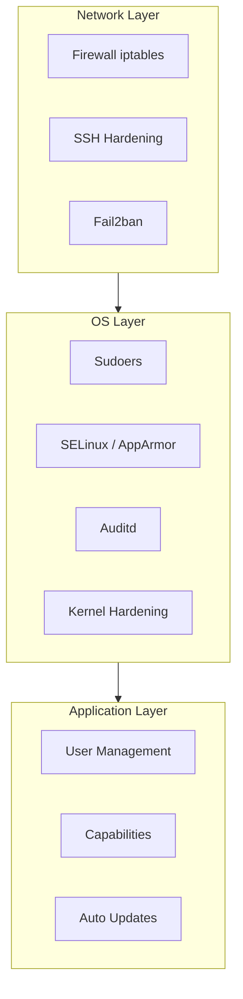

# 08 — Security Hardening

## What is it?

Linux security hardening is the practice of reducing attack surface by configuring user permissions, network access controls, authentication mechanisms, auditing, and intrusion detection. Defense-in-depth applies at every layer: OS, network, application, and data.

## Why it matters for Cloud/DevOps

- A compromised host can lead to data breaches, lateral movement, and regulatory fines
- Cloud security models follow shared responsibility — you harden the OS, cloud provider secures the hypervisor
- CIS benchmarks and compliance frameworks (PCI-DSS, HIPAA, SOC2) require specific hardening controls
- SSH key management is the primary access method to cloud servers
- Automation (Ansible, Chef, Puppet) enforces hardening at scale across fleets



## Key Concepts

### User Management

```bash
# /etc/passwd — user accounts (world-readable)
# Format: username:password:UID:GID:comment:home:shell
cat /etc/passwd

# /etc/shadow — password hashes (root-readable only)
# Format: username:hash:lastchange:min:max:warn:inactive:expire
sudo cat /etc/shadow

# User operations
useradd -m -s /bin/bash alice           # Create user with home
usermod -aG docker alice                # Add to supplementary group
passwd alice                            # Set/change password
userdel -r bob                          # Delete user and home
groupadd devops
groupdel devops

# Lock / unlock accounts
passwd -l alice                         # Lock account (prefix ! in shadow)
passwd -u alice                         # Unlock
usermod -e 2025-01-01 alice             # Set account expiry
chage -l alice                          # Password aging info
chage -M 90 alice                       # Max password age (90 days)
```

### sudoers — Controlled Privilege Escalation

```bash
# /etc/sudoers — edit ONLY with visudo (syntax checking!)
visudo
visudo -f /etc/sudoers.d/custom         # Edit drop-in file

# Examples:
root    ALL=(ALL:ALL) ALL                # root can do anything
%admin  ALL=(ALL) ALL                    # admin group full access
alice   ALL=(ALL) ALL                    # User full access
bob     ALL=(ALL) NOPASSWD: /usr/bin/systemctl restart nginx  # No-pw specific cmd
deploy  ALL=(deploy) ALL                 # Run only as deploy user

# Security best practices:
# 1. Use groups, not individual users
# 2. Limit commands to what's needed
# 3. Use NOPASSWD sparingly
# 4. Keep sudoers drop-ins in /etc/sudoers.d/
```

### SSH Hardening

```bash
# /etc/ssh/sshd_config — key settings:

# Authentication
PubkeyAuthentication yes                # Key-based only (disable passwords)
PasswordAuthentication no               # 🔴 Critical — disable password auth
PermitRootLogin without-password        # Or "no" — never allow root password login
AuthenticationMethods publickey         # Only public key, not keyboard-interactive

# Performance and security
Port 2222                               # Change from default 22 (reduces bot noise)
Protocol 2                              # Only SSH2
AllowUsers alice bob deploy@10.0.*      # Restrict who can SSH
MaxAuthTries 3                          # Max auth attempts before disconnect
ClientAliveInterval 300                 # Check every 5 min
ClientAliveCountMax 2                   # Drop after 2 missed checks
LoginGraceTime 60                       # Must auth within 60s

# Key exchange and ciphers (modern)
KexAlgorithms curve25519-sha256,diffie-hellman-group-exchange-sha256
Ciphers chacha20-poly1305@openssh.com,aes256-gcm@openssh.com
MACs hmac-sha2-512-etm@openssh.com,hmac-sha2-256-etm@openssh.com

# Apply
systemctl reload sshd
```

**SSH key management:**

```bash
# Generate key (ed25519 recommended)
ssh-keygen -t ed25519 -a 100 -f ~/.ssh/id_ed25519

# Copy to server
ssh-copy-id user@host
# Or manually: add pub key to ~/.ssh/authorized_keys

# Agent forwarding (use with caution)
ssh -A user@bastion-host
```

### SELinux / AppArmor — Mandatory Access Control (MAC)

SELinux and AppArmor enforce what processes *can* do beyond traditional user/group permissions.

```bash
# SELinux (RHEL/CentOS/Fedora)
getenforce                              # Enforcing / Permissive / Disabled
setenforce 1                            # Enable (enforcing)
setenforce 0                            # Disable (permissive — logs only)

# Common SELinux commands
ls -Z                                   # View SELinux context
chcon -t httpd_sys_content_t /var/www/html  # Change context
semanage fcontext -l | grep httpd       # List file contexts
restorecon -Rv /var/www/html            # Restore default contexts

# Troubleshooting
ausearch -m avc -ts recent              # SELinux denials
audit2allow -w -a                       # Translate denial to human-readable
audit2allow -a -M mypolicy              # Create policy module

# AppArmor (Ubuntu/Debian/SUSE)
aa-status                               # Show loaded profiles
aa-enforce /usr/sbin/nginx              # Enforce profile
aa-complain /usr/sbin/nginx             # Log violations, don't block
aa-logprof                              # Interactive profile generation
```

### fail2ban — Intrusion Prevention

```bash
# Install and start
apt install fail2ban -y      # Debian/Ubuntu
systemctl enable fail2ban
systemctl start fail2ban

# Configuration: /etc/fail2ban/jail.local
[DEFAULT]
bantime = 3600                # Ban duration (seconds)
findtime = 600                # Window for counting failures
maxretry = 5                  # Max failures before ban

[sshd]
enabled = true
port = ssh
filter = sshd
logpath = /var/log/auth.log
maxretry = 3

# Useful commands
fail2ban-client status                  # All jails
fail2ban-client status sshd             # SSH jail stats
fail2ban-client set sshd unbanip 10.0.0.1  # Manually unban
```

### auditd — System Auditing

```bash
# Start
systemctl enable auditd
systemctl start auditd

# Define rules: /etc/audit/rules.d/audit.rules
-w /etc/passwd -p wa -k identity        # Watch passwd file
-w /etc/shadow -p wa -k identity        # Watch shadow file
-w /etc/sudoers -p wa -k sudoers        # Watch sudoers
-w /var/log/auth.log -p wa -k auth_log # Watch auth logs
-a exit,always -S open -S openat -F success=0 -k failed_open  # Failed opens

# Search audit logs
ausearch -k identity --start today      # Today's identity events
ausearch -i -k sudoers                  # Interpret and search
aureport -au                            # Authentication report
aureport -l                             # Login report
```

### Additional Hardening Checklist

```bash
# 1. Kernel hardening: /etc/sysctl.d/99-security.conf
net.ipv4.tcp_syncookies = 1             # SYN flood protection
net.ipv4.conf.all.rp_filter = 1         # Reverse-path filtering
net.ipv4.conf.default.rp_filter = 1
net.ipv4.icmp_echo_ignore_broadcasts = 1
net.ipv4.conf.all.accept_source_route = 0
kernel.randomize_va_space = 2            # ASLR (full)

# 2. Remove unnecessary packages
apt purge xserver-xorg*  # GUI on server? Uninstall.

# 3. Firewall (allow only necessary ports)
iptables -A INPUT -p tcp --dport 22 -j ACCEPT
iptables -A INPUT -p tcp --dport 443 -j ACCEPT
iptables -P INPUT DROP
iptables -P FORWARD DROP

# 4. Automatic security updates
apt install unattended-upgrades
dpkg-reconfigure -plow unattended-upgrades

# 5. Check for rootkits
apt install rkhunter chkrootkit
rkhunter --check
```

## Commands Reference

| Command | What it does | Key flags |
|---------|-------------|-----------|
| `useradd` | Create user | `-m` home, `-s` shell, `-G` groups |
| `usermod` | Modify user | `-aG` append group, `-L` lock, `-U` unlock |
| `passwd` | Set password | `-l` lock, `-u` unlock, `-d` delete |
| `visudo` | Edit sudoers | Syntax-checked editing |
| `ssh-keygen` | Generate SSH keys | `-t ed25519`, `-b 4096`, `-a 100` |
| `ssh-copy-id` | Install pub key | — |
| `getenforce` | SELinux status | — |
| `setenforce` | Toggle SELinux | `0` permissive, `1` enforcing |
| `audit2allow` | SELinux policy | `-a`, `-M` |
| `aa-status` | AppArmor status | — |
| `fail2ban-client` | Fail2ban control | `status`, `set unbanip` |
| `ausearch` | Audit log search | `-k`, `-i`, `-ts` |
| `aureport` | Audit reports | `-au`, `-l`, `-m` |
| `rkhunter` | Rootkit hunter | `--check`, `--update` |

## Interview Questions

**Q1:** What's the difference between `sudo` and `su`?  
**A:** `sudo` executes a single command with elevated privileges (or as another user) and logs the action. It requires the user to be in `/etc/sudoers`. `su` (switch user) starts a new login shell as the target user (usually root), requiring that user's password. `sudo` is more secure because it provides granular control and audit trails.

**Q2:** How do you disable SSH password authentication and why?  
**A:** Set `PasswordAuthentication no` in `/etc/ssh/sshd_config` and reload: `systemctl reload sshd`. This prevents brute-force password attacks against SSH. Combined with `PubkeyAuthentication yes`, only users with the private key matching a key in `~/.ssh/authorized_keys` can log in.

**Q3:** What is SELinux and when would you use enforcing vs permissive mode?  
**A:** SELinux enforces mandatory access controls beyond traditional Unix permissions. Every process and file has a security context. **Enforcing** actually blocks violations. **Permissive** logs what would be blocked but allows it — used for troubleshooting and building policy before enforcing. **Disabled** skips SELinux entirely (not recommended, as it requires a reboot to re-enable).

**Q4:** How does fail2ban work?  
**A:** fail2ban scans log files (e.g., `/var/log/auth.log`) for repeated authentication failures. When `maxretry` failures occur within `findtime` seconds, it temporarily bans the source IP using iptables/nftables. After `bantime` seconds, the ban expires automatically. This prevents brute-force attacks without permanently blocking IPs.

**Q5:** What should you include in a Linux server hardening checklist?  
**A:** (1) Disable root SSH login, (2) key-only SSH auth, (3) change SSH port, (4) firewall only necessary ports, (5) automatic security updates, (6) SELinux/AppArmor enforcing, (7) auditd monitoring critical files, (8) fail2ban for SSH, (9) remove unused packages/services, (10) kernel hardening (sysctl), (11) regular vulnerability scanning, (12) CIS benchmark compliance.

## Cross-Links

- [01-linux-basics.md](./01-linux-basics.md) — file permissions, chown, chmod
- [05-networking.md](./05-networking.md) — iptables firewall rules
- [09-containerization.md](./09-containerization.md) — capabilities, seccomp, user namespaces
- [08-Docker](../08-Docker/README.md) — Docker security, rootless mode
- [15-SRE](../15-SRE/README.md) — incident response, security monitoring
