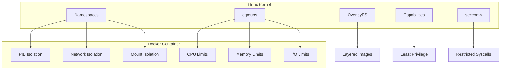

# 09 — Containerization (Linux Kernel Features)

## What is it?

Containerization leverages Linux kernel features to isolate processes and their resource views without running separate operating systems. Docker, Podman, containerd, and Kubernetes all rely on the same underlying primitives: **namespaces** (isolation), **cgroups** (resource limits), **union filesystems** (layered images), **capabilities** (fine-grained privileges), and **seccomp** (syscall filtering).

## Why it matters for Cloud/DevOps

- Containers are the deployment unit for modern cloud-native applications
- Understanding kernel primitives helps debug container issues (paused containers, OOM kills, permission errors)
- Container security depends on proper capability dropping, seccomp profiles, and user namespace remapping
- Orchestrators (Kubernetes, Nomad) abstract these features but expose them via pod security contexts
- Resource limits (CPU/memory requests) map directly to cgroup parameters



## Key Concepts

### cgroups — Control Groups

cgroups (v1 + v2) limit, account for, and isolate resource usage of process groups. cgroups v2 is the modern standard (unified hierarchy).

```bash
# Check which version is in use
stat -fc %T /sys/fs/cgroup/    # cgroup2fs = v2, tmpfs = v1

# cgroups v2 — view hierarchy (systemd-style)
ls /sys/fs/cgroup/
cat /sys/fs/cgroup/memory.current      # Current memory usage of this cgroup
cat /sys/fs/cgroup/cpu.max             # CPU quota (max 100000 100000 = 1 core)
cat /sys/fs/cgroup/pids.current        # Current process count

# Create a cgroup and set limits
mkdir /sys/fs/cgroup/my-container
echo "100000 100000" > /sys/fs/cgroup/my-container/cpu.max         # 1 CPU
echo "100M" > /sys/fs/cgroup/my-container/memory.max               # 100 MB limit
echo $$ > /sys/fs/cgroup/my-container/cgroup.procs                 # Add current process

# Using cgroups via systemd slices
systemctl set-property user-1000.slice MemoryMax=2G
systemd-run --user --scope -p MemoryMax=512M -p CPUQuota=50% ./my-app
```

**cgroup controllers:**

| Controller | Controls | cgroups v2 file |
|------------|----------|-----------------|
| cpu | CPU time, shares, quotas | `cpu.max`, `cpu.weight` |
| memory | RAM + swap usage | `memory.max`, `memory.current`, `memory.swap.max` |
| pids | Number of processes | `pids.max`, `pids.current` |
| io | Block I/O limits | `io.max`, `io.weight` |
| cpuset | CPU pinning + NUMA nodes | `cpuset.cpus`, `cpuset.mems` |
| freezer | Suspend/resume processes | `cgroup.freeze` |

**Viewing container cgroups:**

```bash
# Docker container cgroup path
docker inspect <container> --format '{{.Id}}' | head -c 12
cat /sys/fs/cgroup/system.slice/docker-<container_id>.scope/memory.max

# Or find by PID
PID=$(docker inspect -f '{{.State.Pid}}' my-container)
cat /proc/$PID/cgroup
```

### Namespaces — Isolation

Namespaces wrap global system resources so processes see isolated instances. The Linux kernel supports 8 namespace types:

| Namespace | System resource | Created by (clone flag) | Separates |
|-----------|----------------|------------------------|-----------|
| Mount (mnt) | Mount points | `CLONE_NEWNS` | Filesystem mounts |
| PID (pid) | Process IDs | `CLONE_NEWPID` | Process tree |
| Network (net) | Network stack | `CLONE_NEWNET` | Interfaces, routes, IPs |
| User (user) | UID/GID mapping | `CLONE_NEWUSER` | User/group IDs |
| UTS (uts) | Hostname | `CLONE_NEWUTS` | Hostname, domain |
| IPC (ipc) | IPC resources | `CLONE_NEWIPC` | Message queues, shmem |
| Cgroup | cgroup root | `CLONE_NEWCGROUP` | Cgroup hierarchy |
| Time | Time | `CLONE_NEWTIME` | Boot/monotonic clocks |

```bash
# Check namespaces of a process
lsns -p 1                     # Namespace membership of PID 1
ls -la /proc/1/ns/            # Symlinks to namespace IDs

# Enter a container's namespaces
nsenter -t <PID> -n bash      # Enter network namespace
nsenter -t <PID> -m -u -i bash  # Enter mount + UTS + IPC

# Create a new namespace with unshare
unshare --net --pid --fork bash        # New netns + PID ns
unshare --mount --propagation private bash  # New mount namespace
```

**How Docker uses namespaces:**

| Feature | Namespace |
|---------|-----------|
| Container has its own PID tree | PID namespace |
| Container has its own IP/ports | Network namespace |
| Container sees its own filesystem | Mount namespace |
| Container can set hostname | UTS namespace |
| Root in container != root on host | User namespace (rootless mode) |

### Union Filesystems — OverlayFS

OverlayFS layers multiple directories on top of each other to present a single merged view. This is how Docker images work: multiple read-only layers + a writable upper layer.

```
Container (merged view)
+-------------------------+
|  Upper (writable)       | ← container writes here
+-------------------------+
|  Layer 3: CMD, ENTRYPOINT
+-------------------------+
|  Layer 2: apt install   |
+-------------------------+
|  Layer 1: ubuntu:22.04  |
+-------------------------+
```

```bash
# Create an OverlayFS mount manually
mkdir -p /tmp/{lower,upper,work,merged}
echo "Hello from lower" > /tmp/lower/file.txt
mount -t overlay overlay -o lowerdir=/tmp/lower,upperdir=/tmp/upper,workdir=/tmp/working /tmp/merged

# Files in lower are visible
cat /tmp/merged/file.txt

# Modifications go to upper (copy-up)
echo "modified" >> /tmp/merged/file.txt
ls /tmp/upper/          # The file is copied up here

# Docker overlay2 storage
ls /var/lib/docker/overlay2/
```

### Capabilities — Fine-grained Privileges

Linux capabilities break root's all-or-nothing power into ~40 distinct privileges. Containers drop all capabilities and add only needed ones.

```bash
# List capabilities
capsh --print                 # Current capabilities
getcap /usr/bin/ping          # Capabilities on specific binary

# Common capabilities
CAP_NET_RAW       = raw sockets (ping requires this)
CAP_NET_BIND_SERVICE = bind to ports < 1024
CAP_SYS_ADMIN     = mount, swapon, etc. (powerful — avoid)
CAP_SYS_PTRACE    = ptrace any process
CAP_CHOWN         = change file ownership
CAP_SETUID        = set UID arbitrarily

# Run with specific capabilities
# Docker: --cap-drop=ALL --cap-add=NET_BIND_SERVICE
```

**Docker capability example:**

```bash
docker run --cap-drop=ALL --cap-add=NET_BIND_SERVICE -p 80:80 nginx
# Container can bind to port 80 but has almost no other privileges

# Run as non-root inside container (security best practice)
docker run --user 1000:1000 my-app
```

### seccomp — Secure Computing Mode

seccomp restricts which system calls a process can make. Docker ships with a default seccomp profile that blocks ~44 dangerous syscalls (e.g., `kexec_load`, `reboot`, `swapcontext`).

```bash
# Check seccomp mode of a process
cat /proc/<PID>/status | grep Seccomp
# 0 = disabled, 1 = strict, 2 = filtered

# Docker's default seccomp profile
docker run --security-opt seccomp=default.json nginx

# Run without seccomp (not recommended)
docker run --security-opt seccomp=unconfined nginx

# Custom seccomp profile (allow specific syscalls)
docker run --security-opt seccomp=custom-profile.json my-app

# Custom profile example (allow all but deny reboot):
{
    "defaultAction": "SCMP_ACT_ALLOW",
    "architectures": ["SCMP_ARCH_X86_64"],
    "syscalls": [
        {
            "names": ["reboot", "kexec_load"],
            "action": "SCMP_ACT_ERRNO"
        }
    ]
}
```

### Putting It All Together — How Docker Uses Linux Kernel Features

When you run `docker run nginx`:

1. **Namespaces:** Docker creates PID, Network, Mount, UTS, IPC namespaces
2. **cgroups:** Docker creates a cgroup with CPU/memory limits under `/sys/fs/cgroup/system.slice/docker-<id>.scope/`
3. **OverlayFS:** Docker mounts layers from `/var/lib/docker/overlay2/` as the container's rootfs
4. **Capabilities:** Docker drops all except a safe default set (and applies `--cap-add`/`--cap-drop`)
5. **seccomp:** Docker applies the default seccomp filter (unless `--privileged` or `--security-opt seccomp=unconfined`)
6. **Chroot (via pivot_root):** Docker calls `pivot_root()` to switch the process's root to the OverlayFS mount
7. **PID 1:** The ENTRYPOINT/CMD becomes PID 1 in the PID namespace

```bash
# Inspect the Linux primitives Docker uses
docker run -d --name web --memory=256M --cpus=0.5 nginx

# Find the container PID
PID=$(docker inspect -f '{{.State.Pid}}' web)

# Inspect namespaces
ls -la /proc/$PID/ns/

# Inspect cgroup limits
cat /proc/$PID/cgroup | head -1
cat /sys/fs/cgroup/system.slice/docker-$(docker inspect -f '{{.Id}}' web)/memory.max

# Capabilities
cat /proc/$PID/status | grep -i cap

# Seccomp
cat /proc/$PID/status | grep Seccomp

# Root filesystem (/proc/$PID/root → OverlayFS)
ls /proc/$PID/root/
```

## Commands Reference

| Command | What it does | Key flags |
|---------|-------------|-----------|
| `lsns` | List namespaces | `-p PID`, `-t type` |
| `nsenter` | Enter namespace | `-t PID`, `-n`, `-m`, `-u` |
| `unshare` | Create new ns | `--net`, `--pid`, `--mount`, `--fork` |
| `ls -la /proc/PID/ns/` | Show ns members | — |
| `mount -t overlay` | Mount OverlayFS | `-o lowerdir,upperdir,workdir` |
| `capsh --print` | Show capabilities | — |
| `getcap` | Get file caps | — |
| `setcap` | Set file caps | `cap_net_raw+p` |
| `cat /proc/PID/status` | Seccomp/caps | Grep `Seccomp`, `Cap` |
| `systemd-cgls` | cgroup tree | — |
| `systemd-cgtop` | cgroup resource top | — |

## Interview Questions

**Q1:** What is the difference between cgroups v1 and v2?  
**A:** cgroups v1 had multiple separate hierarchies (one per controller — memory, cpu, pids) which could cause inconsistencies. cgroups v2 uses a unified hierarchy — a single tree structure where all controllers are co-mounted. v2 also adds improved pressure stall information (PSI), better thread-mode support, and is the default in modern distributions (RHEL 9, Ubuntu 22.04+).

**Q2:** How do Linux namespaces provide container isolation?  
**A:** Each namespace wraps a global system resource so that processes inside the namespace see an isolated view. PID namespace gives the container its own PID tree (PID 1 inside is not PID 1 on the host). Network namespace gives its own interfaces, IPs, and firewall rules. Mount namespace has its own mount table. Together they make a process think it's running on its own machine.

**Q3:** What is the purpose of seccomp in containers?  
**A:** Seccomp filters restrict the system calls a container process can make. Docker's default seccomp profile blocks ~44 dangerous syscalls (e.g., `kexec_load`, `reboot`, `acct`) that are unnecessary for most containers and could be used for privilege escalation. This reduces the kernel attack surface even if a container is compromised.

**Q4:** Explain how OverlayFS enables Docker's layered image model.  
**A:** Docker image layers are stored as read-only directories. OverlayFS merges them into a single view with a thin writable upper layer on top. When a container modifies a file, OverlayFS performs a "copy-up" — copying the file from a lower layer to the upper layer. Deletes create "whiteout" files. This means multiple containers can share the same base layers, saving disk space and reducing image pull times.

**Q5:** What capabilities does a typical web server container need?  
**A:** Minimum: `NET_BIND_SERVICE` (to bind to port 80/443). Most containers need nothing else. Drop all others: `--cap-drop=ALL --cap-add=NET_BIND_SERVICE`. For NGINX with SSL, also `SETPCAP`, `SETUID`, `SETGID`, `CHOWN`, `NET_RAW` (depending on configuration). Never grant `SYS_ADMIN` or `SYS_PTRACE` unless absolutely necessary.

## Cross-Links

- [02-process-management.md](./02-process-management.md) — processes, signals, PID 1
- [03-memory-management.md](./03-memory-management.md) — memory cgroups, OOM
- [05-networking.md](./05-networking.md) — network namespaces, veth pairs
- [08-Docker](../08-Docker/README.md) — Docker uses all these primitives
- [09-Kubernetes](../09-Kubernetes/README.md) — pod specs map to cgroup/namespace settings
- [08-security-hardening.md](./08-security-hardening.md) — capabilities, seccomp, user namespaces
