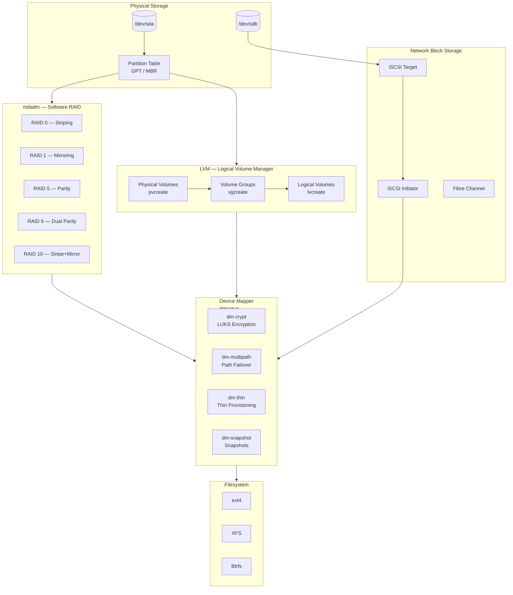
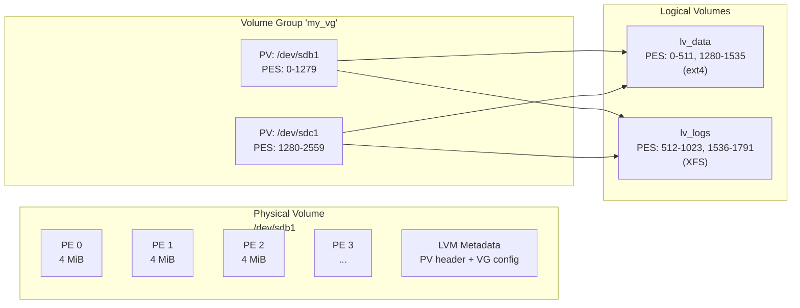
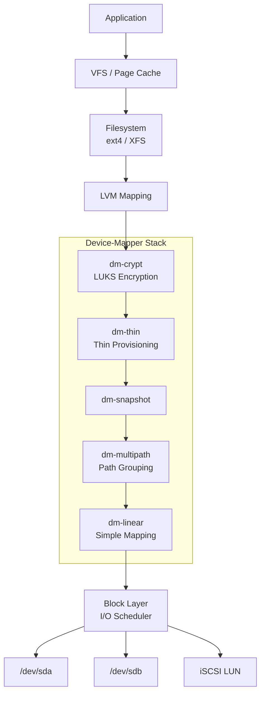

# 10 — Linux Storage Management

## What Is It?

Linux Storage Management encompasses the tools, subsystems, and techniques for provisioning, configuring, and maintaining block storage on Linux systems. It covers everything from raw disk partitioning (GPT/MBR) through logical volume management (LVM), software RAID (mdadm), network block storage (iSCSI), and the kernel's device-mapper framework that underpins most of these features.

## Why It Was Created

Early Unix systems had simple disk models — one partition, one filesystem. As storage grew larger and demands for flexibility increased, Linux accumulated layers to solve practical problems: LVM decouples physical disk layout from logical volumes (allowing resizing, snapshots, and spanning), RAID provides redundancy and performance, and iSCSI enables shared block storage over networks. The device-mapper kernel subsystem was created to provide a generic framework for all these mapping layers.

## When to Use It

- **LVM**: When you need resizable filesystems, snapshots for backups, or to pool multiple disks into one volume
- **RAID**: When you need redundancy (mirroring) or performance (striping) — hardware RAID is faster, but mdadm is free and flexible
- **Disk partitioning**: Always — every disk needs a partition table (GPT is preferred for disks > 2 TB)
- **iSCSI**: When connecting to SAN (storage area network) arrays over Ethernet (cheaper than Fibre Channel)
- **Device-mapper**: When you need custom block-level mappings (encryption with dm-crypt, multipath I/O, thin provisioning)



## Architecture Deep-Dive

### Disk Partitioning — GPT vs MBR

| Feature | MBR (DOS) | GPT |
|---------|-----------|-----|
| Max disk size | 2 TiB | 9.4 ZiB |
| Max partitions | 4 primary (or 3 primary + extended) | 128 (default) |
| Redundancy | No backup | Primary + backup header at end of disk |
| CRC protection | No | Yes (header + partition table) |
| Boot mode | Legacy BIOS | UEFI (also supports BIOS with protective MBR) |
| Partition IDs | 1 byte type code | 16-byte GUID type |

```bash
# Check partition table type
sudo fdisk -l /dev/sda | grep "Disklabel type"

# Create GPT partition table
sudo parted /dev/sdb mklabel gpt

# Create partition with parted
sudo parted /dev/sdb mkpart primary ext4 0% 50%
sudo parted /dev/sdb mkpart primary ext4 50% 100%

# Alternative with fdisk (GPT)
sudo gdisk /dev/sdc
# n, +500M, w

# View partition info
sudo lsblk -o NAME,SIZE,TYPE,FSTYPE,MOUNTPOINT
sudo blkid
```

### LVM — Logical Volume Manager

LVM adds an abstraction layer between physical disks and filesystems. The three-tier architecture (PV → VG → LV) allows arbitrary resizing, snapshots, striping, and migration without downtime.

```bash
# --- Setup LVM from scratch ---
# Create physical volumes
sudo pvcreate /dev/sdb1 /dev/sdc1

# Create a volume group
sudo vgcreate my_vg /dev/sdb1 /dev/sdc1

# Create logical volumes
sudo lvcreate -n lv_data -L 50G my_vg
sudo lvcreate -n lv_logs -L 20G my_vg

# Create filesystems
sudo mkfs.ext4 /dev/my_vg/lv_data
sudo mkfs.xfs /dev/my_vg/lv_logs

# Mount
sudo mount /dev/my_vg/lv_data /mnt/data
sudo mount /dev/my_vg/lv_logs /var/log

# --- Resize operations ---
# Extend a volume group (add a new disk)
sudo pvcreate /dev/sdd1
sudo vgextend my_vg /dev/sdd1

# Extend a logical volume
sudo lvextend -L +10G /dev/my_vg/lv_data
sudo resize2fs /dev/my_vg/lv_data       # ext4
sudo xfs_growfs /mnt/data               # XFS

# Shrink a logical volume (ext4 only — unmount first)
sudo umount /mnt/data
sudo e2fsck -f /dev/my_vg/lv_data
sudo resize2fs /dev/my_vg/lv_data 40G
sudo lvreduce -L 40G /dev/my_vg/lv_data
sudo mount /dev/my_vg/lv_data /mnt/data

# --- Snapshots ---
# Create a read-write snapshot
sudo lvcreate -s -n lv_data_snap -L 5G /dev/my_vg/lv_data

# Mount snapshot for backup
sudo mkdir /mnt/snap
sudo mount /dev/my_vg/lv_data_snap /mnt/snap

# Remove snapshot
sudo umount /mnt/snap
sudo lvremove /dev/my_vg/lv_data_snap

# --- Striping and mirroring ---
# Striped LV (2 stripes across 2 PVs)
sudo lvcreate -n lv_stripe -L 100G -i 2 my_vg

# Mirrored LV (RAID1 at LVM level)
sudo lvcreate -n lv_mirror -L 50G --type raid1 my_vg

# --- Display info ---
sudo pvs          # Physical volume summary
sudo vgs          # Volume group summary
sudo lvs          # Logical volume summary
sudo pvdisplay    # Detailed PV info
sudo vgdisplay    # Detailed VG info
sudo lvdisplay    # Detailed LV info
```

**LVM metadata layout:**



### Software RAID with mdadm

Linux MD (Multiple Devices) provides software RAID with all standard levels. Unlike hardware RAID, there is no dedicated controller — the CPU handles parity calculations.

```bash
# Create a RAID 1 (mirror) array
sudo mdadm --create /dev/md0 --level=1 --raid-devices=2 /dev/sdb1 /dev/sdc1

# Create a RAID 5 array (3+ disks, single parity)
sudo mdadm --create /dev/md1 --level=5 --raid-devices=3 /dev/sdd1 /dev/sde1 /dev/sdf1

# Create a RAID 10 (stripe of mirrors, 4 disks)
sudo mdadm --create /dev/md2 --level=10 --raid-devices=4 /dev/sdg1 /dev/sdh1 /dev/sdi1 /dev/sdj1

# Check status
cat /proc/mdstat
sudo mdadm --detail /dev/md0

# Create filesystem on array
sudo mkfs.xfs /dev/md0
sudo mount /dev/md0 /mnt/raid

# Save configuration for reassembly on boot
sudo mdadm --detail --scan >> /etc/mdadm/mdadm.conf

# Simulate disk failure and recovery
sudo mdadm --manage /dev/md0 --fail /dev/sdb1
sudo mdadm --manage /dev/md0 --remove /dev/sdb1
sudo mdadm --manage /dev/md0 --add /dev/sdb1   # Rebuild starts

# Grow a RAID array (add a disk to RAID 5)
sudo mdadm --grow /dev/md1 --raid-devices=4 --add /dev/sdg1
sudo xfs_growfs /mnt/raid

# Stop and remove an array
sudo umount /mnt/raid
sudo mdadm --stop /dev/md0
sudo mdadm --zero-superblock /dev/sdb1 /dev/sdc1
```

**RAID level comparison:**

| Level | Min Disks | Redundancy | Capacity | Read Perf | Write Perf | Use Case |
|-------|-----------|------------|----------|-----------|------------|----------|
| RAID 0 | 2 | None | Sum | N× | N× | Temp data, cache (risky) |
| RAID 1 | 2 | 1 disk | N/2 | 2× (read) | 1× | Boot drives, critical DB logs |
| RAID 5 | 3 | 1 disk | N−1 | N−1× | N−1× (parity penalty) | General storage |
| RAID 6 | 4 | 2 disks | N−2 | N−2× | N−2× (double parity) | Large capacity with resilience |
| RAID 10 | 4 | 1 per mirror | N/2 | N× | N/2× | High-performance databases |

### iSCSI — Block Storage Over Network

iSCSI transports SCSI commands over TCP/IP, enabling remote block devices to appear as local disks.

```bash
# --- iSCSI Target (server side — using targetcli) ---
sudo apt install targetcli-fb
sudo targetcli

# In target CLI:
/> backstores/block create name=disk1 dev=/dev/sdb1
/> iscsi/ create iqn.2025-01.com.example:storage.target1
/> iscsi/iqn.2025-01.com.example:storage.target1/tpg1/luns create /backstores/block/disk1
/> iscsi/iqn.2025-01.com.example:storage.target1/tpg1/acls create iqn.2025-01.com.example:initiator1
/> iscsi/iqn.2025-01.com.example:storage.target1/tpg1/portals create 0.0.0.0 3260
/> saveconfig
/> exit

# --- iSCSI Initiator (client side) ---
sudo apt install open-iscsi

# Discover targets
sudo iscsiadm -m discovery -t sendtargets -p 192.168.1.100

# Login to target
sudo iscsiadm -m node -T iqn.2025-01.com.example:storage.target1 -p 192.168.1.100 --login

# Verify: it appears as a local disk
sudo lsblk | grep sd
# Should see /dev/sdX (the remote block device)

# Use it like a local disk
sudo mkfs.ext4 /dev/sdX
sudo mount /dev/sdX /mnt/remote

# Logout
sudo iscsiadm -m node -T iqn.2025-01.com.example:storage.target1 --logout
```

### Device-Mapper

Device-mapper (`dm`) is the kernel framework underlying LVM, dm-crypt, dm-multipath, dm-thin, and dm-raid. It maps virtual block devices to physical devices through a chain of targets.

```bash
# List device-mapper devices
sudo dmsetup ls
sudo dmsetup table
sudo dmsetup info

# Examine underlying mapping for an LVM LV
sudo dmsetup table /dev/my_vg/lv_data
# Example output: 0 20971520 linear 8:16 2048

# Create a simple linear mapping (one disk region mapped to a virtual device)
echo "0 20971520 linear /dev/sdb1 0" | sudo dmsetup create my-linear-dev

# Remove mapping
sudo dmsetup remove my-linear-dev

# dm-crypt — disk encryption with LUKS
sudo cryptsetup luksFormat /dev/sdb1
sudo cryptsetup open /dev/sdb1 encrypted_volume
sudo mkfs.ext4 /dev/mapper/encrypted_volume
sudo mount /dev/mapper/encrypted_volume /mnt/encrypted

# dm-multipath — path failover for SAN
sudo multipath -ll     # List multipath devices
# /etc/multipath.conf configures aliases, failover policies
```



## Hands-On Example: End-to-End Storage Setup

Provision a 100 GB data volume with RAID 1 + LVM + ext4, mount it, grow it by adding a disk, and create a snapshot for backup.

```bash
# Prerequisites: 3 empty disks (/dev/sdb, /dev/sdc, /dev/sdd)

# Step 1: Partition disks with GPT
sudo parted /dev/sdb mklabel gpt
sudo parted /dev/sdb mkpart primary ext4 0% 100%
sudo parted /dev/sdc mklabel gpt
sudo parted /dev/sdc mkpart primary ext4 0% 100%
sudo parted /dev/sdd mklabel gpt
sudo parted /dev/sdd mkpart primary ext4 0% 100%

# Step 2: Create RAID 1 mirror on sdb1 + sdc1
sudo mdadm --create /dev/md0 --level=1 --raid-devices=2 /dev/sdb1 /dev/sdc1
cat /proc/mdstat                          # Wait for sync to complete
sudo mdadm --detail /dev/md0              # Verify state: clean

# Step 3: LVM on top of RAID
sudo pvcreate /dev/md0
sudo vgcreate data_vg /dev/md0
sudo lvcreate -n data_lv -l 100%FREE data_vg

# Step 4: Filesystem and mount
sudo mkfs.ext4 /dev/data_vg/data_lv
sudo mkdir -p /mnt/data
sudo mount /dev/data_vg/data_lv /mnt/data
echo '/dev/data_vg/data_lv /mnt/data ext4 defaults 0 2' | sudo tee -a /etc/fstab

# Step 5: Extend — add /dev/sdd1 to the array
sudo mdadm --add /dev/md0 /dev/sdd1          # Add hot spare
sudo mdadm --grow /dev/md0 --raid-devices=3  # Convert RAID1 to 3-device
# RAID1 with 3 devices: each device has a full copy

# Step 6: Grow filesystem
sudo pvresize /dev/md0                       # PV sees new size
sudo lvextend -l +100%FREE /dev/data_vg/data_lv
sudo resize2fs /dev/data_vg/data_lv

# Step 7: Snapshot for backup
sudo lvcreate -s -n data_snap -L 10G /dev/data_vg/data_lv
sudo mkdir /mnt/backup
sudo mount -o ro /dev/data_vg/data_snap /mnt/backup
sudo rsync -av /mnt/backup/ /backup/destination/
sudo umount /mnt/backup
sudo lvremove /dev/data_vg/data_snap
```

## Pricing / Cost Considerations

- **Software RAID + LVM**: Free (included in the Linux kernel). Cost is CPU overhead for parity calculations (RAID 5/6) — ~5–15% for parity writes.
- **Hardware RAID**: $200–$2000+ per controller. Uses dedicated CPU + cache — faster, no host CPU overhead. BBU (battery backup unit) protects cache during power loss.
- **iSCSI SAN**: Shared storage arrays cost $10k–$100k+. Dedicated Ethernet (10/25/40 GbE) adds networking cost. Cheaper than Fibre Channel ($2k–$5k per HBA + $500+ for switches).
- **Cloud block storage**: EBS (AWS) ~$0.08/GB-month, Persistent Disk (GCP) ~$0.04/GB-month. Snapshots are cheaper but slower for restores.
- **dm-crypt encryption**: CPU overhead ~1–5% for AES-NI accelerated crypto. No direct monetary cost.

## Best Practices

1. **Use GPT over MBR** for all new deployments — supports > 2 TB disks and has redundant headers
2. **Align partitions to 1 MiB boundaries** — modern disks use 4 KiB sectors; misalignment causes severe write amplification. `parted` defaults to alignment
3. **Avoid RAID 5 on large disks (> 4 TB)** — URE (Unrecoverable Read Error) probability during rebuild makes failure likely; use RAID 6 or RAID 10
4. **Use LVM thin provisioning with monitoring** — thin pools can overcommit; set monitoring thresholds to prevent out-of-space hangs
5. **Always use filesystem barriers/data journaling** on storage that matters — default is safe; don't disable barriers for production unless you have battery-backed RAID cache
6. **Snapshot size should equal expected changes**, not the full volume size — snapshots use copy-on-write and overflow when the COW store fills
7. **iSCSI: use CHAP authentication** for security. Never expose iSCSI targets to untrusted networks; isolate on dedicated VLAN
8. **Monitor mdadm arrays regularly** — set up cron with `mdadm --monitor` or use smartd to check disk health
9. **Test disaster recovery** — practice failure of each RAID member, test snapshot restore, verify backups are restorable
10. **Use discard/trim for SSDs** — mount with `discard` or run `fstrim` periodically to maintain SSD performance

## Interview Questions

**Q1:** What are the differences between MBR and GPT partition tables?
**A:** MBR uses 32-bit entries, max disk size 2 TiB, max 4 primary partitions. GPT uses 64-bit entries, max disk 9.4 ZiB, max 128 partitions by default. GPT stores a backup header at the end of the disk, has CRC32 integrity checks, and is required for UEFI boot. GPT also has a protective MBR for backwards compatibility.

**Q2:** Explain LVM architecture. What happens when you run lvextend vs resize2fs?
**A:** LVM has three layers: Physical Volumes (PVs) are disks/partitions, Volume Groups (VGs) pool PVs together, Logical Volumes (LVs) carve out space from VGs. `lvextend` resizes the block device (logical volume) but does not touch the filesystem. `resize2fs` (ext4) or `xfs_growfs` (XFS) then resize the filesystem to fill the expanded block device. For ext4, you must unmount before shrinking; XFS cannot shrink at all.

**Q3:** What is a physical extent (PE) in LVM?
**A:** A PE is the smallest allocatable unit in LVM, typically 4 MiB. When you create an LV, it is allocated in PE-sized chunks. This is why LVs must be multiples of PE size. You can change PE size with `vgcreate -s` but it affects all future LVs in that VG.

**Q4:** Compare RAID 5 vs RAID 10 for a database workload.
**A:** RAID 10 (stripe of mirrors) offers much better write performance because every write goes to exactly 2 disks (one in each mirror). RAID 5 requires read-modify-write for every small write (read parity, read old data, XOR, write data + parity) — 4 I/Os per write. For high-write database workloads, RAID 10 is strongly preferred. RAID 5 is acceptable for sequential write workloads (log storage, media).

**Q5:** How does device-mapper work and what is it used for beyond LVM?
**A:** Device-mapper is a kernel framework that maps virtual block devices to physical devices through a chain of targets. Each target specifies a range of sectors and a mapping type. Besides LVM, it powers dm-crypt (LUKS encryption), dm-multipath (SAN path failover), dm-thin (thin provisioning with snapshots), dm-raid (mdraid via device-mapper), and dm-verity (integrity checking used in Android/ChromeOS).

**Q6:** What is the Write Hole in RAID 5/6 and how is it mitigated?
**A:** The write hole occurs when a crash happens during a RAID 5/6 stripe update (writing data + parity). The parity can become inconsistent with the data, causing silent data corruption during rebuild. Mitigations: RAID controller with battery-backed cache (BBU), or Linux mdadm with write-intent bitmap which tracks which stripes are being updated and can replay them after crash.

**Q7:** How does iSCSI differ from NFS?
**A:** iSCSI provides block-level access — the initiator sees a raw block device (/dev/sdX) and manages its own filesystem. NFS provides file-level access — clients see files on a remote server's filesystem. iSCSI requires a filesystem on the initiator side, supports any filesystem type, and can be clustered. NFS handles file locking and sharing better but depends on the server's filesystem.

**Q8:** What is TRIM/discard and why is it important for SSDs?
**A:** TRIM (called discard in Linux) informs the SSD which blocks are no longer in use by the filesystem. Without it, the SSD doesn't know which pages are free, causing write amplification (the SSD must erase then rewrite used-seeming blocks). Mount with `discard` for real-time TRIM, or run `fstrim` periodically (systemd has `fstrim.timer` by default).

**Q9:** Explain thin provisioning in LVM. What happens when a thin pool runs out of space?
**A:** Thin provisioning allows overcommitting storage — you can create thin LVs that appear larger than the backing data pool. Actual data blocks are allocated on write. If the thin pool runs out of space, all thin volumes become read-only or error out (depending on configuration). Solution: extend the thin pool with additional data/metadata space using `lvextend --poolmetadataspare`. Monitor pool usage with `lvs -a -o+discard,max_pool_size,data_percent`.

**Q10:** What is multipath I/O and when would you use it?
**A:** Multipath I/O (dm-multipath) provides redundancy and load balancing when a server has multiple HBA ports or network paths to the same storage LUN (common in SAN environments). It presents the LUN as a single device despite multiple physical paths. If one path fails, I/O is redirected to remaining paths automatically. It can also load-balance across active paths.

## Real Company Usage Examples

- **Netflix**: Uses LVM on RAID 10 for its content delivery storage servers — RAID 10 provides the throughput needed for streaming video, LVM allows disk replacement without downtime.
- **Google**: Uses dm-crypt for all server disk encryption at rest across their fleet. Their Titan security chip manages key unwrapping.
- **GitHub**: MySQL databases use RAID 10 with LVM on ext4. Snapshots via LVM for consistent backups without Percona XtraBackup load.
- **Red Hat / OpenShift**: Uses LVM with thin provisioning (through `containers/storage`) to provide flexible overlay filesystem backends for container images.
- **Cloudflare**: Uses software RAID (mdadm RAID 1) on their edge server NVMe drives — simple, no hardware dependency, easy to replace.
- **Amazon (EBS)**: Underlying Elastic Block Store uses distributed storage with snapshot capabilities; the iSCSI protocol was a predecessor protocol used for early EBS volumes.

## Cross-Links

- [03-memory-management.md](./03-memory-management.md) — Page cache interaction with block devices
- [04-file-systems.md](./04-file-systems.md) — Filesystems on top of LVM/mdadm
- [05-networking.md](./05-networking.md) — iSCSI depends on TCP/IP networking
- [07-performance-tuning.md](./07-performance-tuning.md) — I/O scheduler tuning for different RAID levels
- [08-security-hardening.md](./08-security-hardening.md) — dm-crypt encryption, LUKS key management
- [09-containerization.md](./09-containerization.md) — OverlayFS storage for container images
