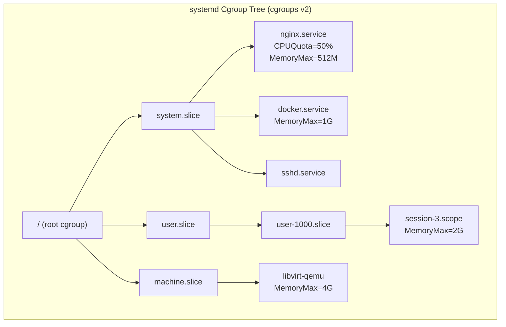

# 11 — Linux Namespaces & Cgroups

## What Is It?

Linux Namespaces and Cgroups (Control Groups) are the two kernel features that form the foundation of containerization. Namespaces provide **isolation** by giving each process group its own view of global system resources (process IDs, network interfaces, mount points, etc.). Cgroups provide **resource management** by limiting, accounting for, and isolating CPU, memory, and I/O usage of process groups. Together they create the illusion of a standalone operating system within a shared kernel.

## Why It Was Created

Before namespaces and cgroups, the only way to isolate workloads was full virtualization (VMware, KVM) — each VM ran its own kernel, incurring significant overhead. Google (then Google) contributed cgroups to the Linux kernel in 2006 (merged 2008) to enable resource accounting for its Borg cluster manager. Namespaces evolved from the earlier `chroot` concept, with mount namespaces added in 2002 (Linux 2.4.19) and PID, NET, IPC, UTS, USER namespaces following over subsequent releases. The combination of both enables lightweight, secure process isolation — the foundation of Docker (2013) and all modern container runtimes.

## When to Use It

- **Containers**: Always — each container gets its own set of namespaces and cgroup limits
- **Multi-tenant environments**: When running untrusted code from different users/organizations on the same kernel
- **Resource guarantees**: When you need to ensure one service cannot starve others of CPU, memory, or I/O
- **Development sandboxes**: Create isolated environments with different hostnames, network stacks, or filesystem trees
- **Experiments**: Safely test system-level changes (e.g., modify hostname, change mount table) without affecting the host
- **Systemd service management**: Every systemd service runs in a cgroup slice; `systemctl set-property` adjusts limits at runtime

```mermaid
graph TB
    subgraph Host["Host Kernel"]
        CG_ROOT[cgroup v2<br/>Unified Hierarchy]
        NS_ROOT[Root Namespaces]
    end
    subgraph Container1["Container A (nginx)"]
        NS1[Namespaces]
        CG1[Cgroup Limits]
        NS1_PID["PID ns: PID 1 = nginx"]
        NS1_NET["Net ns: 10.0.0.2/24"]
        NS1_MNT["Mnt ns: own rootfs"]
        NS1_UTS["UTS ns: hostname=web-1"]
        NS1_IPC["IPC ns: isolated"]
        NS1_USER["User ns: UID map"]
        NS1 --> NS1_PID
        NS1 --> NS1_NET
        NS1 --> NS1_MNT
        NS1 --> NS1_UTS
        NS1 --> NS1_IPC
        NS1 --> NS1_USER
        CG1_LIMITS["CPUQuota=50%<br/>MemoryMax=256M<br/>IOWeight=100"]
        CG1 --> CG1_LIMITS
    end
    subgraph Container2["Container B (Redis)"]
        NS2[Namespaces]
        CG2[Cgroup Limits]
        NS2_PID["PID ns: PID 1 = redis-server"]
        NS2_NET["Net ns: 10.0.0.3/24"]
        NS2_MNT["Mnt ns: own rootfs"]
        NS2_UTS["UTS ns: hostname=cache-1"]
        NS2_IPC["IPC ns: isolated"]
        NS2_USER["User ns: UID map"]
        NS2 --> NS2_PID
        NS2 --> NS2_NET
        NS2 --> NS2_MNT
        NS2 --> NS2_UTS
        NS2 --> NS2_IPC
        NS2 --> NS2_USER
        CG2_LIMITS["CPUQuota=200%<br/>MemoryMax=2G<br/>IOWeight=200"]
        CG2 --> CG2_LIMITS
    end
    CG_ROOT --> CG1
    CG_ROOT --> CG2
    NS_ROOT --> NS1
    NS_ROOT --> NS2
```



## Architecture Deep-Dive

### The 7+1 Namespaces

Each namespace wraps a specific global resource. When a process is created with `clone()` or `unshare()`, it can request new namespaces (specified by `CLONE_NEW*` flags). Processes in different namespaces see different instances of the resource.

| Namespace | Flag | Kernel | Separates | Key Files |
|-----------|------|--------|-----------|-----------|
| Mount (mnt) | CLONE_NEWNS | 2.4.19 (2002) | Mount point tree | `/proc/<PID>/mounts`, `/proc/<PID>/mountinfo` |
| PID (pid) | CLONE_NEWPID | 2.6.24 (2008) | Process ID number space | `/proc/<PID>/ns/pid` |
| Network (net) | CLONE_NEWNET | 2.6.29 (2009) | Network devices, IPs, routes, iptables | `/proc/<PID>/ns/net` |
| UTS (uts) | CLONE_NEWUTS | 2.6.19 (2006) | Hostname, NIS domain name | `/proc/<PID>/ns/uts` |
| IPC (ipc) | CLONE_NEWIPC | 2.6.19 (2006) | System V IPC, POSIX message queues | `/proc/<PID>/ns/ipc` |
| User (user) | CLONE_NEWUSER | 3.8 (2013) | UID/GID mappings | `/proc/<PID>/uid_map`, `/proc/<PID>/gid_map` |
| Cgroup (cgroup) | CLONE_NEWCGROUP | 4.6 (2016) | cgroup root directory | `/proc/<PID>/ns/cgroup` |
| Time (time) | CLONE_NEWTIME | 5.6 (2020) | CLOCK_MONOTONIC, CLOCK_BOOTTIME | `/proc/<PID>/ns/time` |

```mermaid
graph LR
    subgraph Host_View["Host (Root Namespaces)"]
        H_PROC[PID 1: systemd<br/>PID 2345: dockerd<br/>PID 6789: nginx<br/>PID 12345: sshd]
        H_NET[eth0: 192.168.1.5<br/>lo: 127.0.0.1<br/>docker0: 172.17.0.1]
        H_MNT[/ → rootfs<br/>/home, /var, /etc]
        H_UTS[hostname: prod-host]
    end
    subgraph Container_View["Container (New Namespaces)"]
        C_PROC[PID 1: nginx<br/>PID 67: sh<br/>PID 89: sleep]
        C_NET[eth0: 10.0.0.2<br/>lo: 127.0.0.1]
        C_MNT[/ → overlay2 rootfs<br/>/proc, /sys, /dev]
        C_UTS[hostname: web-1]
    end
```

**How namespace membership works:**

```bash
# Every process has symlinks to its namespace inodes
ls -la /proc/1/ns/
# lrwxrwxrwx 1 root root 0 ... cgroup -> cgroup:[4026531835]
# lrwxrwxrwx 1 root root 0 ... ipc -> ipc:[4026531839]
# lrwxrwxrwx 1 root root 0 ... mnt -> mnt:[4026531841]
# lrwxrwxrwx 1 root root 0 ... net -> net:[4026531957]
# lrwxrwxrwx 1 root root 0 ... pid -> pid:[4026531836]
# lrwxrwxrwx 1 root root 0 ... user -> user:[4026531837]
# lrwxrwxrwx 1 root root 0 ... uts -> uts:[4026531838]

# Two processes sharing the same namespace inode are in the same namespace
# Compare namespaces
ls -la /proc/1234/ns/
ls -la /proc/5678/ns/

# List all namespaces on the system
sudo lsns
sudo lsns -t net        # Only network namespaces
sudo lsns -p 1234       # Namespaces of a specific PID
```

**Creating and entering namespaces:**

```bash
# --- unshare: Create new namespaces for a command ---

# New UTS namespace (isolated hostname)
sudo unshare --uts bash
hostname my-container     # Only affects this UTS namespace
hostname                  # Shows my-container
# From another terminal: hostname shows the real hostname
exit

# New mount namespace (isolated mount table)
sudo unshare --mount --propagation private bash
mount -t tmpfs tmpfs /tmp    # Only visible in this mount namespace
# Outside: /tmp remains unchanged
exit

# New PID namespace (first process has PID 1)
sudo unshare --pid --fork bash
echo $$                      # Shows 1
ps aux                       # Only shows processes in this PID ns
exit

# New network namespace
sudo unshare --net bash
ip link                      # Only shows lo (down)
ip link set lo up
ip addr add 10.0.0.1/24 dev lo
exit

# Combine multiple namespaces
sudo unshare --net --pid --uts --mount --fork bash

# --- nsenter: Enter existing namespace ---
# Find container PID
PID=$(docker inspect -f '{{.State.Pid}}' my-container)
# Enter its network namespace
sudo nsenter -t $PID -n bash
ip addr                    # Shows container's interfaces
# Enter all namespaces
sudo nsenter -t $PID -m -u -i -n -p bash
```

### User Namespaces — Mapping Root to Non-Root

User namespaces are the most powerful isolation mechanism. They allow a process to have **root privileges inside its namespace** while running as an unprivileged user on the host. This is the core of rootless containers (Podman, Docker rootless mode).

```bash
# User namespace ID mapping files
cat /proc/$$/uid_map
# 0 1000 1    # Inside-ns UID 0 → outside UID 1000, range 1

# Create a new user namespace (as non-root)
unshare --user --map-root-user bash
whoami              # root (inside namespace)
id                  # uid=0(root) gid=0(root)
# But on the host: this process is UID 1000

# File ownership mapping
touch /tmp/test
ls -ln /tmp/test    # UID 0 (inside namespace)
# On host: UID 1000 (mapped)

# User namespace with PID namespace (rootless container)
unshare --user --map-root-user --pid --fork bash
echo $$             # 1
# This is a rootless container: non-root on host, root inside
```

**User namespace security benefits:**

- Inside the user namespace, you can mount filesystems, create device nodes, bind to ports (< 1024), and run privileged operations — all without actual host root privileges
- UID/GID mapping prevents privilege escalation: even if the process escapes the user namespace, it has the mapped UID (non-root) on the host
- Docker rootless mode and Podman use user namespaces by default
- Kubernetes support for user namespaces is experimental (KEP-127, added in v1.25+)

### Cgroups v1 vs v2

**cgroups v1** (2008–2016): Multiple separate hierarchies, one per controller. A process could belong to different cgroups in different hierarchies (e.g., pid 123 is in `/memory/group-a` for memory and `/cpu/group-b` for CPU). This caused complex interactions and inconsistent accounting.

**cgroups v2** (2016–present, default in Ubuntu 22.04+, RHEL 9+, Amazon Linux 2023): Single unified hierarchy. All controllers are co-mounted at `/sys/fs/cgroup/`. Processes are members of the same cgroup for all controllers.

```bash
# Check which version is in use
stat -fc %T /sys/fs/cgroup/
# cgroup2fs → v2, tmpfs → v1

# cgroups v2 unified hierarchy structure
ls /sys/fs/cgroup/
# system.slice/    # Systemd services
# user.slice/      # User sessions
# docker/          # Docker containers (if using cgroupfs)
# Machine.slice/   # VM processes (libvirt)

# Each directory is a cgroup with controller files
cat /sys/fs/cgroup/cpu.max                 # System-wide CPU quota
cat /sys/fs/cgroup/memory.current          # System-wide memory usage
cat /sys/fs/cgroup/pids.current            # Total processes
```

**Key differences:**

| Aspect | cgroups v1 | cgroups v2 |
|--------|------------|------------|
| Hierarchy | Multiple (one per controller) | Single unified |
| Mount point | `/sys/fs/cgroup/<controller>/` | `/sys/fs/cgroup/` |
| Thread mode | No | Yes (thread subtrees) |
| PSI (Pressure Stall) | Partial | Full support |
| I/O controller | Blkio (separate) | Integrated `io` |
| Default kernel | < 5.0 | ≥ 5.0 (most distros) |
| Docker support | Legacy | Default since Docker 20.10 |

### Resource Limiting with cgroups v2

```bash
# --- CPU Limiting ---

# Create a test cgroup
sudo mkdir /sys/fs/cgroup/my-test

# CPU quota: max time per period (period is 100,000 µs = 100 ms)
# 1 CPU core:
echo "100000 100000" | sudo tee /sys/fs/cgroup/my-test/cpu.max
# 0.5 CPU core:
echo "50000 100000" | sudo tee /sys/fs/cgroup/my-test/cpu.max

# CPU weight (relative share, used when contention exists)
echo "100" | sudo tee /sys/fs/cgroup/my-test/cpu.weight
# Default = 100, range = [1, 10000]

# Test CPU limit
echo $$ | sudo tee /sys/fs/cgroup/my-test/cgroup.procs
stress --cpu 4 --timeout 10
# Check with: cat /sys/fs/cgroup/my-test/cpu.stat

# --- Memory Limiting ---

# Memory max (hard limit)
echo "256M" | sudo tee /sys/fs/cgroup/my-test/memory.max

# Memory low (best-effort protection, not a limit)
echo "128M" | sudo tee /sys/fs/cgroup/my-test/memory.low

# Memory high (soft limit — throttles but doesn't OOM)
echo "512M" | sudo tee /sys/fs/cgroup/my-test/memory.high

# Swap limit
echo "512M" | sudo tee /sys/fs/cgroup/my-test/memory.swap.max

# Check memory pressure
cat /sys/fs/cgroup/my-test/memory.pressure
# some avg10=0.00 avg60=0.00 avg300=0.00 total=0
# full avg10=0.00 avg60=0.00 avg300=0.00 total=0

# OOM events
cat /sys/fs/cgroup/my-test/memory.events
# low 0
# high 0
# max 0
# oom 0
# oom_kill 0

# Test memory limit
echo $$ | sudo tee /sys/fs/cgroup/my-test/cgroup.procs
stress --vm 1 --vm-bytes 512M --timeout 5
dmesg | tail -20       # Check for OOM kills

# --- I/O Limiting ---

# Set I/O limits by device major:minor
ls -l /dev/sda
# brw-rw---- 1 root disk 8, 0 ... /dev/sda

# Read/write bandwidth limit (bytes per second)
echo "8:0 rbps=104857600" | sudo tee /sys/fs/cgroup/my-test/io.max
echo "8:0 wbps=52428800" | sudo tee /sys/fs/cgroup/my-test/io.max

# Read/write IOPS limit
echo "8:0 riops=1000" | sudo tee /sys/fs/cgroup/my-test/io.max
echo "8:0 wiops=500" | sudo tee /sys/fs/cgroup/my-test/io.max

# I/O weight (relative, used when contention exists)
echo "8:0 weight=200" | sudo tee /sys/fs/cgroup/my-test/io.weight
# Default = 100, range [1, 10000]

# --- PIDs Limiting ---

# Limit number of processes/fork bombs
echo "100" | sudo tee /sys/fs/cgroup/my-test/pids.max
echo $$ | sudo tee /sys/fs/cgroup/my-test/cgroup.procs
# Now try: for i in $(seq 1 200); do sleep 5 & done
# Output: "Resource temporarily unavailable" after ~100 forks

# Cleanup
echo $$ | sudo tee /sys/fs/cgroup/
sudo rmdir /sys/fs/cgroup/my-test
```

### Systemd Slices — cgroups Through systemd

systemd manages cgroups through its own interface using **slices** (containers for units), **scopes** (externally created processes), and **services** (systemd-managed daemons).

```bash
# View cgroup tree managed by systemd
systemd-cgls
# ├─user.slice
# │ └─user-1000.slice
# │   └─session-3.scope
# │     ├─ 1234 bash
# │     └─ 5678 vim
# ├─system.slice
# │ ├─sshd.service
# │ │ └─ 7890 sshd: root@pts/0
# │ ├─docker.service
# │ │ └─ 9012 dockerd
# │ └─nginx.service
# │   └─ 3456 nginx: master process

# Monitor resource usage per cgroup
systemd-cgtop

# Set resource limits on running services
sudo systemctl set-property nginx.service MemoryMax=512M
sudo systemctl set-property nginx.service CPUQuota=50%
sudo systemctl set-property nginx.service IOWeight=200

# Create a transient scope (one-off command with limits)
sudo systemd-run --scope -p MemoryMax=256M -p CPUQuota=50% stress --vm 1 --vm-bytes 200M

# Create a user slice with limits
sudo systemctl set-property user-1000.slice MemoryMax=2G

# Check effective limits
systemctl show nginx.service | grep -E "MemoryMax|CPUQuota|IOWeight"
```



### Practical Experiments — Understanding Isolation

**Experiment 1: PID namespace visibility**

```bash
# Terminal 1: Create a new PID namespace
sudo unshare --pid --fork bash
echo "Inside PID namespace: PID 1 = $$"
sleep 300 &
echo "Background sleep PID: $!"

# Terminal 2: Check from host
ps aux | grep sleep
# The sleep process is visible from the host but has a different PID
# Inside the namespace: PID 2
# Outside the namespace: PID 12345 (host's view)
```

**Experiment 2: Network namespace isolation**

```bash
# Terminal 1: Create a veth pair connecting host and netns
sudo ip netns add blue
sudo ip link add veth0 type veth peer name veth1
sudo ip link set veth1 netns blue
sudo ip addr add 10.0.0.1/24 dev veth0
sudo ip link set veth0 up
sudo ip netns exec blue ip addr add 10.0.0.2/24 dev veth1
sudo ip netns exec blue ip link set veth1 up
sudo ip netns exec blue ip link set lo up

# Test connectivity
sudo ip netns exec blue ping 10.0.0.1
ping 10.0.0.2                    # From host to netns

# Traffic from netns is isolated: separate iptables, separate routing table
sudo ip netns exec blue iptables -L
sudo ip netns exec blue ip route

# Cleanup
sudo ip netns delete blue
sudo ip link delete veth0
```

**Experiment 3: cgroup memory limit OOM**

```bash
# Create cgroup with tight memory limit
sudo mkdir /sys/fs/cgroup/oom-test
echo "50M" | sudo tee /sys/fs/cgroup/oom-test/memory.max

# Run a memory hog inside the cgroup
sudo systemd-run --scope -p MemoryMax=50M bash -c "stress --vm 1 --vm-bytes 100M"
# The OOM killer will terminate the process

# View OOM events
cat /sys/fs/cgroup/oom-test/memory.events
# oom 1
# oom_kill 1

# Cleanup
sudo rmdir /sys/fs/cgroup/oom-test
```

**Experiment 4: User namespace — root without privileges**

```bash
# As a non-root user:
unshare --user --map-root-user --pid --fork bash
whoami           # root
mount -t proc proc /proc
id               # uid=0(root) gid=0(root)

# Create a file
touch /tmp/test-file
ls -l /tmp/test-file
# Inside: owned by root:root
# Outside (host): owned by the original user's UID

# Try privileged operations that require actual root:
mount /dev/sda1 /mnt
# mount.nsf: permission denied (kernel checks real privileges)
```

## Hands-On Example: Simulating Kubernetes Pod Resource Limits

This experiment simulates how Kubernetes enforces resource requests and limits using cgroups.

```bash
# Step 1: Create a pod-like cgroup hierarchy
POD_NAME="sim-pod"
CONTAINER_NAME="sim-container"
CGROUP_BASE="/sys/fs/cgroup"

sudo mkdir -p "$CGROUP_BASE/kubepods/besteffort/$POD_NAME/$CONTAINER_NAME"

# Step 2: Set container-level resource limits (mimics Kubernetes container spec)
echo "200000 100000" | sudo tee "$CGROUP_BASE/kubepods/besteffort/$POD_NAME/$CONTAINER_NAME/cpu.max"
echo "256M" | sudo tee "$CGROUP_BASE/kubepods/besteffort/$POD_NAME/$CONTAINER_NAME/memory.max"
echo "128M" | sudo tee "$CGROUP_BASE/kubepods/besteffort/$POD_NAME/$CONTAINER_NAME/memory.high"

# Step 3: Run a process inside the container cgroup
sudo systemd-run --scope -P \
  -p Delegate=yes \
  -p MemoryMax=256M \
  -p CPUQuota=200% \
  bash

# Inside the transient scope:
stress --vm 1 --vm-bytes 300M &

# Step 4: Observe OOM killer behavior
cat "$CGROUP_BASE/kubepods/besteffort/$POD_NAME/$CONTAINER_NAME/memory.events"
# oom_kill will be 1

# Step 5: Cleanup
sudo rmdir "$CGROUP_BASE/kubepods/besteffort/$POD_NAME/$CONTAINER_NAME"
sudo rmdir "$CGROUP_BASE/kubepods/besteffort/$POD_NAME"
```

## Pricing / Cost Considerations

Namespaces and cgroups are free kernel features — there is no licensing cost. The operational costs come from:

- **Monitoring overhead**: Collecting cgroup metrics (CPU, memory, I/O) across thousands of containers adds ~1–3% overhead to Prometheus/node_exporter
- **Engineering complexity**: Debugging cgroup pressure, OOMs, and I/O throttling requires deep kernel knowledge
- **Kernel upgrades**: cgroups v1 → v2 migration required application updates (Docker, Kubernetes) and potential configuration changes
- **Performance**: Namespace switching has negligible overhead (~1–2 µs per syscall). cgroup accounting adds ~0.1–0.5% CPU overhead
- **Cloud costs**: Better isolation through cgroups enables higher density (more containers per host), reducing infrastructure spend

## Best Practices

1. **Use cgroups v2 on modern kernels** — v2 simplifies monitoring, provides better PSI data, and is the future. Ubuntu 22.04+, RHEL 9+, Amazon Linux 2023 all default to v2
2. **Set both memory.max and memory.high** — `memory.max` is the hard OOM wall; `memory.high` is a soft throttle that applies pressure before OOM, giving time for GC/eviction
3. **Always set pids.max** — prevents fork bombs from taking down a host. Kubernetes does this by default via the `pids` controller
4. **Use PSI (Pressure Stall Information) for monitoring** — `memory.pressure`, `cpu.pressure`, and `io.pressure` give early warning before limits are hit, unlike binary OOM signals
5. **Never write directly to cgroupfs in production** — use systemd (via `systemctl set-property`) or container runtime interfaces. Direct cgroupfs writes can race with systemd's cgroup manager
6. **User namespaces for rootless containers** — always prefer rootless containers (Podman default, Docker experimental) to reduce the attack surface of container escapes
7. **Monitor OOM kills per cgroup** — high OOM counts indicate undersized limits; use `memory.events` to track without relying on kernel dmesg
8. **Avoid nested cgroup management** — Docker, systemd, and the admin should not all try to manage the same cgroup tree. Let one manager (systemd) own the hierarchy
9. **Test with stress tools** — use `stress`, `stress-ng`, and `fio` to validate that cgroup limits are actually enforced before deploying to production
10. **Understand cgroup delegation** — when using container runtimes, the runtime delegates a subtree to the container; the init process inside the container can then manage its own child cgroups

## Interview Questions

**Q1:** What is the difference between namespaces and cgroups?
**A:** Namespaces provide **isolation** — they give a process its own view of global resources (PIDs, network interfaces, mount table, etc.), so a container sees only its own processes and network. Cgroups provide **resource control** — they limit how much CPU, memory, and I/O a process group can consume. Namespaces answer "what can you see?"; cgroups answer "how much can you use?".

**Q2:** How do user namespaces improve container security?
**A:** User namespaces map UID 0 (root) inside the container to a non-privileged UID on the host. Even if a container process is compromised and escapes the namespace, it has no root privileges on the host. The /proc/<PID>/uid_map file defines the mapping. This makes container breakouts much harder — the attacker would need a kernel vulnerability that bypasses user namespace isolation or a way to escape the namespace boundary.

**Q3:** Explain the cgroups v2 unified hierarchy. Why is it better than v1?
**A:** cgroups v1 had independent hierarchies for each resource controller (cpu, memory, blkio). A process could be in different groups across different controllers, leading to confusing interactions (e.g., memory hard limit at 512 MB but blkio weight set elsewhere). v2 uses a single tree structure where every process is a member of exactly one cgroup for all controllers. This eliminates the inconsistency and makes it possible to atomically update all resource limits.

**Q4:** How does the PID namespace work? What is the "PID 1 problem" in containers?
**A:** In a new PID namespace, the first process gets PID 1. PID 1 has special semantics: it must reap orphaned child processes (by waiting on SIGCHLD) and it is sent signals that aren't handled by other processes. In containers, if the init process (e.g., a shell script) doesn't properly handle SIGCHLD and reap children, zombie processes accumulate. Container runtimes solve this with `tini` or `dumb-init` as PID 1, which properly reaps children and forwards signals.

**Q5:** What is PSI (Pressure Stall Information) and how would you use it?
**A:** PSI exposes `/proc/pressure/` and per-cgroup `*.pressure` files showing time-based metrics for resource contention. `some avg10=2.00` means 2% of the time in the last 10 seconds at least one task was stalled on the resource. `full` means all tasks were stalled. PSI allows proactive scaling (add more memory before OOM, add more CPU before latency spikes) rather than reactive alerting after limits are exceeded.

**Q6:** How does systemd interact with cgroups?
**A:** systemd is the default cgroup manager on most Linux distributions. It organizes all processes into a tree of slices (for organizational grouping), services (daemons), and scopes (transient process groups). `systemctl set-property <unit> MemoryMax=512M` adjusts cgroup parameters. systemd also creates the `/sys/fs/cgroup/<slice>/<service>/` hierarchy automatically. This is how Kubernetes nodes report cgroup usage via kubelet.

**Q7:** What happens when a process in a cgroup exceeds memory.max?
**A:** The kernel's OOM killer selects a process from within that cgroup and terminates it. The OOM killer scores processes based on memory usage, oom_score_adj (set by container runtimes to protect critical processes), and other heuristics. The event is recorded in `memory.events` (oom and oom_kill counters increment). Tuning memory.high (soft throttle) below memory.max allows the process to slow down and potentially recover before being killed.

**Q8:** Can you create a network namespace without root privileges?
**A:** No — creating a new network namespace (`CLONE_NEWNET`) requires `CAP_NET_ADMIN` in the user's user namespace, even if using user namespaces. However, rootless container tools like Podman use `slirp4netns` or `pasta` to create a userspace network bridge without requiring root for the network namespace itself. Docker rootless mode does the same — it runs a userspace proxy for outbound connectivity.

**Q9:** How do you debug a "Resource temporarily unavailable" error when spawning processes?
**A:** This typically means `pids.max` has been hit in the current cgroup. Check: `pids.current` vs `pids.max` in the cgroup. On Kubernetes, this shows up as a `CrashLoopBackOff` with "fATA[0000] failed to create container: pids limit exceeded". Fix: increase `pids.max` in the cgroup (or Pod's `podPidsLimit` in kubelet config).

**Q10:** What is cgroup delegation and why does Docker need it?
**A:** Cgroup delegation gives a non-privileged process (like a container runtime) ownership over a sub-tree of the cgroup hierarchy. The parent (systemd) delegates `/sys/fs/cgroup/<slice>/docker/<container>/` to the container runtime. The runtime can then create child cgroups for the container's processes. Without delegation, only root could create cgroups. v2 supports delegation more cleanly via the "no internal processes" rule and `cgroup.subtree_control`.

## Real Company Usage Examples

- **Google**: Borg (predecessor to Kubernetes) was the original motivation for cgroups. Every Google service runs in a cgroup/borg job with CPU, memory, and I/O limits. Google's kernel team maintains significant cgroup/namespace contributions.
- **Docker Inc.**: Docker popularized namespaces + cgroups as a user-friendly product. Every `docker run` creates new PID, NET, MNT, UTS, IPC namespaces and a cgroup with user-specified limits.
- **Red Hat / OpenShift**: Podman uses user namespaces by default for rootless containers. OpenShift 4.x relies entirely on cgroups v2 for resource management across clusters.
- **Kubernetes (CNCF)**: Every Pod maps to a cgroup (via kubelet + container runtime). Resource requests/limits in Pod specs translate directly to cgroup parameters. The OOM killer is the last line of defense for memory limit enforcement.
- **Cloudflare**: Uses cgroup CPU limits on edge servers to ensure that packet-processing workloads aren't starved by background tasks, even under high load.
- **Netflix**: Uses cgroups to isolate CDN and streaming workloads on the same server, preventing one from starving the other of memory or I/O bandwidth.

## Cross-Links

- [09-containerization.md](./09-containerization.md) — Containerization builds on namespaces and cgroups
- [02-process-management.md](./02-process-management.md) — Process lifecycle, PID 1 behavior
- [03-memory-management.md](./03-memory-management.md) — Memory cgroups, OOM killer internals
- [05-networking.md](./05-networking.md) — Network namespaces, veth pairs, iptables per netns
- [07-performance-tuning.md](./07-performance-tuning.md) — PSI monitoring, resource pressure tuning
- [10-storage-management.md](./10-storage-management.md) — I/O cgroup limits on block devices
- [08-Docker](../08-Docker/README.md) — Docker's use of namespaces and cgroups
- [09-Kubernetes](../09-Kubernetes/README.md) — Pod resource limits map to cgroup parameters
