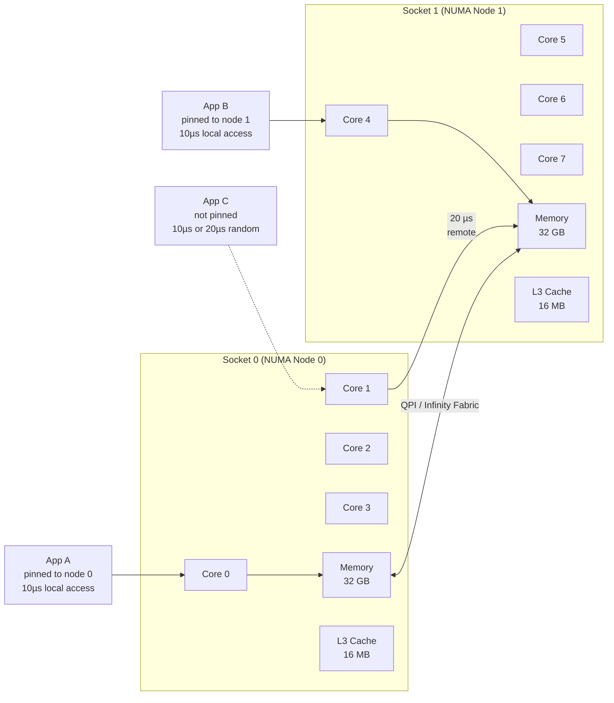

# 12 — Linux I/O & Scheduling

## What Is It?

Linux I/O & Scheduling covers the kernel subsystems that manage how data flows between applications and storage hardware (the I/O stack) and how the CPU allocates execution time across competing processes (the scheduler). The I/O stack spans from the VFS/page cache through the block layer and I/O schedulers down to device drivers. The CPU scheduler (CFS — Completely Fair Scheduler) decides which process runs next, for how long, and on which CPU core. Together they determine the latency, throughput, and fairness characteristics of a Linux system.

## Why It Was Created

Early Linux used a single simple I/O elevator (Linus Elevator) that merged and sorted requests. As storage evolved from HDDs to SSDs to NVMe, the kernel needed different scheduling strategies — SSDs have no seek time so merging/sorting is counterproductive. Similarly, the original O(n) scheduler scaled poorly with many processes; it was replaced by the O(1) scheduler (2.6) then CFS (2.6.23) to provide fairness at scale. The rise of io_uring (5.1) addressed the overhead of the traditional POSIX AIO interface, and modern I/O schedulers (mq-deadline, kyber, BFQ) were designed for multi-queue block devices (blk-mq).

## When to Use It

- **I/O scheduler selection**: Choose `none` for NVMe/SSDs, `mq-deadline` for HDDs/VM disks, `kyber` for latency-sensitive SSDs, `BFQ` for desktop/interactive workloads
- **io_uring**: For high-performance applications (databases, storage servers, web servers) that need to minimize syscall overhead
- **O_DIRECT**: When you want to bypass the page cache (databases with own caching, high-throughput streaming)
- **CFS tuning**: When you need to adjust fairness/latency trade-offs (`kernel.sched_latency_ns`, `kernel.sched_min_granularity_ns`)
- **CPU pinning**: For latency-critical workloads (DPDK, real-time audio, NFV) that must not be migrated between cores
- **NUMA awareness**: When running workloads on multi-socket servers to keep memory access local
- **nice/renice**: For everyday priority adjustment of background vs. foreground tasks

```mermaid
graph TB
    subgraph Userspace["Userspace"]
        APP[Application]
        LIBC[libc / glibc]
        LIBURING[liburing]
    end
    subgraph VFS_Layer["VFS Layer"]
        VFS[Virtual File System]
        CACHE[Page Cache<br/>Buffered I/O]
    end
    subgraph Block_Layer["Block Layer"]
        BLK_MQ[blk-mq<br/>Multi-Queue]
        MAP[Software<br/>Stage<br/>Staging queues]
        RQ[Hardware<br/>Stage<br/>Dispatch queues]
    end
    subgraph IOSched["I/O Scheduler"]
        NONE[none<br/>No reordering]
        MQ_DEADLINE[mq-deadline<br/>Deadline-based]
        KYBER[Kyber<br/>Latency-target]
        BFQ[BFQ<br/>Fair queuing]
    end
    subgraph Storage["Storage Devices"]
        NVMe[NVMe SSD<br/> /dev/nvme0n1]
        SATA[SATA SSD<br/> /dev/sda]
        HDD[HDD<br/> /dev/sdb]
    end
    subgraph CPU_Sched["CPU Scheduler"]
        CFS[CFS — Completely Fair]
        RT[Real-Time<br/>SCHED_FIFO / SCHED_RR]
        DL[Deadline<br/>SCHED_DEADLINE]
        IDLE[Idle<br/>SCHED_IDLE]
    end
    subgraph Cores["CPU Cores"]
        CORE0[Core 0<br/>L1/L2 cache]
        CORE1[Core 1<br/>L1/L2 cache]
        CORE2[Core 2<br/>...]
        CORE3[Core 3]
        LLC[L3 Cache<br/>(shared)]
    end
    APP --> LIBC
    APP --> LIBURING
    LIBC --> VFS
    LIBURING --> BLK_MQ
    VFS --> CACHE
    CACHE --> BLK_MQ
    MAP --> RQ
    RQ --> NONE
    RQ --> MQ_DEADLINE
    RQ --> KYBER
    RQ --> BFQ
    NONE --> NVMe
    MQ_DEADLINE --> SATA
    MQ_DEADLINE --> HDD
    KYBER --> NVMe
    BFQ --> SATA
    APP --> CFS
    APP --> RT
    CFS --> CORE0
    CFS --> CORE1
    RT --> CORE2
    DL --> CORE3
```

## Architecture Deep-Dive

### I/O Stack — From Application to Disk

The Linux I/O stack has several layers that transform a `write()` call into disk commands:

```mermaid
graph TB
    APP[write(fd, buf, 4096)]
    APP --> SYSCALL[sys_write]
    SYSCALL --> VFS[vfs_write]
    VFS --> EXT4[ext4_file_write_iter]
    EXT4 --> DIO{DIO?}
    DIO -- "No (buffered)" --> PAGE_CACHE[generic_perform_write<br/>Write to page cache<br/>Mark page dirty]
    DIO -- "Yes (O_DIRECT)" --> BLK_LAYER[__blockdev_direct_IO]
    PAGE_CACHE --> FLUSHER[Flusher Threads<br/>pdflush / writeback]
    FLUSHER --> BIO[Submit BIO<br/>(Block I/O)]
    BLK_LAYER --> BIO
    BIO --> BLK_MQ[blk-mq: plug → map → dispatch]
    BLK_MQ --> SCHED[I/O Scheduler<br/>mq-deadline / kyber / BFQ]
    SCHED --> DRIVER[Device Driver<br/>nvme / ahci / virtio]
    DRIVER --> DISK[Disk Hardware]
```

**Buffered vs Direct I/O:**

| Aspect | Buffered (default) | O_DIRECT |
|--------|-------------------|----------|
| Data path | App → page cache → disk | App → disk (bypass cache) |
| Cache coherency | Kernel manages | App manages |
| Performance | Fast for repeated reads | Fast for large sequential I/O |
| Alignment required | No | Yes (sector-aligned, typically 512/4096) |
| Atomicity | Write-back can reorder | Write-through |
| Use case | General purpose | Databases, DBMS, custom caching |

```bash
# Buffered write
dd if=/dev/zero of=test bs=1M count=1024

# Direct I/O (bypass page cache)
dd if=/dev/zero of=test bs=1M count=1024 oflag=direct

# Check if a process uses O_DIRECT
sudo lsof | grep -i direct   # Not directly visible
# Check open file flags
/usr/bin/ls -l /proc/<PID>/fd/
# Run: cat /proc/<PID>/fdinfo/<N> to see flags

# Drop caches to measure cold-cache performance
echo 3 | sudo tee /proc/sys/vm/drop_caches
```

### I/O Schedulers — Which One and Why

Linux has four I/O schedulers for blk-mq (multi-queue block layer):

**none:** No scheduling. Passes requests straight to the device. Best for NVMe — these devices have deep native queues and can reorder internally. Also best for high-end SSDs and for devices with their own scheduling (hardware RAID controllers).

**mq-deadline:** Ensures each request has a deadline (read: 500ms, write: 5s). Batches requests by sector for sequential throughput while preventing starvation. Good for HDDs (seeks are expensive) and VM disks (spinning or SSD) where you want a balance of throughput and latency.

**Kyber:** Uses historic latency measurements to adjust queue depths. Maintains separate read/write dispatch queues. Targets specific percentiles (default: 2ms read, 10ms write). Good for SSDs in latency-sensitive environments.

**BFQ (Budget Fair Queuing):** Allocates I/O bandwidth based on process weight (like CFU for I/O). Groups processes into queues, assigns budgets per process. Prevents one process from monopolizing disk. Best for desktops and interactive workloads.

```bash
# Check current I/O scheduler per device
cat /sys/block/sda/queue/scheduler
# [mq-deadline] kyber bfq none

# Change scheduler
echo kyber | sudo tee /sys/block/nvme0n1/queue/scheduler

# Permanent change (via udev rule)
echo 'ACTION=="add|change", KERNEL=="sd*|nvme*", ATTR{queue/scheduler}="none"' | sudo tee /etc/udev/rules.d/60-iosched.rules

# Tune mq-deadline
cat /sys/block/sda/queue/iosched/read_expire   # Default: 500
cat /sys/block/sda/queue/iosched/write_expire  # Default: 5000
cat /sys/block/sda/queue/iosched/front_merges  # Default: 1

# Tune Kyber target latencies
cat /sys/block/nvme0n1/queue/iosched/read_lat_nsec      # 2000000 (2ms)
cat /sys/block/nvme0n1/queue/iosched/write_lat_nsec     # 10000000 (10ms)

# Queue depth and merging
cat /sys/block/sda/queue/nr_requests          # Max queue depth
cat /sys/block/sda/queue/max_sectors_kb       # Max I/O size
cat /sys/block/sda/queue/nomerges             # 0=all merges, 1=no complex, 2=none
```

### io_uring — Modern Async I/O

io_uring (Linux 5.1) addresses the overhead of traditional I/O by sharing submission and completion queues between userspace and kernel, eliminating the need for per-I/O syscalls.

```bash
# Check io_uring support
grep io_uring /proc/filesystems
# nodev   io_uring

# Install liburing
sudo apt install liburing-dev

# io_uring throughput comparison
# Using fio with io_uring vs libaio vs sync
fio --name=test --ioengine=io_uring --rw=randread --bs=4k --size=1G --runtime=30
fio --name=test --ioengine=libaio --rw=randread --bs=4k --size=1G --runtime=30
fio --name=test --ioengine=sync --rw=randread --bs=4k --size=1G --runtime=30

# io_uring syscall reduction (straced)
strace -c fio --name=test --ioengine=io_uring --rw=read --bs=1M --size=1G 2>&1 | tail -5
strace -c fio --name=test --ioengine=sync --rw=read --bs=1M --size=1G 2>&1 | tail -5
```

**io_uring workloads that benefit most:**

- Database engines (MySQL, PostgreSQL, RocksDB)
- Storage servers (Ceph, MinIO, GlusterFS)
- Web servers (NGINX with io_uring patches)
- Any application doing high-frequency I/O where syscall overhead is measurable

### Process Scheduling — CFS, Real-Time, and Priority

**CFS (Completely Fair Scheduler):** The default scheduler since Linux 2.6.23. It maintains a red-black tree of processes keyed by `vruntime` (virtual runtime). The scheduler picks the leftmost node (smallest vruntime — most under-served). It runs the process for a time slice proportional to its weight (nice value), then updates vruntime and reinserts into the tree.

```bash
# CFS tuning parameters
sysctl kernel.sched_latency_ns           # Target latency (default: 24ms)
sysctl kernel.sched_min_granularity_ns   # Minimum preemption granularity (default: 3ms)
sysctl kernel.sched_wakeup_granularity_ns # Wakeup preemption granularity
sysctl kernel.sched_migration_cost_ns    # Migration cost estimate

# Adjust for throughput vs latency
# Lower latency (more preemption, better interactivity)
sudo sysctl -w kernel.sched_min_granularity_ns=1000000  # 1ms
# Higher throughput (less preemption, better cache utilization)
sudo sysctl -w kernel.sched_min_granularity_ns=10000000 # 10ms

# View scheduler statistics
cat /proc/schedstat
cat /proc/sched_debug                    # (if CONFIG_SCHED_DEBUG=y)
```

**Scheduling policies:**

| Policy | Flag | Priority | Behavior |
|--------|------|----------|----------|
| SCHED_OTHER (SCHED_NORMAL) | — | Dynamic (nice) | Default CFS time-sharing |
| SCHED_BATCH | SCHED_BATCH | — | Like OTHER but wakes less often (batch jobs) |
| SCHED_IDLE | SCHED_IDLE | — | Very low priority (runs only when nothing else) |
| SCHED_FIFO | — | 1–99 (real-time) | First-in-first-out, runs until blocked/yielded |
| SCHED_RR | — | 1–99 (real-time) | Round-robin within priority, time-sliced |
| SCHED_DEADLINE | — | Runtime/period | Guaranteed CPU budget over period |

```bash
# Check scheduling policy and priority
chrt -p 1                 # PID 1 (systemd) — typically SCHED_OTHER
chrt -p $$                # Current process

# Set real-time FIFO priority (must be root)
sudo chrt --fifo 99 ./latency-critical-app

# Set round-robin with priority 50
sudo chrt --rr 50 ./multi-threaded-app

# Set deadline scheduling (runtime 1s, period 2s)
sudo chrt --deadline 2000000000 --runtime 1000000000 ./time-critical-app

# Show all processes with RT priority
ps -eo pid,policy,pri,ni,comm | grep -E "FF|RR|DL"

# Nice value (priority adjustment for SCHED_OTHER)
nice -n 19 ./background-job          # Run with low priority (19 = nicest)
renice -n -5 -p 1234                  # Increase priority of PID 1234
renice -n 10 -u www-data              # Set for all www-data processes

# Monitor priority and wait time
top -o NI                            # Sort by nice value
watch -n 1 cat /proc/loadavg         # Load average
```

### NUMA Awareness

NUMA (Non-Uniform Memory Access) systems have multiple memory controllers — one per socket. Accessing local memory is faster than remote memory (higher latency, lower bandwidth).

```bash
# Check NUMA topology
numactl --hardware
# available: 2 nodes (0-1)
# node 0 cpus: 0 1 2 3
# node 0 size: 32768 MB
# node 1 cpus: 4 5 6 7
# node 1 size: 32768 MB
# node distances:
# node   0   1
#   0:  10  20
#   1:  20  10

# Show NUMA policy of a process
cat /proc/$$/numa_maps

# Run a process pinned to node 0 (local memory)
numactl --cpunodebind=0 --membind=0 ./app

# Run with interleaved memory allocation (useful for HPC)
numactl --interleave=all ./memory-bound-app

# Preferred node (allocate on node 0, fall back to others)
numactl --preferred=0 ./app

# Check NUMA miss ratio (high = bad locality)
perf stat -e "remote_node_accesses" ./app

# AutoNUMA (kernel automatically migrates pages)
sysctl kernel.numa_balancing            # 1 = enabled
```

### CPU Pinning with taskset

CPU pinning (affinity) binds a process to specific CPU cores, preventing scheduler migration which reduces cache warming overhead.

```bash
# Check current affinity
taskset -p $$                   # Show as hex mask
# 0xff = cores 0-7
# 0x03 = cores 0,1

# Pin to specific cores
taskset -c 0,1 ./app            # Pin to cores 0 and 1
taskset -c 0-3 ./app            # Pin to cores 0-3

# Pin a running process
taskset -cp 0-3 1234

# CPU masks
# 0x01 = core 0
# 0x02 = core 1
# 0x04 = core 2
# 0xF0 = cores 4-7

# Reserve CPU cores for exclusive use (isolcpus kernel parameter)
# Add to GRUB_CMDLINE_LINUX: isolcpus=2,3 nohz_full=2,3 rcu_nocbs=2,3
# Then only tasks explicitly pinned to cores 2,3 will run there

# cpuset cgroup (more granular than taskset)
sudo mkdir /sys/fs/cgroup/my-app
echo "0-3" | sudo tee /sys/fs/cgroup/my-app/cpuset.cpus
echo "0" | sudo tee /sys/fs/cgroup/my-app/cpuset.mems
echo $$ | sudo tee /sys/fs/cgroup/my-app/cgroup.procs
```



## Hands-On Example: I/O Tuning for a Database Server

```bash
# Scenario: Tuning a PostgreSQL server for NVMe storage

# Step 1: Verify storage
lsblk -d -o NAME,ROTA,SCHED,QUEUE
# nvme0n1  0 none   1024   (Non-rotational, no scheduler needed)

# Step 2: Set I/O scheduler to none
echo none | sudo tee /sys/block/nvme0n1/queue/scheduler

# Step 3: Tune block layer for database workload
echo 4096 | sudo tee /sys/block/nvme0n1/queue/max_sectors_kb
echo 2 | sudo tee /sys/block/nvme0n1/queue/nomerges
echo 1024 | sudo tee /sys/block/nvme0n1/queue/nr_requests

# Step 4: Set process scheduling for PostgreSQL
sudo chrt --rr 80 $(pgrep -u postgres postgres | head -1)

# Step 5: Pin PostgreSQL to NUMA-local cores
pg_pid=$(pgrep -u postgres postgres | head -1)
sudo numactl --cpunodebind=0 --membind=0 -- $pg_pid

# Step 6: Renice background maintenance tasks
renice -n 19 -u postgres -- -g $(ps -eo pid,comm --noheaders | grep -E "autovacuum|checkpointer" | awk '{print $1}')

# Step 7: CFS tuning for DB latency
sudo sysctl -w kernel.sched_min_granularity_ns=2000000    # 2ms
sudo sysctl -w kernel.sched_wakeup_granularity_ns=1000000 # 1ms

# Step 8: Verify I/O scheduling behavior with blktrace
sudo blktrace -d /dev/nvme0n1 -o db-trace &
# Run DB benchmark...
sudo blkparse -i db-trace | head -50

# Step 9: Measure results
fio --name=db-test --ioengine=io_uring --direct=1 --rw=randwrite --bs=8k --numjobs=4 --runtime=60 --group_reporting
```

## Pricing / Cost Considerations

- **I/O schedulers and CFS**: Free — they are part of the kernel. No licensing cost.
- **CPU pinning and NUMA**: Free — but require the hardware (multi-socket systems are more expensive than single-socket).
- **io_uring**: Free — reduces syscall overhead without additional hardware. May require application rewrites to adopt.
- **Real-time scheduling**: Free — but `SCHED_FIFO`/`SCHED_RR` can lock up the system if a process doesn't yield, requiring careful engineering.
- **Hardware costs**: NVMe SSDs cost ~$0.15–$0.30/GB (vs HDD ~$0.02/GB). The I/O scheduler choice impacts how much hardware you need — proper tuning often delays capacity upgrades.
- **Cloud costs**: Cloud instances expose virtual block devices; scheduler selection (`mq-deadline` vs `none`) can affect performance consistency. Instance types with local NVMe (i3/i4i/m5d) cost more but offer better I/O predictability.

## Best Practices

1. **Set I/O scheduler to `none` for NVMe** — NVMe devices have deep hardware queues and internal scheduling; kernel reordering adds overhead
2. **Use `mq-deadline` for HDDs and VM disks** — prevents starvation and batches reads/writes efficiently; the deadline mechanism ensures no request waits forever
3. **Prefer io_uring over libaio for new projects** — io_uring has lower overhead, supports more I/O types (buffered, O_DIRECT, async), and is actively maintained. libaio is legacy
4. **Never use O_DIRECT unless you have a good reason** — the page cache is well-tuned; O_DIRECT is for databases with their own buffer pool or streaming where cache pollution is harmful
5. **Pin latency-critical processes to dedicated cores** — use `taskset -c` or cpuset cgroups; isolate cores with `isolcpus` kernel parameter for truly dedicated CPUs
6. **Match process and memory affinity** — on NUMA systems, always bind processes to cores on the same node as their memory; `numactl --cpunodebind --membind` is your friend
7. **Set nice=19 for batch/backup jobs** — ensures interactive/foreground workloads are prioritized; `ionice -c 3` similarly minimizes I/O impact
8. **Monitor scheduling latency with `perf sched`** — `perf sched record` followed by `perf sched latency` shows wakeup and scheduling delays
9. **Use cgroup cpu.weight instead of nice in production** — nice values are per-process and easily overridden; cgroup cpu.weight applies to all processes in the cgroup and is managed consistently
10. **Test with real hardware, not VMs** — I/O scheduler behavior under virtualization is different; `virtio-blk` exposes `none` or `mq-deadline` but the hypervisor schedules actual I/O

## Interview Questions

**Q1:** What is the difference between buffered I/O and direct I/O?
**A:** Buffered I/O goes through the kernel's page cache: writes go to memory first (fast), then are written back to disk asynchronously. Direct I/O (O_DIRECT) bypasses the page cache entirely — data is transferred directly between user buffer and disk. Buffered is best for general workloads (small reads, repeated access) while O_DIRECT is used by databases that manage their own caching and need write-through semantics.

**Q2:** How does the CFS scheduler decide which process to run next?
**A:** CFS maintains a red-black tree keyed by `vruntime` — the amount of time a process has run, weighted by its nice value. The scheduler picks the process with the smallest vruntime (the least-run process). It runs for a time slice proportional to its weight, updates vruntime, and reinserts into the tree. This ensures perfect fairness over time: each process gets CPU time in proportion to its weight.

**Q3:** When would you choose Kyber over mq-deadline for an I/O scheduler?
**A:** Kyber targets specific I/O latency percentiles (default 2ms read, 10ms write) and adjusts queue depth to maintain those targets. It's good for SSDs handling mixed workloads where tail latency matters (e.g., a real-time analytics database). mq-deadline is simpler and better for HDDs or when you want predictable throughput. Kyber adapts dynamically; mq-deadline uses fixed deadlines.

**Q4:** Explain how io_uring works and why it's faster than synchronous I/O.
**A:** io_uring uses a pair of shared ring buffers (submission queue and completion queue) in memory-mapped space. The application writes I/O requests to the SQ, and the kernel reads them without a syscall (using SMP memory ordering). Completions are written to the CQ. This eliminates per-I/O syscall overhead. For 1M+ IOPS workloads, this reduces CPU usage by 30–50% compared to synchronous or libaio I/O.

**Q5:** What is NUMA and why does it matter for performance tuning?
**A:** NUMA (Non-Uniform Memory Access) describes multi-socket systems where each socket has its own memory controller. Accessing memory on the local socket is fast (e.g., 100ns), while accessing remote memory (another socket via QPI/Infinity Fabric) is slower (e.g., 150–200ns) and uses inter-socket bandwidth. For CPU-bound workloads, binding processes and memory to the same NUMA node avoids remote memory penalties and improves cache locality.

**Q6:** What happens when you set `SCHED_FIFO` with priority 99?
**A:** `SCHED_FIFO` priority 99 is the highest real-time priority. A process with this policy runs until it voluntarily yields or blocks on I/O — no other process (including kernel threads) can preempt it. If this process enters an infinite loop, the system effectively locks up (no shell, no SSH, no kernel response). This is why RT priorities require root and should be used sparingly — always test with lower priorities first.

**Q7:** What is blk-mq in the Linux block layer?
**A:** blk-mq (block multi-queue) replaced the single-request-queue block layer in Linux 3.13 for SSDs and 3.16 for all devices. It implements multiple I/O submission queues per CPU (software staging queues) mapped to multiple hardware dispatch queues (for NVMe's multiple hardware queues). This eliminates the single-queue lock bottleneck and scales to millions of IOPS on fast SSDs.

**Q8:** How does the OOM killer interact with CFS and cgroup memory limits?
**A:** When a cgroup hits `memory.max`, the kernel invokes the OOM killer which selects a process from within that cgroup based on oom_score (a function of memory usage, oom_score_adj, and process lifetime). CFS controls CPU allocation but doesn't directly interact with memory. However, if a process is throttled by CPU limits, it may not be able to free memory quickly enough, leading to OOM even if memory usage would be manageable with more CPU time.

**Q9:** What is `ionice` and how does it differ from `nice`?
**A:** `nice` adjusts CPU scheduling priority (from -20 to 19). `ionice` sets the I/O scheduling class for a process. Classes: 1 (RT — highest priority), 2 (Best-effort — default, with 0–7 priority levels), 3 (Idle — only runs when no other I/O). A process with `ionice -c 3` will only issue I/O when the disk is idle, making it perfect for backup jobs that shouldn't interfere with production.

**Q10:** How would you debug high I/O latency in production?
**A:** 1) `iostat -x 1` — check `await`, `svctm`, `%util` per device. 2) `iotop` — find which processes are doing I/O. 3) `blktrace` + `blkparse` — trace I/O through the block layer to find scheduler delays. 4) Check `/sys/block/*/queue/scheduler` — wrong scheduler for the device type. 5) Check cgroup `io.pressure` — PSI shows if I/O is contended. 6) For NVMe: `nvme list` + `nvme smart-log` to check device health. 7) `perf` to sample I/O stack functions.

## Real Company Usage Examples

- **Google**: Uses CFS with heavily tuned latency settings for Borg jobs. Google's production kernel includes many custom scheduler heuristics. Their datacenter networking uses CPU pinning for packet processing.
- **Cloudflare**: Uses `none` I/O scheduler on all NVMe devices in edge servers. Pins critical packet-processing threads (XDP, DPDK) to isolated CPU cores with `isolcpus` and `nohz_full` for zero scheduling latency.
- **Meta (Facebook)**: Uses BFQ on their production MySQL servers to ensure consistent I/O latency for foreground queries while background tasks (backup, analytics) don't starve the database.
- **Netflix**: Uses io_uring in their API gateway and content-serving path. Early adopters of io_uring for NGINX to handle high connection counts with minimal CPU overhead.
- **ScyllaDB / Redpanda**: Both use io_uring as their primary I/O engine. ScyllaDB pins each shard to a dedicated core with `taskset`, allocates memory from the local NUMA node, and uses O_DIRECT with io_uring for predictable low-latency database I/O.
- **Intel**: The original developers of blk-mq and NVMe driver optimizations. Many kernel I/O contributions come from Intel's Linux Performance team.

## Cross-Links

- [02-process-management.md](./02-process-management.md) — Process states, context switching, signals
- [03-memory-management.md](./03-memory-management.md) — Page cache, OOM, swap interaction with I/O
- [07-performance-tuning.md](./07-performance-tuning.md) — Monitoring I/O latency, tuning sysctl parameters
- [10-storage-management.md](./10-storage-management.md) — LVM, RAID, mdadm — all below the I/O stack
- [11-namespaces-cgroups.md](./11-namespaces-cgroups.md) — CPU and I/O cgroup controllers
- [14-filesystem-internals.md](./14-filesystem-internals.md) — VFS, inodes, page cache interaction
- [09-Kubernetes](../09-Kubernetes/README.md) — Pod CPU manager policies (static vs dynamic, CPU pinning)
