# 13 — Linux Troubleshooting & Debugging

## What Is It?

Linux Troubleshooting & Debugging covers the tools and methodologies used to diagnose and resolve production issues on Linux systems. It spans from userspace tracing with `strace`/`ltrace`, to kernel profiling with `perf`, to dynamic instrumentation with eBPF (extended Berkeley Packet Filter), to post-mortem crash analysis with `kdump`/`crash`. These tools give visibility into every layer of the stack — from application syscall behavior to kernel function execution and hardware performance counter data.

## Why It Was Created

Production systems inevitably fail — applications crash, latency spikes, connections hang, disks fill up, processes get stuck. Static debugging (log analysis, code review) is insufficient because bugs often manifest only under specific runtime conditions. Linux tracing tools evolved to provide dynamic observability without restarting or modifying the system. `strace` (1990s) gave basic syscall tracing. `perf` (2009) added hardware PMU profiling. eBPF (2014) revolutionized the field by allowing safe, programmable kernel instrumentation without kernel module development. Each tool fills a specific gap in the observability spectrum.

## When to Use It

- **strace**: When you need to see exactly what syscalls a process makes, what arguments it passes, and what return values it gets
- **ltrace**: When you need to trace library calls (e.g., is `malloc` returning NULL, is `connect` failing)
- **perf**: When you need CPU profiling (hot functions), hardware event counting (cache misses, branch mispredictions), or tracepoints
- **ftrace**: When you need to trace kernel function calls (debug driver issues, scheduler behavior)
- **eBPF/bcc**: When you need production-safe dynamic tracing — file opens by process, TCP connections, latency distributions, OOM investigation
- **kdump/crash**: After a kernel panic — to analyze the memory dump and find the root cause
- **Everyday production debugging**: OOM killer analysis, zombie process hunting, file descriptor leak detection, disk I/O bottleneck identification

```mermaid
graph TB
    subgraph Userspace_Tracing["Userspace Tracing"]
        STRACE[strace<br/>System calls]
        LTRACE[ltrace<br/>Library calls]
        GDB[gdb<br/>Debugger]
        VALGRIND[Valgrind<br/>Memory errors]
    end
    subgraph Kernel_Tracing["Kernel Tracing"]
        PERF[perf<br/>PMU + tracepoints]
        FTRACE[ftrace<br/>Function tracing]
        KPROBE[kprobe<br/>Dynamic kernel probes]
        UPROBE[uprobe<br/>Dynamic user probes]
    end
    subgraph BPF["eBPF / bcc / bpftrace"]
        EXECSNOOP[execsnoop<br/>Track process exec]
        BIOLATENCY[biolatency<br/>I/O latency dist]
        TCPCONNECT[tcpconnect<br/>Track connections]
        OOMKILL[oomkill<br/>OOM trace]
        FILEDELETE[filetop<br/>File reads/writes]
        RUNQLAT[runqlat<br/>Scheduler latency]
    end
    subgraph Crash["Post-Mortem"]
        KDUMP[kdump<br/>Crash dump capture]
        CRASH[crash<br/>Dump analysis]
        SOCORRO[socorro<br/>Mozilla crash system]
    end
    subgraph Issues["Common Issues"]
        OOM[OOM Killer]
        ZOMBIE[Zombie Processes]
        FD_LEAK[FD Leaks]
        IO_BOTTLENECK[I/O Bottleneck]
        LATENCY[Latency Spikes]
        CRASH_KERNEL[Kernel Panic]
    end
    OOM --> OOMKILL
    OOM --> PERF
    ZOMBIE --> STRACE
    FD_LEAK --> STRACE
    FD_LEAK --> FILEDELETE
    IO_BOTTLENECK --> BIOLATENCY
    IO_BOTTLENECK --> PERF
    LATENCY --> RUNQLAT
    LATENCY --> PERF
    CRASH_KERNEL --> KDUMP --> CRASH
```



## Architecture Deep-Dive

### strace — System Call Tracing

strace intercepts and records system calls made by a process. It shows the syscall name, arguments, and return value. It can attach to running processes or trace new ones.

```bash
# Basic usage
strace ls                          # Trace ls command
strace -o /tmp/ls.log ls           # Write to file
strace -p 1234                     # Attach to running PID
strace -p 1234 -p 5678             # Multiple PIDs
strace -f -p 1234                  # Follow forks

# Filtering
strace -e trace=open,openat,read,write  # Only specific syscalls
strace -e trace=network             # Only network syscalls
strace -e trace=file                # Only file-related syscalls
strace -e trace=process             # Only process-related (fork, exec)
strace -e trace=%desc               # File descriptors
strace -e trace=%memory             # Memory mapping

# Timestamps and statistics
strace -t ls                        # Absolute timestamps
strace -tt ls                       # Microsecond precision
strace -T ls                        # Time spent in each syscall
strace -c ls                        # Summary of syscall counts/times

# Verbose output
strace -v ls                        # Verbose (unpack structs)
strace -s 256 ls                    # Show up to 256 bytes of strings
strace -y ls                        # Show device numbers
strace -yy ls                       # Show path names for FDs

# Real-world: debug connection refused
strace -e trace=connect,wgetsockopt,setsockopt nc example.com 80

# Real-world: find which file a process is writing to
strace -e trace=write -p $(pidof my-process) 2>&1 | grep -v "..."
```

**Common strace scenarios:**

| Scenario | Command | What to look for |
|----------|---------|------------------|
| Slow startup | `strace -T -o trace.log ./app` | Long `open()`, `read()` times |
| Missing file | `strace -e trace=open,openat ./app` | `ENOENT` return values |
| Permission denied | `strace ./app 2>&1 | grep EACCES` | `EACCES` anywhere |
| Connection refused | `strace -e network nc host 80` | `ECONNREFUSED`, `EHOSTUNREACH` |
| Socket hang | `strace -e trace=read,poll,select -p $PID` | `ETIMEDOUT` on poll/select |
| Out of memory | `strace ./app 2>&1 | grep mmap` | `ENOMEM` |
| Too many open files | `strace -e trace=open,close -c -p $PID` | Open count >> close count |

### perf — Performance Profiling

perf uses hardware Performance Monitoring Units (PMUs) and kernel tracepoints to profile CPU usage, cache behavior, and kernel events with minimal overhead.

```bash
# CPU profiling (hot functions)
perf record -F 99 -a -g -- sleep 10        # Sample at 99Hz, all CPUs, with call stacks
perf report -g graph                       # Show call graph (TUI)
perf report --stdio -g folded              # Text output, flamegraph-ready

# HW events
perf stat -e cycles,instructions,cache-misses,branch-misses ./app
perf stat -e cycles,instructions -p $PID
perf stat -a -e context-switches,migrations,page-faults -- sleep 5

# Software events
perf stat -e sched:sched_switch -a -- sleep 5   # Context switch count
perf stat -e sched:sched_process_fork -a -- sleep 5
perf stat -e block:block_rq_complete -a -- sleep 5  # I/O completions

# Tracepoints
perf list tracepoint                        # List all tracepoints
perf list | grep "sched:"                   # Scheduler tracepoints
perf record -e sched:sched_switch -a -- sleep 5
perf script                                 # Dump raw events

# Performance comparison
perf stat --repeat 5 ./app-v1
perf stat --repeat 5 ./app-v2

# Annotate specific function
perf annotate -s <function_name>

# LLVM PMU for NVMe
perf stat -e nvme:*,block:* -a -- sleep 1

# Generate flamegraph
perf script | stackcollapse-perf.pl | flamegraph.pl > flame.svg
```

**perf use cases:**

| Use case | Command | Events |
|----------|---------|--------|
| Find CPU hogs | `perf top` | cycles |
| Cache miss analysis | `perf stat -e cache-misses,L1-dcache-load-misses` | PMU |
| Lock contention | `perf record -e lock:lock_acquire -a` | tracepoint |
| Scheduler latency | `perf sched record; perf sched latency` | tracepoint |
| I/O tracing | `perf record -e block:* -a` | tracepoint |

### ftrace — Kernel Function Tracer

ftrace (built into the kernel, no dependencies) can trace every function entry/exit in the kernel, filtered by function name, module, or duration.

```bash
# Set up ftrace (via debugfs)
cd /sys/kernel/tracing

# Available tracers
cat available_tracers
# function, function_graph, wakeup, irqsoff, preemptirqsoff, nop

# Set tracer
echo function > current_tracer

# Filter by function
echo do_sys_open > set_ftrace_filter
echo vfs_read >> set_ftrace_filter

# Start tracing
echo 1 > tracing_on
cat trace                           # View output
echo 0 > tracing_on

# Function graph (show entry + exit + duration)
echo function_graph > current_tracer
echo 1 > tracing_on
cat trace
# 1)               | do_sys_open() {
# 1)               |   getname() {
# 1)   0.190 us    |     getname_flags();
# 1)   0.480 us    |   }
# 1)   7.321 us    | }

# Trace specific PID
echo $$ > set_ftrace_pid

# Trace events (like perf tracepoints but from ftrace)
echo 1 > events/kmem/kmalloc/enable
echo 1 > events/kmem/kfree/enable
echo 1 > events/sched/sched_switch/enable

# Maximum latency tracer (find worst-case scheduling delay)
echo wakeup > current_tracer
echo 1 > tracing_on
# Wait
cat trace | head -50
```

### eBPF / bcc / bpftrace

eBPF allows running sandboxed programs in the kernel that attach to tracepoints, kprobes, uprobes, and perf events. bcc provides Python/Lua front-ends. bpftrace provides a one-liner awk-like language.

```bash
# Install bcc tools (Ubuntu)
sudo apt install bpfcc-tools linux-headers-$(uname -r)

# Install bpftrace
sudo apt install bpftrace

# --- execsnoop (track new processes) ---
sudo execsnoop-bpfcc
# PCOMM            PID    PPID   RET ARGS
# bash             1234   5678     0 /bin/bash
# nginx            2345   1        0 /usr/sbin/nginx
# sshd             3456   1        0 /usr/sbin/sshd -D

# --- biolatency (I/O latency distribution) ---
sudo biolatency-bpfcc
# Tracing block device I/O... Hit Ctrl-C to end.
# ^C
# usecs               : count    distribution
# 0 -> 1              : 0        |
# 2 -> 3              : 0        |
# 4 -> 7              : 2        |
# 8 -> 15             : 15       |*****
# 16 -> 31            : 42       |***************
# 32 -> 63            : 28       |**********
# 64 -> 127           : 5        |*
# 128 -> 255          : 1        |

# --- tcpconnect (trace every TCP connection) ---
sudo tcpconnect-bpfcc
# PID    COMM         IP SADDR            DADDR            DPORT
# 7890   curl         4  10.0.0.5         93.184.216.34    80
# 7891   wget         4  10.0.0.5         93.184.216.34    443

# --- oomkill (trace OOM killer events) ---
sudo oomkill-bpfcc
# BUG: Process killed due to OOM: java (pid=1234) triggered by mem-hog (pid=5678), score=850

# --- filetop (file reads/writes by process) ---
sudo filetop-bpfcc
# 16:23:45 load: 2.45  PID    COMM             READS  WRITES R_Kb    W_Kb   T FILE
# 1234   nginx            120    0       480     0 R access.log
# 5678   postgres         45     15      360     120   R data_file

# --- runqlat (scheduler run queue latency) ---
sudo runqlat-bpfcc
# Tracing run queue latency... Hit Ctrl-C to end.
# ^C
# usecs               : count    distribution
# 0 -> 1              : 0        |
# 1 -> 2              : 145      |*******************
# 2 -> 4              : 320      |****************************************
# 4 -> 8              : 89       |***********
# 8 -> 16             : 12       |*
# 16 -> 32            : 3        |

# --- bpftrace one-liners ---

# Syscall count by process
bpftrace -e 'tracepoint:raw_syscalls:sys_enter { @[comm] = count(); }'

# Files opened by process
bpftrace -e 'tracepoint:syscalls:sys_enter_open { printf("%s %s\n", comm, str(args->filename)); }'

# Count kernel functions (careful — high overhead)
bpftrace -e 'kprobe:vfs_read { @[comm] = count(); }'

# TCP connection tracking
bpftrace -e 'kprobe:tcp_connect { printf("%s -> %s:%d\n", comm, ntop(2, args->sk->__sk_common.skc_daddr), args->sk->__sk_common.skc_dport); }'

# Block I/O tracing
bpftrace -e 'tracepoint:block:block_rq_complete { @us = hist(args->nr_sector * 512 / 1000); }'

# OOM tracing
bpftrace -e 'tracepoint:oom:mark_victim { printf("OOM kill: %s (%d)\n", comm, pid); }'

# Count page faults by process
bpftrace -e 'tracepoint:exceptions:page_fault_user { @[comm] = count(); }'
```

```mermaid
graph TB
    subgraph eBPF_Arch["eBPF Architecture"]
        BPF_PROG[eBPF Program<br/>(C / bpftrace)]
        VERIFIER[Kernel Verifier<br/>Safety check]
        JIT[JIT Compiler<br/>BPF → native]
        MAPS[eBPF Maps<br/>hash / array / perf]
        HELPERS[Helper Functions<br/>bpf_get_current_pid_tgid]
    end
    subgraph Attach_Points["Attachment Points"]
        KPROBE_L[kprobe<br/>Dynamic kernel func]
        TRACEPOINT[tracepoint<br/>Static kernel event]
        UPROBE[uprobe<br/>Dynamic user func]
        PERF_EVT[perf_event<br/>PMU counters]
        XDP[XDP<br/>Network driver]
    end
    subgraph Userspace["Userspace"]
        LOADER[Loader<br/>bcc / libbpf / iproute2]
        DATA_COLL[Data Collection<br/>Perf ring buffer]
    end
    BPF_PROG --> VERIFIER
    VERIFIER --> JIT
    JIT --> MAPS
    JIT --> HELPERS
    LOADER --> KPROBE_L
    LOADER --> TRACEPOINT
    LOADER --> UPROBE
    LOADER --> PERF_EVT
    LOADER --> XDP
    MAPS --> DATA_COLL
```

### Crash Analysis — kdump + crash

When the kernel panics, kdump uses kexec to boot a small "capture kernel" that saves the crashed kernel's memory to a dump file. The `crash` utility analyzes the dump.

```bash
# Set up kdump (RHEL/CentOS)
sudo yum install kexec-tools crash
sudo systemctl enable kdump
sudo systemctl start kdump

# Test kernel panic (trigger dump)
echo c | sudo tee /proc/sysrq-trigger

# Dump location
ls /var/crash/
# 127.0.0.1-2025-01-15-14:30:21/
#   vmcore         # Compressed memory dump
#   vmcore-dmesg   # Kernel log at panic time
#   kexec-dmesg.log

# Analyze with crash
sudo crash /usr/lib/debug/lib/modules/$(uname -r)/vmlinux /var/crash/*/vmcore

# crash> commands:
# bt              # Backtrace of current task (panic thread)
# bt -a           # Backtrace of all CPUs
# log             # Kernel log (dmesg from crash time)
# ps              # List processes
# files           # Open files
# vm              # Virtual memory info
# kmem -i         # Memory usage summary
# dev -i          # Device info
# sys             # System info (uptime, load)
# runq            # Run queue
# foreach bt      # Backtrace for every task
# mod             # Loaded modules

# Common analysis patterns:
# crash> bt   → Find the crashing function
# crash> log  → Find "BUG:", "Oops:", "Call Trace:" messages
# crash> ps   → Find which processes were running
# crash> vm <pid> → Memory layout of a specific process
```

### Common Production Issues — Investigation Guide

**OOM Killer:**

```bash
# Check if OOM killer has triggered
dmesg | grep -i "killed process"
dmesg | grep -i "oom"

# OOM killer score of a process
cat /proc/<PID>/oom_score
cat /proc/<PID>/oom_score_adj

# Prevent a critical process from being OOM-killed
echo -1000 | sudo tee /proc/<PID>/oom_score_adj

# Find which cgroup triggered OOM
cat /sys/fs/cgroup/system.slice/<service>/memory.events

# eBPF oomkill gives richer info
sudo oomkill-bpfcc
```

**Zombie Processes:**

```bash
# Find zombie processes
ps aux | grep Z
# STAT column shows Z for zombie

# Count zombies
top -b -n1 | grep zombie
cat /proc/loadavg   # Last field = running/total/zombie

# Find parent of zombie
cat /proc/<ZOMBIE_PID>/status | grep PPid

# Zombie creation: parent hasn't called wait()
# Fix: send SIGCHLD to parent, or kill the parent
# If parent is init (PID 1): systemd should reap it
# Check if parent is stuck
strace -p <PARENT_PID> -e trace=wait4
```

**File Descriptor Leaks:**

```bash
# Count open FDs per process
ls /proc/<PID>/fd/ | wc -l

# Top FD consumers
for pid in /proc/[0-9]*; do
  echo "$(ls "$pid"/fd 2>/dev/null | wc -l) $(basename $pid) $(cat $pid/cmdline 2>/dev/null | tr '\0' ' ')"
done | sort -rn | head -10

# Check FD limit
cat /proc/<PID>/limits | grep "open files"

# List open files for a process
ls -la /proc/<PID>/fd/
# Many -> /dev/null, pipes, sockets?

# eBPF: track file opens per process
filetop-bpfcc

# Monitor FD growth over time
watch -n 1 'ls /proc/<PID>/fd/ | wc -l'

# Trace FD creation
strace -e trace=open,openat,dup,dup2,dup3 -p <PID>
```

**Disk I/O Bottleneck:**

```bash
# Check device utilization
iostat -x 1 10
# %util → near 100%? Device is saturated
# await → high? Requests are waiting
# r_await/w_await → read vs write latency
# svctm → actual service time

# Find which processes are doing I/O
iotop -oP                          # Only processes doing I/O
# Use non-interactive mode
iotop -bto -d 5 > /tmp/iotop.log

# I/O latency distribution (eBPF)
biolatency-bpfcc

# Check I/O scheduler and queue
cat /sys/block/sda/queue/scheduler
cat /sys/block/sda/queue/nr_requests

# Check for I/O errors
dmesg | grep -i "I/O error"
cat /sys/block/sda/device/state

# Check swap activity (heavy swapping = I/O bottleneck)
vmstat 1 5
# si/so → swap in/out (if both > 0, memory is overcommitted)
```

## Hands-On Example: Debugging a Production Latency Spike

```bash
# Scenario: Web server (nginx) latency spikes from 10ms to 5s

# Step 1: Check system load
uptime && vmstat 1 5

# Step 2: Find CPU or I/O bottleneck
top -b -n1 | head -20
# wa (I/O wait) high? → I/O bottleneck
# us/sy high? → CPU bottleneck

# Step 3: If I/O wait is high
iostat -x 1 3
# Check await > 1000ms → device saturated

# Step 4: Find the process causing I/O
iotop -bto -d 2 | head -20

# Step 5: Trace I/O latency distribution with eBPF
biolatency-bpfcc
# Looking for latency tail: many I/Os > 100ms?

# Step 6: If CPU is the issue — profile
perf record -F 99 -a -g -- sleep 10
perf report -g graph
# Is nginx worker on CPU? Or some other process?

# Step 7: Check scheduler latency
runqlat-bpfcc
# Are processes waiting long on run queue?

# Step 8: Check context switching
perf stat -e context-switches -a -- sleep 5
# Very high context switch rate → too many threads

# Step 9: Check file descriptor limits
for pid in /proc/[0-9]*; do
  fd_count=$(ls "$pid"/fd 2>/dev/null | wc -l)
  if [ "$fd_count" -gt 1000 ]; then
    echo "PID $(basename $pid) has $fd_count FDs"
  fi
done

# Step 10: Check OOM/dmesg
dmesg | tail -20
# Any OOM kills? I/O errors? Hardware errors?

# Step 11: Trace system calls of a misbehaving worker
strace -p $(pgrep -f "nginx: worker" | head -1) -e trace=epoll_wait,read,write -T 2>&1 | tail -50
# Long epoll_wait? Slow read/write?
```

## Pricing / Cost Considerations

- **strace/ltrace/gdb**: Free — built into the GNU toolchain. Overhead: 2–100x slowdown depending on tracing volume. Never run in production without filtering.
- **perf**: Free — built into the Linux kernel. Overhead: ~1–3% for sampling, higher for tracepoint-heavy workloads. Safe for production use with sampling.
- **ftrace**: Free — built into the kernel. Very low overhead when filtering is used. Production-safe.
- **eBPF/bcc/bpftrace**: Free — kernel feature since 3.18 (stable since 4.x). Low overhead (1–5%) for typical tracing. Production-safe by design (verifier ensures safety).
- **kdump**: Free — but requires reserved memory for the capture kernel (~256 MB to 1 GB). The crash utility is free.
- **Commercial tools**: Sysdig (container monitoring, ~$0–$200/node), Datadog (APM + eBPF-based tracing, ~$15/host/month), New Relic, Dynatrace — all offer managed observability built on these same primitives.
- **Training cost**: These tools have steep learning curves. Expect 1–3 weeks to become productive with eBPF, less for strace/perf.

## Best Practices

1. **Never run `strace -f -p <PID>` in production without filtering** — the overhead can stall the process and cause cascading failures. Always use `-e trace=` to limit events
2. **Use `perf top` first, then `perf record`** — `perf top` shows live hotspots without saving data; switch to `perf record` only when you need call stacks or historical analysis
3. **Sample at 99 Hz (not 100 Hz)** — avoids lockstep sampling with periodic events (every 10ms = 100 Hz timer), which creates sampling bias
4. **Prefer tracepoints over kprobes when possible** — tracepoints are stable API, have lower overhead, and won't break across kernel versions. kprobes can crash the kernel if the probed function is inlined
5. **Use bpftrace for ad-hoc investigation** — it's awk-like syntax lets you write one-liners faster than writing full bcc Python programs. Switch to bcc for production tools
6. **Check `/var/crash/` after mysterious reboots** — if the system crashes without logging to dmesg, the kdump vmcore will have the full kernel state
7. **Set vm.oom_dump_tasks=0 in sysctl** — prevents the OOM killer from dumping all process memory info (huge slow log), but loses per-task details. Use eBPF oomkill instead
8. **Use `time -v` before reaching for strace** — `/usr/bin/time -v ./app` shows page faults, context switches, and max resident memory without the overhead of strace
9. **Build a "debugging kit" ahead of time** — compile bcc tools, have perf with debuginfo installed, know your crash dump location. You don't want to `apt-get install` during an incident
10. **Understand the overhead of each tool** — strace (2-100x), perf sampling (~1%), perf tracepoints (~3-10%), eBPF kprobes (~5-15%), bpftrace (~1-5%). Always start with the least intrusive tool

## Interview Questions

**Q1:** What is the difference between `strace` and `perf`?
**A:** `strace` catches every system call entry/exit with full arguments and return values — it's comprehensive but has high overhead (can slow the process 10–100x). `perf` uses hardware PMU sampling or tracepoints to profile with low overhead (~1–3%). Use strace when you need exact syscall arguments (debugging ENOENT); use perf when you need to find CPU hotspots or count hardware events.

**Q2:** How does eBPF ensure safety in the kernel?
**A:** eBPF programs go through a verifier before loading: it checks for loops, out-of-bounds access, unreachable instructions, and type safety. The verifier guarantees that the program terminates and doesn't corrupt kernel memory. Programs are also JIT-compiled to native code. If the verifier rejects the program, it never executes. This prevents the crashes that kernel modules can cause.

**Q3:** What information would you look for in a crash dump to diagnose a kernel panic?
**A:** 1) The crashing function (from `bt` backtrace of the panic CPU). 2) The panic message from `log` — look for "Oops:", "BUG:", unable to handle kernel NULL pointer dereference". 3) The instruction pointer — which kernel function and offset. 4) The process that was running (`ps`). 5) Register state at crash time. 6) Loaded modules (`mod`) — a buggy third-party module is often the cause. 7) `sys` for uptime and system info.

**Q4:** How would you investigate a file descriptor leak in production?
**A:** 1) `ls /proc/<PID>/fd/ | wc -l` to count current FDs. 2) Compare with the process's limit (`cat /proc/<PID>/limits`). 3) Watch over time: `watch -n 1 'ls /proc/<PID>/fd/ | wc -l'`. 4) Use `filetop-bpfcc` to track file opens by the process. 5) Check if FDs are socket FDs (hanging connections) or file FDs (open files without close). 6) Use `strace -e trace=open,close,dup,dup2 -p <PID>` to see if opens are unbalanced.

**Q5:** Explain the difference between `btrace` and `bpftrace`.
**A:** `btrace` (block trace) is a single-purpose tool for tracing block I/O (based on blktrace). `bpftrace` is a general-purpose eBPF front-end that can trace any kernel or userspace event using an awk-like language. bpftrace can do everything btrace does (via tracepoint:block:*) plus network, scheduler, memory, and application-level tracing.

**Q6:** How does the OOM killer select which process to kill?
**A:** The OOM killer calculates an oom_score for each process based on: memory usage (RSS, swap, page table memory), oom_score_adj (set by container runtimes to protect critical processes), process runtime (longer-lived processes get lower scores), and process priority (nice). The process with the highest score is killed. You can see scores in `/proc/<PID>/oom_score` and adjust with `echo -1000 > /proc/<PID>/oom_score_adj` to make a process unkillable.

**Q7:** What is a zombie process and how do you get rid of it?
**A:** A zombie process has completed execution but still has an entry in the process table because its parent hasn't called `wait()` to read its exit status. Zombies appear as `Z` in `ps` and consume almost no resources (just a PID table entry). You can't kill them with SIGKILL. Fix: send SIGCHLD to the parent, or kill the parent process (the zombie's PPID becomes 1, which systemd will reap). Persistent zombies indicate a buggy parent that ignores SIGCHLD.

**Q8:** What does `%util` in `iostat -x` actually mean?
**A:** `%util` is the percentage of time the device was busy processing I/O requests. For a single HDD, 100% util means the device is saturated (can't do more work). For SSDs with multiple hardware queues, 100% util doesn't necessarily mean saturation — the device can process multiple I/Os in parallel. Look at `await` (average I/O latency) and `avgqu-sz` (average queue length) alongside %util to determine if the device is actually saturated.

**Q9:** How would you use `perf` to find a cache thrashing issue?
**A:** `perf stat -e cache-misses,L1-dcache-load-misses,LLC-load-misses,L1-dcache-loads -- ./app`. High cache-misses to loads ratio (>10%) indicates poor cache locality. Then use `perf record -e cache-misses -a -g -- sleep 10` followed by `perf report` to find which functions cause the most cache misses. Common causes: linked list traversal (vs array iteration), false sharing (multiple threads writing to different fields on the same cache line), or random pointer chasing.

**Q10:** What is the difference between `blktrace` and `iostat`?
**A:** `iostat` gives aggregated statistics (average latency, queue size, throughput) sampled every interval. `blktrace` captures every single block I/O with timestamps, allowing you to see the full latency distribution, identify high-percentile outliers, and trace each I/O's path through the block layer. Use iostat for quick health checks; use blktrace when you need to debug high-percentile latency or identify problematic I/O patterns.

## Real Company Usage Examples

- **Netflix**: Uses eBPF extensively in production — `bcc` tools for network performance monitoring, `bpftrace` for ad-hoc debugging of CDN latency issues. Their Vector agent uses eBPF for system-level metrics. open source their eBPF tools at github.com/Netflix/bpftrace-scripts.
- **Meta (Facebook)**: Developed and upstreamed many eBPF features. Uses perf extensively for fleet-wide profiling. Their BPF team created `bpftrace`. Runs eBPF-based network load balancers (Katran) at scale.
- **Google**: Uses ftrace and perf for kernel debugging across their datacenter fleet. gLinux (their internal distro) includes custom tracing infrastructure. The Google kernel team contributed kprobes and uprobes to the kernel.
- **Cloudflare**: Uses kdump for all kernel panics — automated crash analysis pipeline collects vmcore from every edge server. Uses eBPF for DDoS mitigation (XDP-based packet filtering) and for tracing HTTP request latencies through their proxy stack.
- **Red Hat**: Provides kdump + crash support for RHEL customers. Their kernel developers maintain and extend perf and ftrace. SystemTap (their earlier tracing tool) is now largely superseded by eBPF in RHEL 9.
- **Datadog / New Relic**: Both build commercial APM products on top of eBPF — Datadog's `system-probe` uses eBPF for network flow monitoring, process lifecycle events, and TCP tracing without kernel module dependencies.

## Cross-Links

- [02-process-management.md](./02-process-management.md) — Process states, zombie processes, signals
- [03-memory-management.md](./03-memory-management.md) — OOM killer, memory mapping, page faults
- [05-networking.md](./05-networking.md) — Socket tracing, TCP state machine, netstat
- [07-performance-tuning.md](./07-performance-tuning.md) — Monitoring tools, baseline metrics, tuning
- [12-io-scheduling.md](./12-io-scheduling.md) — I/O latency, block layer, scheduling
- [08-security-hardening.md](./08-security-hardening.md) — Auditd, syscall auditing, seccomp interaction
- [11-namespaces-cgroups.md](./11-namespaces-cgroups.md) — cgroup OOM, PSI monitoring
