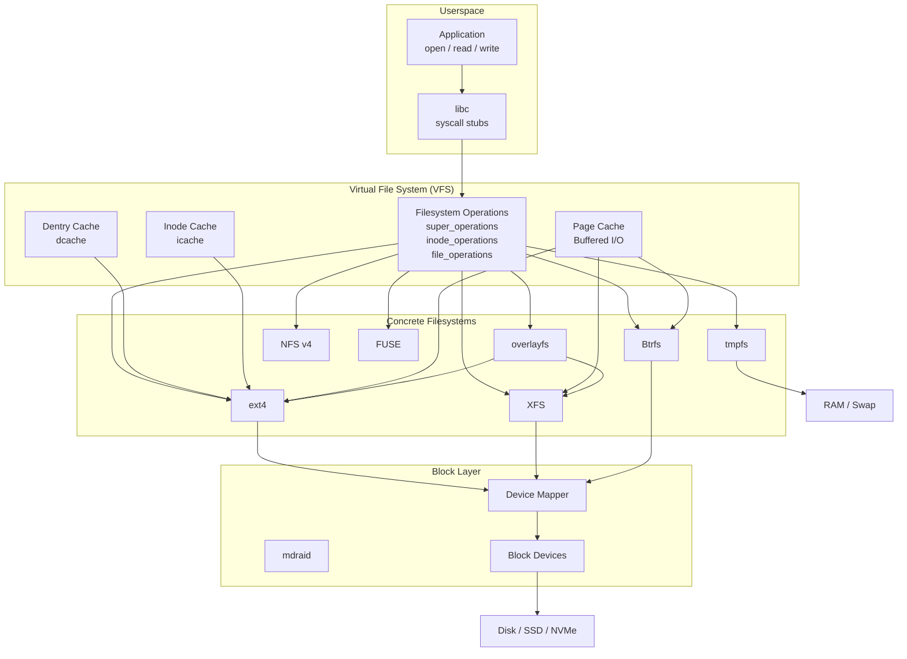
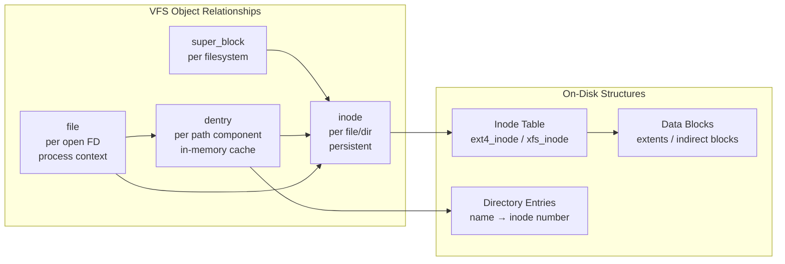
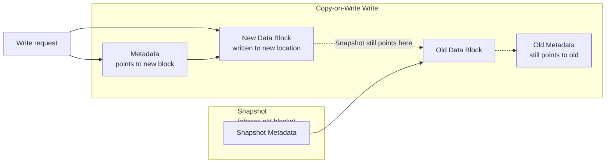
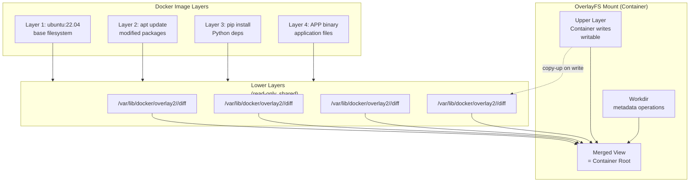

# 14 — Linux Filesystem Internals

## What Is It?

Linux Filesystem Internals covers the kernel subsystems and data structures that make files, directories, and storage work. At the top sits the **Virtual File System (VFS)** — an abstraction layer that provides a common interface for all filesystem implementations. Below VFS, each filesystem (ext4, XFS, Btrfs) implements its own on-disk format, journaling strategy, and performance optimizations. The stack also includes inodes (metadata storage), dentries (directory entry cache), extended attributes, links, tmpfs (RAM-based filesystem), and overlayfs (container image layers).

## Why It Was Created

Unix's philosophy of "everything is a file" required a clean abstraction so that different filesystem types could coexist under the same system call interface (open, read, write, stat). VFS was created to provide that abstraction — it maps generic operations (`vfs_read`, `vfs_write`) to filesystem-specific implementations. Each on-disk filesystem (ext2 → ext3 → ext4, XFS, Btrfs) was created to address limitations of its predecessor: ext3 added journaling over ext2, ext4 added extents and delayed allocation, XFS was designed for parallel scalability, and Btrfs added built-in snapshots, checksums, and compression.

## When to Use It

- **ext4**: General-purpose default — best for most workloads (boot drives, small to medium storage)
- **XFS**: Large files, parallel I/O (multiple threads writing concurrently), > 50 TB volumes, databases with large files
- **Btrfs**: When you need snapshots, compression, checksums, or subvolumes without LVM — great for NAS/home labs, Docker storage, and file servers
- **tmpfs**: For temporary data that fits in RAM (caches, build directories, `/tmp`)
- **overlayfs**: Container images — every Docker/Podman container uses overlayfs for layered filesystem
- **Network filesystems (NFS, CIFS)**: When storage must be shared across multiple servers
- **Special purpose**: FUSE (user-space filesystems), squashfs (read-only compressed), ZFS (if licensing permits)



## Architecture Deep-Dive

### VFS — Virtual File System

VFS defines four primary object types that every filesystem must implement:

| Object | Description | Key Operations |
|--------|-------------|---------------|
| **super_block** | Represents a mounted filesystem | `alloc_inode`, `destroy_inode`, `sync_fs`, `statfs` |
| **inode** | Represents a file/directory on disk (metadata) | `create`, `lookup`, `link`, `unlink`, `mkdir`, `rmdir`, `setattr` |
| **dentry** | Directory entry — maps filename to inode (in-memory cache) | `d_compare`, `d_revalidate`, `d_delete` |
| **file** | An open file descriptor context | `read`, `write`, `mmap`, `open`, `release`, `poll`, `llseek` |

```bash
# VFS statistics
cat /proc/fs/nfsd/pool_stats      # NFS VFS stats

# Filesystem types currently in use
cat /proc/filesystems

# Super block info for each mount
cat /proc/self/mounts
cat /proc/self/mountinfo           # More detailed

# Inode cache hit rates
cat /proc/sys/fs/inode-nr         # Current inodes in use
# 45239  1024   (first = total, second = free)

# Dentry cache info
cat /proc/slabinfo | grep dentry
# dentry             3567   5628    192 ...
```



### Inodes and Dentries

**Inode** — A data structure storing metadata about a file: permissions, ownership, timestamps (atime, mtime, ctime), size, block pointers, and extended attribute references. Inodes do not store the filename (that's in directory entries).

```bash
# View inode data
ls -li /etc/hosts
# 129318 -rw-r--r-- 1 root root 234 Jan 15 10:00 /etc/hosts
# 129318 = inode number

# stat shows inode metadata
stat /etc/hosts
# File: /etc/hosts
# Size: 234          Blocks: 8          IO Block: 4096   regular file
# Device: 801h/2049d Inode: 129318      Links: 1
# Access: 2025-01-15 10:00:00.000000000 +0000
# Modify: 2025-01-15 10:00:00.000000000 +0000
# Change: 2025-01-15 10:00:00.000000000 +0000

# Inode limits on ext4
dumpe2fs -h /dev/sda1 | grep -i inode
# Inode count:              655360
# Inodes per group:         8192
# Inode size:               256

# Find files by inode
find / -inum 129318
# /etc/hosts

# Inode exhaustion (runs out before disk space)
df -i /var
# Filesystem     Inodes  IUsed   IFree IUse% Mounted on
# /dev/sda1      655360  655360      0  100% /var
```

**Dentry** — A memory-only structure that maps a filename (component) to an inode. The dentry cache (dcache) speeds up path resolution (walking `/a/b/c` needs to look up three dentries).

```bash
# Dcache hit rates (from slabinfo)
cat /proc/slabinfo | grep dentry
# dentry: number of dentries in cache

# Clear dcache (if dentry cache is too large)
echo 2 | sudo tee /proc/sys/vm/drop_caches

# Negative dentry (cached ENOENT — prevent repeated failed lookups)
# Useful when a file is checked frequently and doesn't exist
```

### ext4 — The Default Linux Filesystem

ext4 is the evolution of ext3 (which added journaling to ext2). It adds extents (replacing indirect block pointers), delayed allocation, multi-block allocator, and faster fsck.

```bash
# Create ext4 filesystem
sudo mkfs.ext4 /dev/sdb1

# With specific options
sudo mkfs.ext4 -b 4096 -i 16384 -O ^has_journal /dev/sdb1
# -b: block size (4096 default)
# -i: bytes per inode (higher = fewer inodes, saves space)
# -O ^has_journal: disable journaling (risk data loss, ~30% faster)

# Tune ext4 parameters
sudo tune2fs -l /dev/sdb1           # List all parameters
sudo tune2fs -c 30 /dev/sdb1        # Max mount count before fsck
sudo tune2fs -i 30d /dev/sdb1       # Max time between fsck
sudo tune2fs -m 5 /dev/sdb1         # Reserved blocks % (default 5%)

# Journaling modes
mount -o data=ordered /dev/sdb1 /mnt   # Default: journal metadata, ordered data
mount -o data=writeback /dev/sdb1 /mnt # Journal metadata only (fast, risk)
mount -o data=journal /dev/sdb1 /mnt   # Journal both (slow, safest)

# ext4 extent map
debugfs -R "stat <inode_number>" /dev/sdb1
# EXTENTS:
# (0-7): 24576-24583    # Logical blocks 0-7 → physical blocks 24576-24583
# (8-15): 24584-24591

# Resize ext4
sudo resize2fs /dev/data_vg/data_lv       # Expand to available space
sudo resize2fs /dev/data_vg/data_lv 100G  # Shrink to 100G (must unmount)

# Repair
sudo fsck.ext4 -f -p /dev/sdb1            # Force check, auto-repair
sudo e2fsck -f -c -c /dev/sdb1            # Check for bad blocks
```

**ext4 on-disk layout:**

```mermaid
graph TB
    subgraph Ext4_Layout["ext4 Partition Layout"]
        BOOT[Boot Block<br/>(optional)]
        GROUP0[Block Group 0]
        GROUP1[Block Group 1]
        GROUP2[Block Group N...]
    end
    subgraph Group["Single Block Group"]
        SUPER[Superblock<br/>(backup in some groups)]
        GDT[Group Descriptors]
        BLOCK_BITMAP[Block Bitmap<br/>free/used blocks]
        INODE_BITMAP[Inode Bitmap<br/>free/used inodes]
        INODE_TABLE[Inode Table<br/>256 bytes per inode]
        DATA[Data Blocks<br/>extents / directory entries]
    end
    GROUP0 --> SUPER
    GROUP0 --> GDT
    GROUP0 --> BLOCK_BITMAP
    GROUP0 --> INODE_BITMAP
    GROUP0 --> INODE_TABLE
    GROUP0 --> DATA
```

### XFS — High-Performance Scalable FS

XFS was originally developed by SGI for Irix, ported to Linux in 2001. It excels with large files and parallel I/O through allocation groups (independent allocation regions).

```bash
# Create XFS filesystem
sudo mkfs.xfs /dev/sdb1

# With specific options
sudo mkfs.xfs -b size=4096 -d agcount=8 -l size=128m /dev/sdb1
# -b: block size
# -d agcount: number of allocation groups (one per CPU core often optimal)
# -l: log (journal) size

# XFS has no online shrink (filesystem cannot be shrunk)
# For shrinkable LVs, use ext4 or Btrfs

# Grow XFS (only online grow, no shrink)
sudo xfs_growfs /mnt               # Expand to device size
sudo xfs_growfs -D 500000 /mnt     # Expand to specific data blocks

# XFS repair
sudo xfs_repair /dev/sdb1          # Offline repair
sudo xfs_repair -n /dev/sdb1       # Dry run (check only)
sudo xfs_check /dev/sdb1           # Legacy check tool

# XFS performance tuning
sudo xfs_admin -c "version" /dev/sdb1      # Print FS version
sudo xfs_admin -u /dev/sdb1                # Print UUID
sudo xfs_admin -U generate /dev/sdb1       # Generate new UUID

# Query XFS info
sudo xfs_info /dev/sdb1
# meta-data=/dev/sdb1           isize=512    agcount=4, agsize=65536 blks
# data     =                    bsize=4096   blocks=262144, imaxpct=25
# naming   =version 2           bsize=4096
# log      =internal log        bsize=4096   blocks=2560, version=2
# realtime =none                extsz=65536  blocks=0, rtextents=0

# XFS real-time device (for high-throughput streaming)
sudo mkfs.xfs -r extsize=65536 /dev/sdb1 -rt /dev/sdc1

# XFS crash recovery
# Mount replays the log; if mount fails:
sudo xfs_repair -L /dev/sdb1     # Zero log (force — last resort, may lose data)
```

**XFS allocation groups:**

```mermaid
graph TB
    subgraph XFS_Layout["XFS Filesystem Layout"]
        SUPER_X["Superblock<br/>(AG 0 only)"]
        AG0[Allocation Group 0]
        AG1[Allocation Group 1]
        AG2[Allocation Group 2]
        AG3[Allocation Group N]
    end
    subgraph AG_Struct["Single Allocation Group"]
        AG_SUPER[AG Superblock]
        FREE_SPACE[B+Tree<br/>Free Space]
        INODE_BTREE[B+Tree<br/>Inodes]
        DATA_BLOCKS[Data Blocks<br/>extents]
        LOG[Internal Log<br/>(AG 0 only)]
    end
    AG0 --> AG_SUPER
    AG0 --> FREE_SPACE
    AG0 --> INODE_BTREE
    AG0 --> DATA_BLOCKS
    AG0 --> LOG
    AG1 --> AG_SUPER
    AG1 --> FREE_SPACE
    AG1 --> INODE_BTREE
    AG1 --> DATA_BLOCKS
```

### Btrfs — Copy-on-Write with Snapshots

Btrfs (B-tree filesystem, pronounced "butter FS") is a modern copy-on-write (COW) filesystem with built-in subvolumes, snapshots, compression, checksums, and RAID.

```bash
# Create Btrfs filesystem
sudo mkfs.btrfs /dev/sdb1

# Multi-device (Btrfs native RAID)
sudo mkfs.btrfs -d raid1 -m raid1 /dev/sdb1 /dev/sdc1
sudo mkfs.btrfs -d raid0 -m raid1 /dev/sdb1 /dev/sdc1 /dev/sdd1

# Add device to existing Btrfs
sudo btrfs device add /dev/sdd1 /mnt
sudo btrfs filesystem balance /mnt   # Rebalance data across all devices

# Subvolumes (like lightweight, independent filesystem trees)
sudo btrfs subvolume create /mnt/@home
sudo btrfs subvolume create /mnt/@data
sudo btrfs subvolume list /mnt

# Set default subvolume (boot into specific subvolume)
sudo btrfs subvolume set-default <ID> /mnt

# Snapshots (instant, space-efficient via COW)
sudo mkdir /mnt/snapshots
sudo btrfs subvolume snapshot /mnt/data /mnt/snapshots/data-2025-01-15
sudo btrfs subvolume snapshot -r /mnt/data /mnt/snapshots/data-2025-01-15-readonly

# List snapshots
sudo btrfs subvolume list -s /mnt

# Send/receive (incremental backup via snapshots)
sudo btrfs send /mnt/snapshots/data-2025-01-15 | sudo btrfs receive /backup/
sudo btrfs send -p /mnt/snapshots/data-2025-01-14 /mnt/snapshots/data-2025-01-15 | sudo btrfs receive /backup/

# Compression (transparent — zstd, zlib, lzo)
mount -o compress=zstd:3 /dev/sdb1 /mnt
sudo btrfs filesystem defragment -czstd /mnt/large-file

# Checksums (detect bit rot)
sudo btrfs scrub start /mnt
sudo btrfs scrub status /mnt

# Status
sudo btrfs filesystem show
sudo btrfs filesystem df /mnt
sudo btrfs device usage /mnt
```

**Btrfs COW write flow:**



### Hard Links vs Soft Links

```bash
# Hard link (same inode, same data blocks)
ln /etc/passwd /tmp/passwd-hard
ls -li /etc/passwd /tmp/passwd-hard
# 129318 -rw-r--r-- 2 root root ... /etc/passwd
# 129318 -rw-r--r-- 2 root root ... /tmp/passwd-hard
# (Same inode, links=2)

# Soft link (separate inode, points to path)
ln -s /etc/passwd /tmp/passwd-soft
ls -li /tmp/passwd-soft
# 56789 lrwxrwxrwx 1 root root 11 ... /tmp/passwd-soft -> /etc/passwd

# Differences:
# Hard: same inode, can't cross filesystem boundaries, can't link directories
# Soft: different inode, can cross filesystems, can link dirs, breaks if target moves
```

**When links are useful:**

- **Hard links**: Snapshot utilities (rsnapshot, rdiff-backup), Git object storage, deduplication
- **Soft links**: Managing multiple versions of executables (`/usr/bin/java → /usr/lib/jvm/...`), configuration file management

### Extended Attributes (xattr)

Extended attributes attach arbitrary key-value metadata to files. Namespace prefixes denote scope:

| Namespace | Scope | Set by | Example |
|-----------|-------|--------|---------|
| `user.*` | Any | Any user | `user.mime_type=text/plain` |
| `trusted.*` | Root only | Root | SELinux contexts, ACLs |
| `system.*` | System | Kernel | ACL entries (`system.posix_acl_access`) |
| `security.*` | Security | Root | SELinux labels (`security.selinux`) |

```bash
# Set extended attribute
setfattr -n user.mime_type -v "text/plain" file.txt
setfattr -n user.backup_date -v "2025-01-15" file.txt

# Get extended attribute
getfattr -d file.txt
# user.mime_type="text/plain"
# user.backup_date="2025-01-15"

# Remove attribute
setfattr -x user.backup_date file.txt

# List attribute names only
getfattr file.txt

# SELinux context (stored as security.selinux)
getfattr -n security.selinux file.txt
# security.selinux="unconfined_u:object_r:user_home_t:s0"
```

### tmpfs — RAM-Based Filesystem

tmpfs stores files in volatile memory (RAM + swap). It's used for `/tmp`, `/dev/shm`, and container writeable layers.

```bash
# Mount tmpfs
sudo mount -t tmpfs -o size=1G tmpfs /mnt/tmp

# /dev/shm is already tmpfs (default 50% of RAM)
df -h /dev/shm
# tmpfs            16G  128K   16G   1% /dev/shm

# tmpfs has no persistent storage — data is lost on unmount/reboot
# Files in tmpfs use kernel memory + swap

# Create a 500MB tmpfs with specific permissions
sudo mount -t tmpfs -o size=500M,mode=1777 tmpfs /mnt/tmp

# Kernel uses tmpfs for various internal mounts
mount | grep tmpfs
# tmpfs on /tmp type tmpfs (rw,nosuid,size=2G)
# tmpfs on /dev/shm type tmpfs (rw,nosuid,nodev)

# tmpfs resize online
sudo mount -o remount,size=2G /mnt/tmp

# Check tmpfs usage
df -h /mnt/tmp
```

### overlayfs — Container Image Layers

overlayfs merges multiple directories into a single mount. Read-only lower layers (base image) + writable upper layer = container filesystem.

```bash
# overlayfs structure
# lowerdir: Base layers (read-only)
# upperdir: Container writes (read-write)
# workdir: Metadata for atomic operations
# merged: The combined view

# Manual overlayfs mount
mkdir -p /tmp/{base,changes,work,merged}

# Lower layer: base image
echo "Hello from base image" > /tmp/base/hello.txt
mkdir /tmp/base/bin

# Upper layer: container modifications
echo "New file" > /tmp/changes/new.txt

# Mount overlay
sudo mount -t overlay overlay -o lowerdir=/tmp/base,upperdir=/tmp/changes,workdir=/tmp/work /tmp/merged

# Merged view shows both
cat /tmp/merged/hello.txt     # Hello from base image
cat /tmp/merged/new.txt       # New file

# Modify a lower file (copy-up)
echo "modified" >> /tmp/merged/hello.txt
# The file is copied from lower to upper (copy-on-write)

# Whiteout (delete a file from lower layer)
rm /tmp/merged/hello.txt
# A whiteout character device appears in upperdir

# Function of workdir (required for atomic operations)
ls -la /tmp/work/
# workdir tracks in-progress copy-up operations

# Docker overlay2 storage
ls /var/lib/docker/overlay2/
# Each container gets its own upperdir

# Verify overlayfs mounts
cat /proc/mounts | grep overlay
# overlay on /merged type overlay (rw,relatime,lowerdir=...,upperdir=...,workdir=...)

# Unmount
sudo umount /tmp/merged
```



## Hands-On Example: Building a Custom Filesystem Stack

```bash
# Scenario: Create a 10 GB encrypted Btrfs volume with compression and snapshots

# Step 1: Create and format with LUKS + Btrfs
sudo dd if=/dev/zero of=/tmp/virtual-disk bs=1M count=10240
sudo losetup /dev/loop0 /tmp/virtual-disk

# Step 2: Encrypt
sudo cryptsetup luksFormat /dev/loop0
sudo cryptsetup open /dev/loop0 secure-fs

# Step 3: Create Btrfs with zstd compression
sudo mkfs.btrfs -L "secure-data" /dev/mapper/secure-fs
sudo mkdir /mnt/secure
sudo mount -o compress=zstd:3 /dev/mapper/secure-fs /mnt/secure

# Step 4: Create subvolumes
sudo btrfs subvolume create /mnt/secure/@data
sudo btrfs subvolume create /mnt/secure/@snapshots

# Step 5: Set up directory structure
sudo mkdir -p /mnt/secure/@data/{documents,projects,backups}
sudo setfattr -n user.project -v "demo" /mnt/secure/@data/projects

# Step 6: Create test data and snapshot
dd if=/dev/urandom of=/mnt/secure/@data/projects/test.dat bs=1M count=100
sudo btrfs subvolume snapshot -r /mnt/secure/@data /mnt/secure/@snapshots/data-2025-01-15

# Step 7: Verify snapshot and compression
sudo btrfs subvolume list /mnt/secure
sudo compsize /mnt/secure/@data       # Show compression ratio

# Step 8: Check checksum
sudo btrfs scrub start /mnt/secure
sudo btrfs scrub status /mnt/secure

# Step 9: Cleanup
sudo umount /mnt/secure
sudo cryptsetup close secure-fs
sudo losetup -d /dev/loop0
rm /tmp/virtual-disk
```

## Pricing / Cost Considerations

- **ext4, XFS, Btrfs**: Free and open source — included in the Linux kernel.
- **Btrfs RAID**: Free native RAID (RAID 0,1,5,6,10) — no hardware RAID controller needed. RAID 5/6 are still considered unstable in Btrfs for production.
- **XFS**: Requires `xfsprogs` package (free). No licensing even though XFS was originally proprietary (SGI released it under GPL).
- **Commercial filesystems**: ZFS (licensed under CDDL — not in mainline kernel due to license incompatibility; available via DKMS or OpenZFS on Linux), VxFS (Veritas — commercial, $500+/socket).
- **Storage costs**: Filesystem choice affects usable capacity — ext4 reserves 5% for root (tunable), Btrfs with compression can store 2-3x more data, XFS has minimal overhead on large files.
- **Snapshots and backups**: Btrfs snapshots are free and near-instant. LVM snapshots require pre-allocated COW space. Both save significant backup infrastructure costs.

## Best Practices

1. **Use ext4 for boot partitions** — it's the most mature, widely tested, and supported by all bootloaders. XFS cannot be used for /boot
2. **Use XFS for large file / high-concurrency workloads** — allocation groups enable parallel allocation; ext4's single block group mutex is a bottleneck for concurrent writers
3. **Use Btrfs subvolumes instead of LVM snapshots** — Btrfs snapshots are space-efficient (COW shares data blocks) and don't require pre-allocated snapshot space like LVM
4. **Always enable checksums on Btrfs** — `mkfs.btrfs` defaults to CRC32C. This detects bit rot. Use `btrfs scrub` periodically to find and repair errors (on RAID configurations)
5. **Avoid Btrfs RAID 5/6 in production** — they have known data-loss bugs (write hole similar to mdadm). Use RAID 1 or RAID 10 with Btrfs, or use mdadm underneath
6. **Set noatime on performance-critical mounts** — `mount -o noatime` eliminates atime updates on every read, avoiding a write on every read. `relatime` is the default and is usually sufficient
7. **Never shrink XFS** — XFS cannot be shrunk. If you need flexible volume management, put LVM under XFS, or use ext4/Btrfs. Always plan XFS partition sizes carefully
8. **Monitor inode usage** — ext4 can run out of inodes while disk space remains. `df -i` shows inode usage. Use `-i` (bytes per inode) parameter on mkfs to tune for many small files
9. **Use overlayfs for temporary layering** — never modify a Docker image's lower layers; always write to the upper layer. OverlayFS copy-up is atomic and safe
10. **Test filesystem repair procedures** — practice `fsck.ext4 -f`, `xfs_repair`, and `btrfs check` on test volumes. Know that `btrfs check --repair` can cause further damage if used incorrectly

## Interview Questions

**Q1:** What is the VFS and why is it important?
**A:** The Virtual File System (VFS) is a kernel abstraction layer that provides a common interface for all filesystem types. It defines standard operations (inode_operations, file_operations, super_operations) that every filesystem must implement. This allows any filesystem — ext4, XFS, Btrfs, NFS, tmpfs — to be accessed through the same system calls (open, read, write, stat). VFS is what makes "everything is a file" work across heterogeneous filesystem implementations.

**Q2:** Compare ext4, XFS, and Btrfs — when would you use each?
**A:** ext4 is the default general-purpose filesystem — best for small to medium storage (< 50 TB), boot drives, and workloads without special requirements. XFS excels at large files and concurrent I/O — use it for databases, media servers, and multi-threaded workloads over 50 TB. Btrfs offers snapshots, compression, checksums, and subvolumes — use it when you need these features built in (NAS, backup servers, container storage). XFS cannot be shrunk; Btrfs can be fragile on RAID 5/6.

**Q3:** What is copy-on-write and how does it benefit Btrfs snapshots?
**A:** Copy-on-write means that when a file is modified, the new data is written to a new block rather than overwriting the old block. The old block remains intact and is referenced by the snapshot. Only the changed blocks consume new space — unchanged blocks are shared between the live filesystem and all snapshots. This makes Btrfs snapshots near-instant and space-efficient (they initially consume zero additional space). Without COW, snapshots would need to copy the entire file (LVM snapshots require pre-allocated COW store).

**Q4:** Explain how overlayfs works with Docker images.
**A:** Docker stores each image layer as a read-only directory. When a container runs, overlayfs merges these layers (lowerdir) with a writable upperdir. The merged view is the container rootfs. When a container modifies a file from a lower layer, overlayfs performs a copy-up — copying the file from lower to upper and modifying it there. Deleted files from lower layers are hidden by whiteout markers in upperdir. This allows multiple containers to share base layers (saving disk and memory) while maintaining per-container writable storage.

**Q5:** What is an inode and what information does it contain?
**A:** An inode is a filesystem data structure that stores all metadata about a file except its name: file type (regular, directory, symlink, etc.), permissions (rwx), ownership (UID, GID), timestamps (atime, mtime, ctime), file size, block count, block/extent pointers to data, and extended attribute references. The filename is stored in directory entries, which map names to inode numbers. Inodes are stored in the inode table (ext4) or B+tree (XFS, Btrfs).

**Q6:** What happens during ext4 journal recovery after an unclean shutdown?
**A:** On mount, the ext4 driver checks if the journal is clean. If not, it replays the journal — reading committed transactions from the journal log and applying them to the filesystem metadata. Uncommitted transactions (those started but not committed before the crash) are discarded. This ensures the filesystem metadata is always consistent (as of the last committed transaction). Data journaling (data=journal) also recovers file data; ordered mode (default) only journals metadata. The recovery is automatic and typically completes in seconds to minutes depending on journal size.

**Q7:** What is the difference between a hard link and a symbolic link at the filesystem level?
**A:** A hard link creates an additional directory entry pointing to the same inode. Both entries are equal — there is no "original" vs "link". The inode's link count tracks how many directory entries refer to it; data is freed only when link count reaches 0. Hard links cannot span filesystems or point to directories. A symbolic link is a separate file (own inode) containing a path string. When accessed, the kernel follows the path. Symbolic links can cross filesystems, point to directories, and can be dangling (target doesn't exist). The link count of the target inode is not affected.

**Q8:** How does delayed allocation work in ext4 and what are its trade-offs?
**A:** Delayed allocation defers the assignment of physical disk blocks until data is actually flushed to disk (by pdflush or fsync). Instead of allocating blocks at write() time, the filesystem reserves virtual blocks and delays the block allocator decision until writeback. Benefits: better block allocation decisions (can allocate contiguous extents), reduced fragmentation, and the opportunity to coalesce multiple writes. Risk: if the system crashes before writeback, data is lost even if the application called write() (data in page cache but not yet allocated). Delayed allocation is enabled by default in ext4.

**Q9:** What is the dentry cache and why does it speed up file access?
**A:** The dentry cache (dcache) stores recently accessed directory entry mappings (filename → inode) in memory. When a process opens `/usr/lib/libc.so`, the kernel must resolve each path component (`usr`, `lib`, `libc.so`). Without dcache, each lookup requires reading directory data from disk. The dcache caches resolved dentries, avoiding repeated disk reads for common paths. It also caches negative lookups (files that don't exist). The dcache is part of the slab allocator and grows/shrinks with memory pressure.

**Q10:** How would you recover data from a damaged ext4 filesystem?
**A:** 1) Unmount the filesystem immediately to prevent further writes. 2) Run `fsck.ext4 -f -y /dev/sdX` for automatic repair. 3) If that fails, try `fsck.ext4 -f -c -c /dev/sdX` to also check for bad blocks. 4) If critical data is unrecoverable, use `debugfs` to manually extract files: `debugfs /dev/sdX`, then `ls -l /lost+found`, then `cat <inode>` or `dump <file> /recovery/path`. 5) For severely damaged filesystems where metadata is destroyed but data blocks remain, use `ext4magic` or `photorec` to scan for file signatures (carving). 6) Always restore from backup first — fsck is a last resort.

## Real Company Usage Examples

- **Google**: Uses ext4 as the primary filesystem for most servers. Their custom Linux kernel includes performance tweaks for ext4 at datacenter scale. Google also uses tmpfs extensively for per-process temporary data.
- **Meta (Facebook)**: Large-scale deployment of XFS for their data warehouse (HDFS data nodes). XFS's allocation groups and scalability with concurrent writes match HDFS's write-once-read-many pattern. Use Btrfs for some internal storage servers.
- **Red Hat**: XFS is the default filesystem in RHEL (since RHEL 7). Red Hat engineers are the primary XFS maintainers upstream. OpenShift uses overlayfs for container storage by default.
- **SUSE**: Btrfs is the default filesystem (since SUSE Linux Enterprise 12). SUSE uses Btrfs subvolumes to separate system directories (@, @home, @var) for snapshot-based rollback with snapper.
- **Netflix**: Uses tmpfs for content caching on CDN appliances — frequently accessed content is served from RAM, minimizing disk reads. Uses Btrfs for some storage appliances.
- **Docker / Containerd**: overlayfs is the default storage driver. Every Docker image pull and container create relies on overlayfs for layer merging. The Docker overlay2 driver manages hundreds of thousands of layers across millions of containers.
- **Cloudflare**: Uses XFS for their edge server disk cache. The ability to handle millions of small cached objects efficiently while maintaining large sequential write throughput for cache fills was the deciding factor.

## Cross-Links

- [01-linux-basics.md](./01-linux-basics.md) — FHS hierarchy, file commands, ls, stat
- [04-file-systems.md](./04-file-systems.md) — Comparison of ext4/XFS/Btrfs, mount options
- [10-storage-management.md](./10-storage-management.md) — LVM, RAID, iSCSI — block layer below filesystems
- [12-io-scheduling.md](./12-io-scheduling.md) — Page cache, buffered/direct I/O interaction
- [09-containerization.md](./09-containerization.md) — OverlayFS, container image layers
- [07-performance-tuning.md](./07-performance-tuning.md) — Filesystem tuning, mount options, I/O benchmarks
- [13-troubleshooting-debugging.md](./13-troubleshooting-debugging.md) — Tracing filesystem operations with perf/eBPF
- [08-Docker](../08-Docker/README.md) — Docker's use of overlayfs and storage drivers
