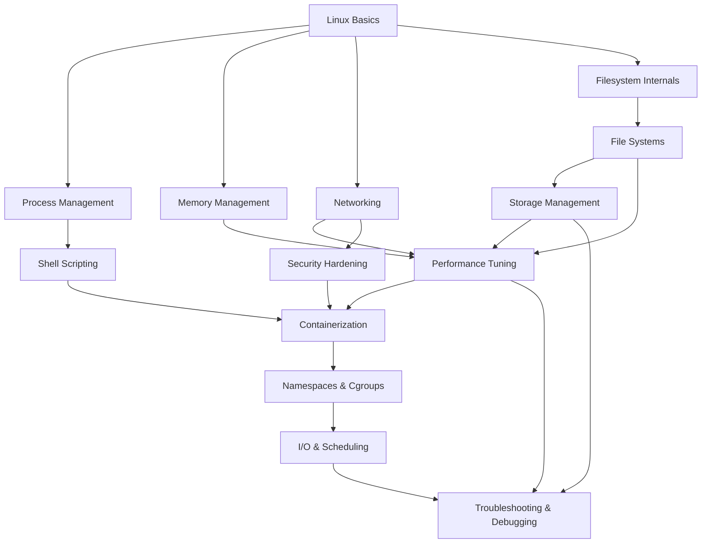

# 03 — Linux

Linux is the backbone of modern cloud infrastructure. This module covers everything from basic commands to kernel-level features that power containers, performance tuning, and production operations.

## Table of Contents

| # | Topic | File |
|---|-------|------|
| 1 | **Linux Basics** — FS hierarchy, commands, pipes, redirection | [01-linux-basics.md](./01-linux-basics.md) |
| 2 | **Process Management** — ps, top, signals, systemd | [02-process-management.md](./02-process-management.md) |
| 3 | **Memory Management** — virtual memory, swap, OOM, NUMA | [03-memory-management.md](./03-memory-management.md) |
| 4 | **File Systems** — ext4, XFS, Btrfs, LVM, RAID, inodes | [04-file-systems.md](./04-file-systems.md) |
| 5 | **Networking** — ip, ss, tcpdump, iptables, DNS, netns | [05-networking.md](./05-networking.md) |
| 6 | **Shell Scripting** — bash, sed, awk, cron, error handling | [06-shell-scripting.md](./06-shell-scripting.md) |
| 7 | **Performance Tuning** — sysctl, ulimit, perf, strace, sar | [07-performance-tuning.md](./07-performance-tuning.md) |
| 8 | **Security Hardening** — sudoers, SSH, SELinux, auditd | [08-security-hardening.md](./08-security-hardening.md) |
| 9 | **Containerization** — cgroups, namespaces, OverlayFS, seccomp | [09-containerization.md](./09-containerization.md) |
| 10 | **Storage Management** — LVM, RAID, iSCSI, device-mapper, partitioning | [10-storage-management.md](./10-storage-management.md) |
| 11 | **Namespaces & Cgroups** — PID/NET/MNT/UTS network isolation, cgroup v1/v2, resource limiting | [11-namespaces-cgroups.md](./11-namespaces-cgroups.md) |
| 12 | **I/O & Scheduling** — I/O schedulers, io_uring, CFS, NUMA, CPU pinning | [12-io-scheduling.md](./12-io-scheduling.md) |
| 13 | **Troubleshooting & Debugging** — strace, perf, ftrace, eBPF/bcc, kdump | [13-troubleshooting-debugging.md](./13-troubleshooting-debugging.md) |
| 14 | **Filesystem Internals** — VFS, inodes, ext4/XFS/Btrfs internals, overlayfs | [14-filesystem-internals.md](./14-filesystem-internals.md) |

## Prerequisites

- Basic familiarity with the command line
- A Linux environment (Ubuntu/Debian or RHEL/CentOS recommended) for hands-on practice

## Related Modules

- [04-Databases](../04-Databases/README.md) — Databases often run on Linux; understand FS and memory tuning
- [08-Docker](../08-Docker/README.md) — Docker leverages cgroups, namespaces, and union filesystems
- [09-Kubernetes](../09-Kubernetes/README.md) — K8s nodes are Linux hosts; pod networking uses netns
- [14-DevOps](../14-DevOps/README.md) — CI/CD pipelines execute on Linux agents
- [15-SRE](../15-SRE/README.md) — SRE relies on Linux performance observability tools

---
Previous: [02 — Networking](../02-Networking/README.md)
Next: [04 — Databases](../04-Databases/README.md)
