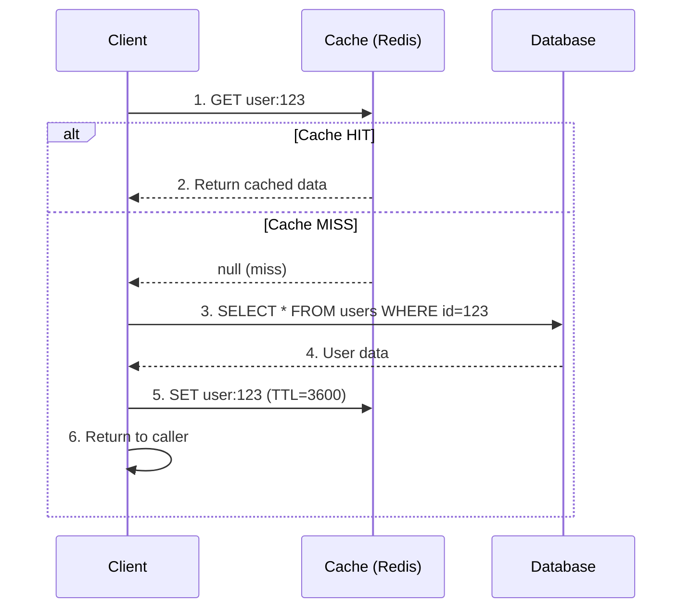

# Cache Aside Pattern

## Definition
Cache Aside (also called Lazy Loading) is the most common caching pattern. The application checks the cache first. On a miss, it loads data from the database and populates the cache.

## Flow Diagram



## Code Example

```python
def get_user(user_id):
    key = f"user:{user_id}"
    
    # Step 1: Try cache
    user = cache.get(key)
    if user:
        return user
    
    # Step 2: Cache miss — load from DB
    user = db.query("SELECT * FROM users WHERE id = ?", user_id)
    
    # Step 3: Populate cache (with TTL)
    cache.setex(key, 3600, user)
    
    return user
```

## Write Strategy

```python
def update_user(user_id, data):
    # Update database first
    db.execute("UPDATE users SET name = ? WHERE id = ?", 
               data['name'], user_id)
    
    # Invalidate cache
    cache.delete(f"user:{user_id}")
    # NOT: cache.set(f"user:{user_id}", data)
    # Lazy invalidation avoids race conditions
```

## Advantages
- Simple to implement
- Cache only stores data that's actually requested
- Resilient to cache failures (falls back to DB)
- Easy to reason about

## Disadvantages
- Cache miss penalty (three trips: cache → DB → cache)
- Stale data until TTL or explicit invalidation
- Cache stampede possible on popular keys

## Interview Questions
1. How does cache aside differ from read-through caching?
2. Why should you invalidate (delete) rather than update the cache on writes?
3. How do you prevent cache stampede with cache aside?
4. What happens if the cache is down?
5. When should you NOT use cache aside?
