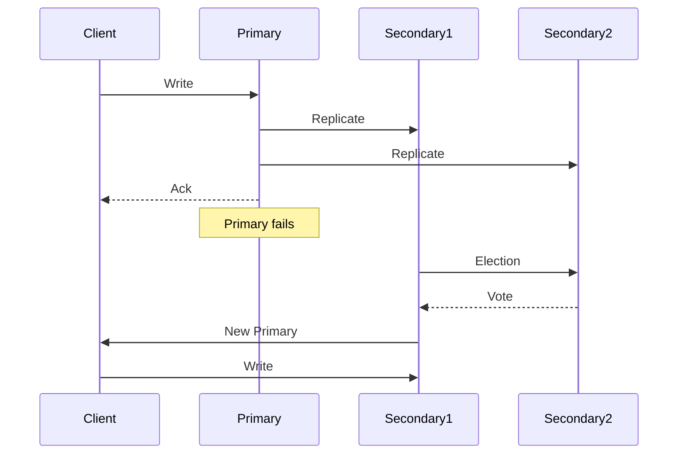

# MongoDB

## Definition
MongoDB is a document-oriented NoSQL database that stores data in flexible, JSON-like documents with dynamic schemas. It's designed for high performance, high availability, and horizontal scaling.



## Real-World Example
**MetLife**: Uses MongoDB to power their customer portal, consolidating data from 70+ legacy systems into a single document model. Reduced development time by 60% and improved customer experience.

## Document Model

```
// Relational (SQL):
// Separate tables for user, posts, comments

// MongoDB (Document):
{
  "_id": ObjectId("507f1f77bcf86cd799439011"),
  "name": "Alice Johnson",
  "email": "alice@example.com",
  "address": {
    "street": "123 Main St",
    "city": "San Francisco",
    "zip": "94105"
  },
  "posts": [
    {
      "title": "My First Post",
      "body": "...",
      "created_at": ISODate("2023-01-15T10:30:00Z"),
      "comments": [
        { "text": "Great post!", "by": "Bob" }
      ]
    }
  ]
}
```

## Architecture

```
                     ┌──────────────┐
                     │  mongos      │
                     │  (Router)    │
                     └──────┬───────┘
                            │
          ┌─────────────────┼─────────────────┐
          │                 │                 │
     ┌────▼────┐      ┌────▼────┐      ┌────▼────┐
     │ Shard 1 │      │ Shard 2 │      │ Shard 3 │
     └────┬────┘      └────┬────┘      └────┬────┘
          │                │                │
     ┌────▼────┐      ┌────▼────┐      ┌────▼────┐
     │Replica  │      │Replica  │      │Replica  │
     │  Set    │      │  Set    │      │  Set    │
     │P-S-S    │      │P-S-S    │      │P-S-S    │
     └─────────┘      └─────────┘      └─────────┘
```

## Key Features

### Flexible Schema
```
// Collection can have documents with different fields
// No migrations needed — just start writing new fields

// Document 1
{ "name": "Alice", "age": 30 }

// Document 2
{ "name": "Bob", "email": "bob@x.com", "address": { "city": "NYC" } }
```

### Aggregation Pipeline
```javascript
db.orders.aggregate([
  { $match: { status: "completed" } },
  { $group: { _id: "$customer_id", total: { $sum: "$amount" } } },
  { $sort: { total: -1 } },
  { $limit: 10 },
  { $lookup: {
      from: "customers",
      localField: "_id",
      foreignField: "_id",
      as: "customer"
  }}
])
```

### Indexes

| Index Type | Usage |
|------------|-------|
| **Single field** | Basic query on one field |
| **Compound** | Multiple fields, order matters |
| **Multikey** | Array fields |
| **Text** | Full-text search |
| **Geospatial** | 2dsphere, 2d indexes |
| **Hashed** | Sharding key distribution |
| **TTL** | Auto-expire documents |
| **Partial** | Index on subset of documents |

## Replication (Replica Set)

```
Primary:   Handles all writes, applies oplog
Secondary: Replicates oplog, can serve reads
Arbiter:   Voting member, no data (odd member count)

Failover:
  Primary fails ──► Election ──► New Primary (~5s)
    │                    │
    ▼                    ▼
  Clients reconnect   Uses Raft-like consensus
```

## Advantages
- Flexible schema (fast iteration)
- Horizontal scaling (native sharding)
- Rich query language
- Geospatial queries
- Aggregation pipeline
- Good developer experience

## Disadvantages
- No joins (application-level)
- No ACID across documents (multi-doc transactions since 4.0)
- Memory-mapped storage (can cause issues)
- Indexes consume significant RAM
- Write performance can degrade with many indexes
- Less efficient for complex relational queries

## When to Use MongoDB

```
✅ Good fit:
  - Content management systems
  - Real-time analytics
  - IoT data
  - Product catalogs
  - User profiles
  - Mobile apps

❌ Poor fit:
  - Financial transactions (needs ACID)
  - Complex joins and relationships
  - Highly normalized data
  - Small datasets (SQL is simpler)
```

## Interview Questions
1. How does MongoDB's document model differ from relational tables?
2. Explain MongoDB replica set election process
3. How does sharding work in MongoDB?
4. What's the aggregation pipeline and give an example
5. When would you choose MongoDB over PostgreSQL?
