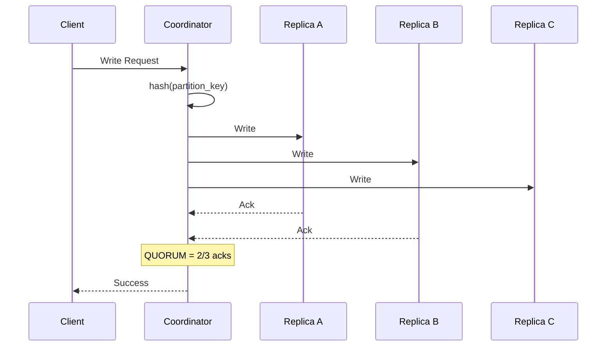

# Cassandra

## Definition
Apache Cassandra is a distributed, wide-column NoSQL database designed for handling large amounts of data across many commodity servers with high availability and no single point of failure. It's built on Amazon's DynamoDB paper and Google's Bigtable.



## Real-World Example
**Apple**: Deploys over 100,000 Cassandra nodes for iCloud, handling billions of writes per day across multiple data centers with zero downtime during software upgrades.

## Data Model

```
Column Family (Table):
  users_by_email

  Row Key (Partition Key)          Columns
  ┌────────────────────────┬────────────────────────┐
  │ "alice@example.com"    │ name: "Alice"          │
  │                        │ age: 30                │
  │                        │ city: "SF"            │
  ├────────────────────────┼────────────────────────┤
  │ "bob@example.com"      │ name: "Bob"            │
  │                        │ age: 25                │
  │                        │ city: "NYC"            │
  └────────────────────────┴────────────────────────┘

  CQL (Cassandra Query Language):
  CREATE TABLE users_by_email (
    email text PRIMARY KEY,
    name text,
    age int,
    city text
  );
```

## Architecture

```
                    ┌──────────────┐
                    │  Application  │
                    └──────┬───────┘
                           │
                    ┌──────▼───────┐
                    │  Driver      │
                    │ (token-aware)│
                    └──────┬───────┘
                           │
         ┌─────────────────┼─────────────────┐
         │                 │                 │
    ┌────▼────┐      ┌────▼────┐      ┌────▼────┐
    │ Node 1  │      │ Node 2  │      │ Node 3  │
    │ 10.0.0.1│      │10.0.0.2 │      │10.0.0.3 │
    ├─────────┤      ├─────────┤      ├─────────┤
    │ Range:  │      │ Range:  │      │ Range:  │
    │ A-K     │      │ L-R     │      │ S-Z     │
    └─────────┘      └─────────┘      └─────────┘
```

## Key Concepts

### Partitioning
```
Data is distributed using consistent hashing:
  token = hash(partition_key)
  
Ring: [Node A]──[Node B]──[Node C]──[Node D]
            A-K      L-R       S-Z       (replicas)
            │        │         │         │
            └────────┴─────────┴─────────┘
```

### Replication
```
Replication Factor (RF) = 3

Write goes to Partition Owner ──► Replica 1 ──► Replica 2
Each node knows every other node (gossip protocol)
```

### Consistency Levels
```
ANY:       Write to any node (one replica)
ONE:       Write to one replica
QUORUM:    Write to majority (RF/2 + 1)
ALL:       Write to all replicas
LOCAL_QUORUM: Quorum within datacenter
EACH_QUORUM:  Quorum in each datacenter
```

## Advantages
- Linear scalability (add nodes, double throughput)
- No single point of failure
- Cross-datacenter replication
- High write throughput
- Tunable consistency
- Schema flexibility

## Disadvantages
- No joins or subqueries
- No ACID transactions
- Eventual consistency by default
- Read performance depends on partition design
- Large memory requirements (row caches, memtables)
- Complex compaction and repair operations

## Data Modeling: Query-First

```
Design approach:
  1. Identify application queries
  2. Create table for each query pattern
  3. Denormalize data for single-table access

Example:
  Query: "Get all orders for user in last 30 days"
  
  CREATE TABLE orders_by_user (
    user_id text,
    order_date timestamp,
    order_id text,
    amount decimal,
    status text,
    PRIMARY KEY (user_id, order_date, order_id)
  ) WITH CLUSTERING ORDER BY (order_date DESC);
  
  SELECT * FROM orders_by_user 
  WHERE user_id = 'alice' 
  AND order_date > '2023-01-01';
```

## Interview Questions
1. How does Cassandra's gossip protocol work?
2. Explain Cassandra's read repair mechanism
3. How does consistent hashing work in Cassandra?
4. What is a compaction strategy and when would you use each?
5. Design a Cassandra schema for a time-series IoT application
