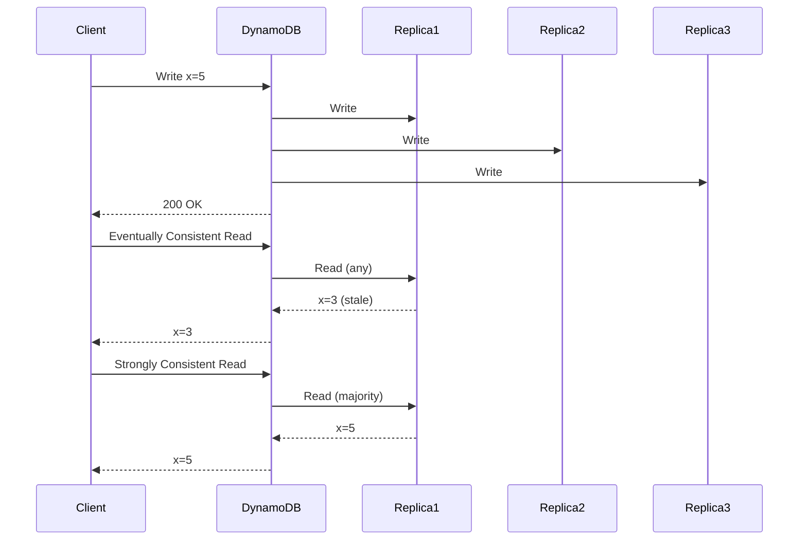

# DynamoDB

## Definition
Amazon DynamoDB is a fully managed NoSQL key-value and document database that delivers single-digit millisecond performance at any scale. It's serverless, auto-scaling, and highly available across multiple AZs.



## Real-World Example
**Lyft**: Uses DynamoDB for ride-matching, driver location, and pricing data. Handles millions of requests per second during peak hours with consistent single-digit millisecond latency.

## Data Model

```
Table: Users
┌─────────────────────────────────────────────────────────┐
│ Partition Key │ Sort Key    │ Attributes                 │
│  (user_id)    │ (created_at)│                            │
├────────────────┼────────────┼────────────────────────────┤
│  "user_001"    │ 2023-01-15 │ name: Alice, age: 30       │
│  "user_001"    │ 2023-06-20 │ name: Alice, order: #42   │
│  "user_002"    │ 2023-02-10 │ name: Bob, email: b@x.com │
└────────────────┴────────────┴────────────────────────────┘

Primary Key options:
  Simple:  Partition Key only (e.g., user_id)
  Composite: Partition Key + Sort Key (e.g., user_id + timestamp)
```

## Architecture

```
                    ┌──────────────┐
                    │   Clients    │
                    └──────┬───────┘
                           │
                    ┌──────▼───────┐
                    │  DynamoDB    │
                    │  API         │
                    │  (HTTPS)     │
                    └──────┬───────┘
                           │
         ┌─────────────────┼─────────────────┐
         │                 │                 │
    ┌────▼────┐      ┌────▼────┐      ┌────▼────┐
    │ Storage │      │ Storage │      │ Storage │
    │ Node    │      │ Node    │      │ Node    │
    ├─────────┤      ├─────────┤      ├─────────┤
    │Partition│      │Partition│      │Partition│
    │(3 AZs)  │      │(3 AZs)  │      │(3 AZs)  │
    └─────────┘      └─────────┘      └─────────┘
```

## Key Features

### Read/Write Capacity Modes

| Mode | Description | Use Case |
|------|-------------|----------|
| **On-demand** | Auto-scales, pay per request | Unpredictable traffic |
| **Provisioned** | Fixed capacity, cheaper | Predictable workloads |
| **Auto-scaling** | Dynamic provisioned | Growing workloads |

### Consistency Models

```
Eventual (default):
  Write ──► ACK ──► Replicate ──► Consistent eventually
  Read: May see stale data (sub-second)

Strong (optional):
  Write ──► Replicate ──► ACK ──► Always read latest
  Read: Always returns latest write
  Higher latency, lower throughput
```

### Secondary Indexes

```
Local Secondary Index (LSI):
  Different sort key, same partition key
  Created at table creation only

Global Secondary Index (GSI):
  Different partition key
  Can create/drop anytime
  Eventually consistent
```

## DynamoDB Streams

```
Table changes ──► Stream ──► Lambda ──► Elasticsearch
                           ──► Lambda ──► Cache invalidation
                           ──► Lambda ──► Analytics

Use cases:
  - Real-time data replication
  - Materialized views
  - Cache invalidation
  - Audit logging
  - Cross-region replication
```

## Access Patterns

```python
# Key-Value: Get item by primary key
response = table.get_item(Key={'user_id': '123'})

# Query: Get items with same partition key, filter by sort key
response = table.query(
    KeyConditionExpression='user_id = :uid AND created_at > :date',
    ExpressionAttributeValues={':uid': '123', ':date': '2023-01-01'}
)

# Scan: Full table scan (expensive, avoid in production)
response = table.scan(
    FilterExpression='age > :age',
    ExpressionAttributeValues={':age': 30}
)
```

## Advantages
- Fully managed (no server maintenance)
- Single-digit millisecond latency
- Auto-scaling
- Multi-AZ by default
- ACID transactions (since 2018)
- Streams for event-driven architectures
- Pay-per-use pricing

## Disadvantages
- No joins (application-level)
- Limited query patterns (must design for access patterns)
- Hot partition problems (uneven key distribution)
- 400KB item size limit
- Expensive for large scans
- No full-text search
- RCU/WCU costs add up

## Design Patterns

| Pattern | Description |
|---------|-------------|
| **Single-table design** | One table for all entities, uses composite keys |
| **Adjacency list** | Store graph relationships (friends, follows) |
| **Materialized aggregate** | Pre-compute counts/sums in items |
| **Transactional outbox** | Outbox pattern with Transactions |
| **Write sharding** | Add random suffix to hot partition keys |

## Interview Questions
1. How does DynamoDB achieve consistent performance at scale?
2. Design a DynamoDB schema for a social media app
3. What's the difference between LSI and GSI?
4. How do you handle hot partitions in DynamoDB?
5. When would you choose DynamoDB over PostgreSQL?
