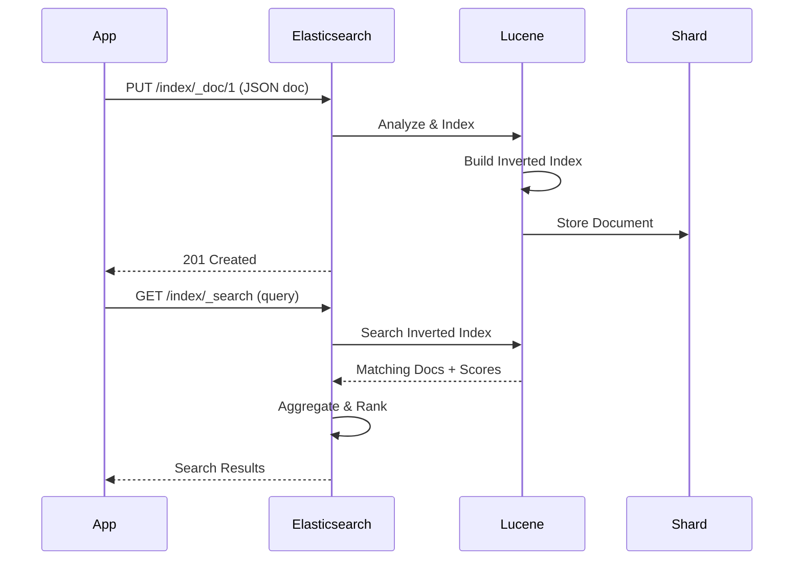

# Elasticsearch

## Definition
Elasticsearch is a distributed, RESTful search and analytics engine built on Apache Lucene. It provides near real-time full-text search, structured search, analytics, and visualization through Kibana.



## Real-World Example
**GitHub**: Uses Elasticsearch to power code search across 200M+ repositories. When you search for a function name, Elasticsearch returns relevant results in milliseconds by indexing source code content and metadata.

## Inverted Index

```
Documents:
  Doc 1: "The quick brown fox"
  Doc 2: "The lazy dog"
  Doc 3: "A quick brown dog"

Inverted Index:
  "brown"  → [Doc 1, Doc 3]
  "dog"    → [Doc 2, Doc 3]
  "fox"    → [Doc 1]
  "lazy"   → [Doc 2]
  "quick"  → [Doc 1, Doc 3]

Search: "quick brown"
  → Intersection of "quick" and "brown" docs
  → [Doc 1, Doc 3]
  → Relevance scoring (TF-IDF/BM25)
```

## Architecture

```
                      ┌──────────────┐
                      │   Kibana     │
                      │  (Visualize) │
                      └──────┬───────┘
                             │
                      ┌──────▼───────┐
                      │   Logstash    │
                      │  (Ingestion)  │
                      └──────┬───────┘
                             │
                      ┌──────▼───────┐
                      │ Elasticsearch │
                      └──────┬───────┘
                             │
         ┌───────────────────┼───────────────────┐
         │                   │                   │
    ┌────▼────┐        ┌────▼────┐        ┌────▼────┐
    │  Node 1  │        │  Node 2  │        │  Node 3  │
    │  Master  │        │  Data    │        │  Data    │
    └─────────┘        └─────────┘        └─────────┘
```

## Key Concepts

### Index
```
Index = Database in relational terms
Type  = Table (deprecated in 7.x, removed in 8.x)
Document = Row
Field = Column

PUT /users/_doc/1
{
  "name": "Alice",
  "age": 30,
  "bio": "Software engineer from California"
}
```

### Sharding
```
Index "users": 5 primary shards, 1 replica

Shard 0:  [Node 1]  [Node 2 (replica)]
Shard 1:  [Node 2]  [Node 3 (replica)]
Shard 2:  [Node 3]  [Node 1 (replica)]
Shard 3:  [Node 1]  [Node 3 (replica)]
Shard 4:  [Node 2]  [Node 1 (replica)]
```

### Mapping (Schema)
```json
{
  "mappings": {
    "properties": {
      "name": { "type": "text" },
      "age": { "type": "integer" },
      "bio": { 
        "type": "text",
        "analyzer": "standard",
        "fields": {
          "keyword": { "type": "keyword" }
        }
      },
      "created_at": { "type": "date" },
      "tags": { "type": "keyword" },
      "location": { "type": "geo_point" }
    }
  }
}
```

## Query DSL

```json
// Full-text search
GET /users/_search
{
  "query": {
    "match": {
      "bio": "software engineer"
    }
  }
}

// Filtered search
GET /products/_search
{
  "query": {
    "bool": {
      "must": { "match": { "description": "laptop" } },
      "filter": [
        { "range": { "price": { "gte": 500, "lte": 2000 } } },
        { "term": { "brand": "Apple" } }
      ]
    }
  }
}

// Aggregation (analytics)
GET /orders/_search
{
  "size": 0,
  "aggs": {
    "by_status": {
      "terms": { "field": "status" },
      "aggs": {
        "total_revenue": {
          "sum": { "field": "amount" }
        }
      }
    }
  }
}
```

## Advantages
- Powerful full-text search
- Real-time indexing and search
- Scalable (distributed by nature)
- Rich query DSL
- Aggregations for analytics
- Schema flexible (dynamic mapping)
- ELK stack integration

## Disadvantages
- No transactions
- Eventual consistency
- Cluster management complexity
- Resource intensive (RAM, disk)
- Indexing latency (near real-time)
- No joins in traditional sense
- Split-brain risk in older versions

## ELK Stack

```
 ┌──────────┐    ┌──────────┐    ┌──────────┐
 │          │    │          │    │          │
 │ Logstash │───►│Elastic   │───►│  Kibana  │
 │(Ingest)  │    │search    │    │(Visualize)│
 │          │    │(Store)   │    │          │
 └──────────┘    └──────────┘    └──────────┘
      │
      │  Beats (lightweight shippers):
      │  Filebeat (logs), Metricbeat (metrics)
      │  Packetbeat (network), Heartbeat (uptime)
      ▼
  Data Sources
```

## Interview Questions
1. How does Elasticsearch's inverted index work?
2. Explain the difference between a master and data node
3. How does Elasticsearch handle document routing to shards?
4. What's the difference between match and term queries?
5. Design a search system using Elasticsearch for an e-commerce site
