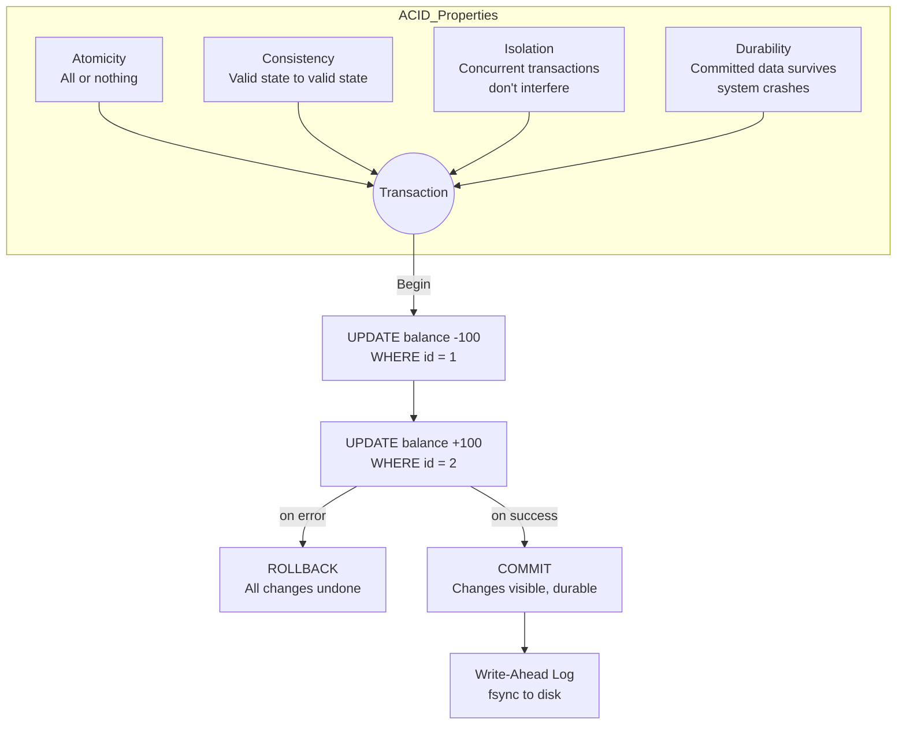

# ACID

## Definition
ACID is a set of properties that guarantee database transactions are processed reliably. It's the gold standard for data integrity in relational databases.

## The Four Properties



### Atomicity

```
"All or nothing"

BEGIN;
  UPDATE account SET balance = balance - 100 WHERE id = 1;  ✓
  UPDATE account SET balance = balance + 100 WHERE id = 2;  ✗ (constraint violation)
ROLLBACK;  -- Both changes are undone
```

### Consistency

```
"Valid state to valid state"

Constraints enforced:
  - NOT NULL
  - UNIQUE
  - FOREIGN KEY
  - CHECK constraints
  - Triggers and rules

Example:
  CHECK (balance >= 0) prevents negative balance
```

### Isolation

```
"Concurrent transactions don't interfere"

PostgreSQL implements isolation via MVCC:
  ┌──────────────────────────────────────┐
  │            MVCC (Snapshot)           │
  ├──────────────────────────────────────┤
  │ Transaction A sees snapshot of DB    │
  │ at time T1                           │
  │                                      │
  │ Transaction B starts at T2 < T1     │
  │ B's writes are invisible to A       │
  │ until A commits                      │
  │                                      │
  │ Each row has xmin/xmax (creation/   │
  │ deletion transaction IDs)           │
  └──────────────────────────────────────┘
```

### Durability

```
"Committed data survives crashes"

Mechanisms:
  - Write-Ahead Log (WAL)
  - fsync() to persistent storage
  - Battery-backed RAID cache
  - Replication to other nodes

PostgreSQL WAL:
  BEGIN ──► WAL record ──► Data page modification
  COMMIT ──► WAL flushed to disk ──► Returns success
```

## ACID Implementation by Database

| Database | ACID Level | Notes |
|----------|-----------|-------|
| PostgreSQL | Full ACID | Default for all operations |
| MySQL (InnoDB) | Full ACID | Depends on configuration |
| MongoDB | Per-document ACID | Multi-doc transactions since 4.0 |
| Cassandra | No ACID | Eventual consistency |
| DynamoDB | ACID | Transactions API since 2018 |
| Redis | Basic | Limited (no rollback) |

## ACID vs BASE

| ACID | BASE |
|------|------|
| Strong consistency | Eventual consistency |
| Pessimistic | Optimistic |
| Isolation first | Availability first |
| Vertical scaling | Horizontal scaling |
| Complex transactions | Simple operations |
| Schema rigid | Schema flexible |

## When ACID Matters

```
✅ Required:
  - Financial transactions
  - Inventory management
  - Booking systems (flights, hotels)
  - Healthcare records
  - Payment processing

❌ Not critical:
  - Social media posts
  - Content management
  - Analytics
  - Logging
  - User preferences
```

## Related Topics
- [BASE](../04-Databases/13-base.md) — The AP alternative to ACID
- [Transactions](../04-Databases/11-transactions.md) — Transaction isolation levels and 2PC
- [CAP Theorem](../01-Computer-Science-Fundamentals/02-cap-theorem.md) — Consistency vs availability tradeoffs
- [Consistency Models](../01-Computer-Science-Fundamentals/11-consistency.md) — Consistency spectrum from strong to eventual

## Interview Questions
1. Explain each ACID property with examples
2. How does MVCC help with isolation in PostgreSQL?
3. Why is durability important and how is it achieved?
4. When would you sacrifice ACID for performance?
5. How does MongoDB handle ACID transactions compared to PostgreSQL?
