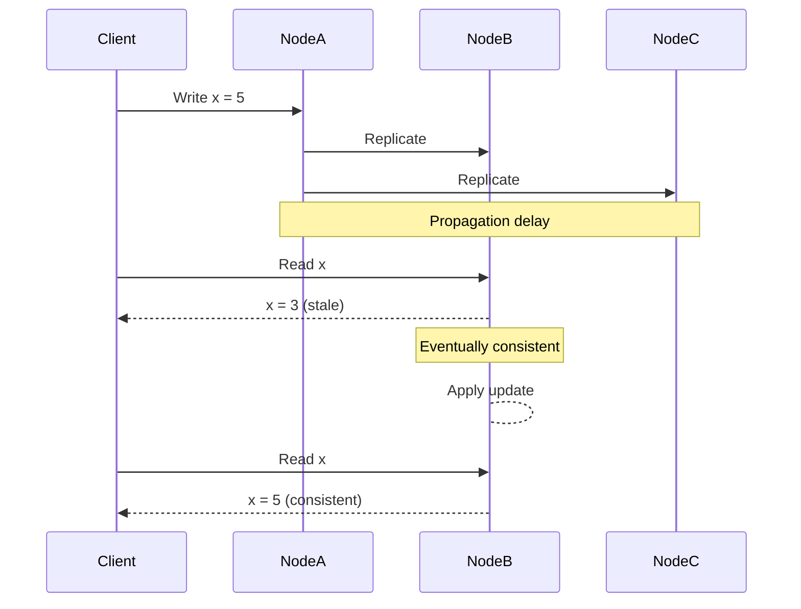

# BASE

## Definition
BASE (Basically Available, Soft state, Eventual consistency) is an alternative to ACID for distributed systems that prioritize availability over strong consistency. It's the design philosophy behind many NoSQL databases.



## The Three Properties

### Basically Available
```
The system guarantees availability (responds to requests)
even during failures or network partitions.

Example:
  Cassandra: If a node fails, requests route to other nodes.
  DynamoDB:  99.99% availability SLA, even during partition.
```

### Soft State
```
The system state can change over time without input
due to eventual consistency processes.

Example:
  DNS: A record change propagates slowly. Some servers
  serve stale data while others have the update.
```

### Eventual Consistency
```
Given enough time without new updates, all replicas
will converge to the same value.

Example:
  DynamoDB (eventual consistency):
  Write to us-east-1 ──► Read from eu-west-1
  ──► May see stale data for ~1 second
  ──► Eventually consistent
```

## BASE in Practice

```
┌─────────────────────────────────────────────────────────┐
│                    Eventual Consistency                   │
├─────────────────────────────────────────────────────────┤
│                                                          │
│  Write x=5 ──► Node A ──────────────────────────────►   │
│                                                          │
│  Replicate ──► Node B ────► (delay: ~100ms) ───────►   │
│                                                          │
│  Replicate ──► Node C ────► (delay: ~200ms) ───────►   │
│                                                          │
│                                                          │
│  Read at t=0:  Node A → 5        Node B → 3     Node C → 3│
│  Read at t=50ms:  Node A → 5    Node B → 3     Node C → 3│
│  Read at t=150ms: Node A → 5    Node B → 5     Node C → 3│
│  Read at t=250ms: Node A → 5    Node B → 5     Node C → 5│
│                                                          │
│                         ▲ Eventually all converge to 5   │
└─────────────────────────────────────────────────────────┘
```

## BASE Databases

| Database | Consistency Model | Use Case |
|----------|------------------|----------|
| Cassandra | Tunable (default: eventual) | High write throughput |
| DynamoDB | Configurable (eventual/strong) | Serverless applications |
| CouchDB | Eventual | Offline-first apps |
| Riak | Eventual | Distributed key-value |
| Voldemort | Eventual | High availability |

## Tradeoffs

| Aspect | ACID | BASE |
|--------|------|------|
| Consistency | Strong | Eventual |
| Availability | Lower (CP systems) | Higher (AP systems) |
| Performance | Slower (locking, coordination) | Faster (no coordination) |
| Complexity | Simple to reason about | Complex (conflict resolution) |
| Write latency | Higher (sync replication) | Lower (async replication) |
| Data loss risk | Minimal | Potential (small window) |

## When to Use BASE

```
✅ Good for:
  - Social media feeds
  - Product catalogs
  - User sessions
  - Analytics
  - Logging
  - Content delivery

❌ Avoid for:
  - Financial transactions
  - Inventory management
  - Healthcare records
  - Any system requiring strong consistency
```

## Conflict Resolution

### Last-Writer-Wins (LWW)
```python
# Cassandra default
UPDATE users SET name = 'Alice' WHERE id = 1;  # timestamp: T1
UPDATE users SET name = 'Bob' WHERE id = 1;    # timestamp: T2
# Result: name = 'Bob' (latest timestamp wins)
```

### Version Vectors
```python
# Each node tracks its own version
Node A: {A: 3, B: 2, C: 1}  # version vector
Node B: {A: 2, B: 4, C: 1}

# Conflict detection: concurrent updates to same key
# Application logic resolves (CRDT or custom merge)
```

### CRDTs (Conflict-Free Replicated Data Types)
```python
# Counter (G-Counter): Only incremented, never decremented
# Each node maintains own counter
# Merge = max of all counters

# Set (OR-Set): Add and remove elements
# Each element has unique tag
# Add wins over remove by default
```

## Interview Questions
1. Explain BASE model and when to use it
2. Compare BASE and ACID for a social media application
3. How does eventual consistency affect application design?
4. What are CRDTs and how do they handle conflicts?
5. Design a system using BASE that provides read-after-write consistency for user profiles
