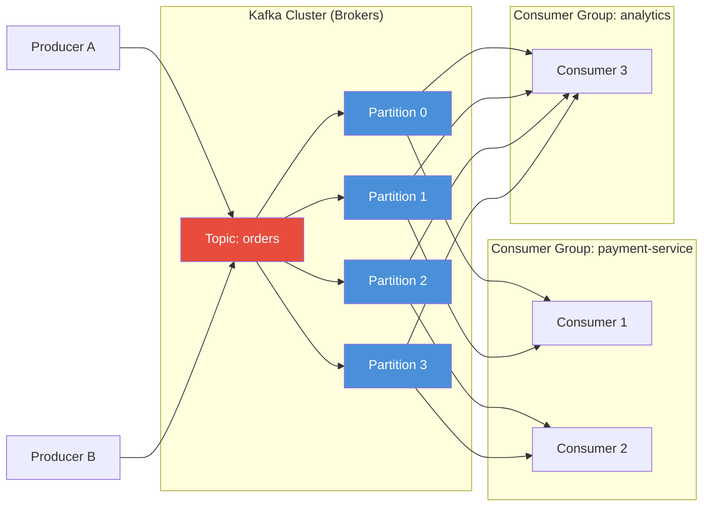

# Kafka

## Definition
Apache Kafka is a distributed event streaming platform capable of handling trillions of events per day. It provides high-throughput, fault-tolerant publish-subscribe messaging.

## Real-World Example
**LinkedIn**: Processes 7+ trillion messages per day across 100+ Kafka clusters. Every action (profile view, job application, connection request) is an event in Kafka.

## Architecture

## Key Concepts

| Concept | Description |
|---------|-------------|
| **Topic** | Category/feed name for messages |
| **Partition** | Ordered, immutable sequence of records |
| **Broker** | Server storing partitions |
| **Producer** | Publishes messages to topics |
| **Consumer** | Subscribes to topics and processes messages |
| **Consumer Group** | Group of consumers sharing work |
| **Offset** | Unique ID of message within partition |

## Kafka vs RabbitMQ

| Feature | Kafka | RabbitMQ |
|---------|-------|----------|
| Throughput | Millions/sec | Thousands/sec |
| Message model | Pull-based | Push-based |
| Ordering | Per-partition | Per-queue |
| Message retention | Configurable time/size | After ack, deleted |
| Routing | Topic-based | Exchange/routing keys |
| Use case | Event streaming, logs | Task queues, RPC |

## Related Topics
- [RabbitMQ](../05-Message-Queues/02-rabbitmq.md) — AMQP-based message broker
- [SQS](../05-Message-Queues/03-sqs.md) — AWS managed queue service
- [Pulsar](../05-Message-Queues/04-pulsar.md) — Multi-tenant, geo-replicated messaging
- [Delivery Guarantees](../05-Message-Queues/08-delivery-guarantees.md) — At-most-once, at-least-once, exactly-once
- [Partition & Offset](../05-Message-Queues/07-partition-offset.md) — Kafka partitioning internals

## Interview Questions
1. How does Kafka achieve high throughput?
2. Explain Kafka's consumer group rebalancing
3. How does Kafka guarantee ordering within a partition?
4. What is exactly-once semantics in Kafka?
5. Design a Kafka-based event-driven architecture for an e-commerce platform
