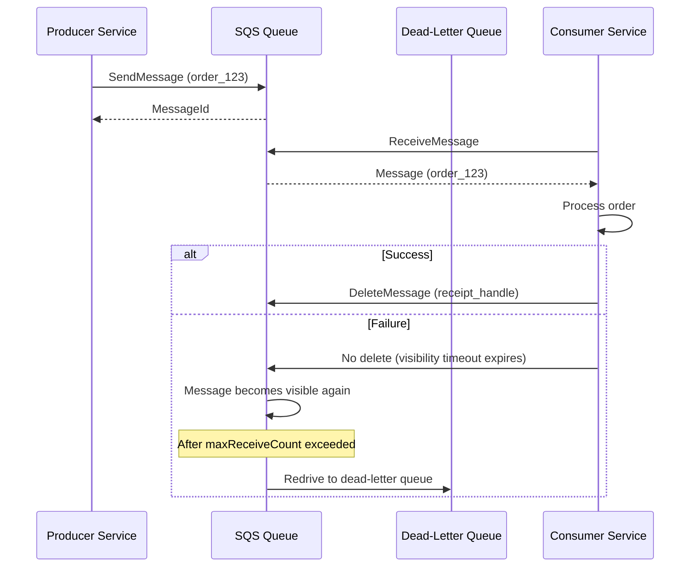

# SQS (Simple Queue Service)

## Definition
Amazon SQS is a fully managed message queuing service for decoupling microservices, distributed systems, and serverless applications. It offers two queue types: Standard (high throughput) and FIFO (exactly-once, ordered).

## Real-World Example
**Airbnb**: Uses SQS to handle booking confirmation workflows. When a booking is made, SQS queues tasks for payment processing, host notification, calendar update, and guest confirmation — allowing each task to be processed independently.

## Standard vs FIFO

| Feature | Standard | FIFO |
|---------|----------|------|
| **Throughput** | Unlimited (thousands/sec) | 300 msg/s (3000 with batching) |
| **Ordering** | Best-effort | Strict FIFO per message group ID |
| **Delivery** | At-least-once (possible duplicates) | Exactly-once (built-in dedup) |
| **Use case** | Most async workloads | Order-sensitive (payments, events) |
| **Name suffix** | (any) | Must end with `.fifo` |

## SQS Architecture



## Key Features

```
Visibility timeout: 
  - Message hidden from other consumers after receive
  - Default: 30s (configurable: 0s-12h)
  - If not deleted within timeout → re-visible

Dead-letter queue (DLQ):
  - Messages moved after N failed receives (maxReceiveCount)
  - Analyze DLQ to identify failure patterns
  - Redrive back to source queue with DLQ redrive

Long polling:
  - Wait for messages instead of polling (reduce cost)
  - Wait up to 20 seconds
  - Use ReceiveMessageWaitTimeSeconds = 20

Delay queues:
  - Messages invisible for initial delay period
  - Up to 15 minutes (DelaySeconds)
  - For: delayed processing, scheduled tasks
```

## SQS vs SNS vs Kafka

| Aspect | SQS | SNS | Kafka |
|--------|-----|-----|-------|
| **Pattern** | Queue (point-to-point) | Pub/sub (fan-out) | Partitioned log |
| **Persistence** | Up to 14 days | None (push only) | Configurable retention |
| **Consumers** | One (competing) | Many (subscriptions) | Consumer groups |
| **Ordering** | FIFO option | No | Per-partition |
| **Performance** | Unlimited (Standard) | 100K msg/s | 1M+ msg/s |

## Interview Questions

1. Compare SQS Standard vs FIFO queues
2. What is a dead-letter queue and when is it triggered?
3. How does SQS handle message visibility timeout?
4. When would you use SQS over Kafka?
5. Design a decoupled architecture with SQS for image processing
6. How do you achieve exactly-once processing with SQS FIFO + idempotent consumer?
