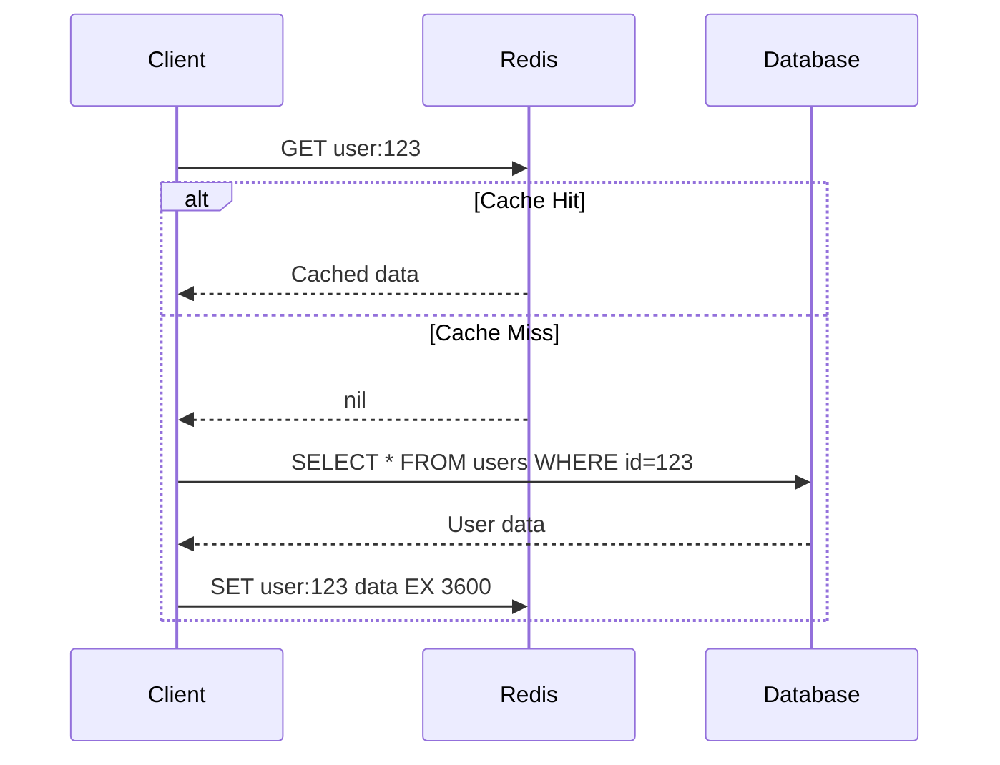

# Redis Caching

## Definition
Redis is an in-memory data structure store commonly used as a cache due to its sub-millisecond latency, rich data types, and built-in eviction policies.



## Real-World Example
**Twitter**: Caches user timelines in Redis. When a user visits their feed, Redis serves the cached timeline with ~1ms latency instead of querying the database. Timeline cache is invalidated when new tweets arrive.

## Redis as Cache

```python
import redis

cache = redis.Redis(host='localhost', port=6379)

# Cache API response
def get_user(user_id):
    key = f"user:{user_id}"
    
    # Try cache first
    cached = cache.get(key)
    if cached:
        return json.loads(cached)
    
    # Cache miss — fetch from DB
    user = db.fetch_user(user_id)
    
    # Store in cache with TTL
    cache.setex(key, 3600, json.dumps(user))
    return user
```

## Cache Configuration

```conf
# Memory management
maxmemory 4gb
maxmemory-policy allkeys-lru  # Eviction strategy

# Persistence (optional for cache-only)
save ""  # Disable persistence for pure cache

# Network
bind 0.0.0.0
port 6379
timeout 300

# Performance
tcp-keepalive 300
tcp-backlog 511
```

## Eviction Policies

| Policy | Description | Best For |
|--------|-------------|----------|
| `noeviction` | Return error on maxmemory | Don't use for cache |
| `allkeys-lru` | Evict LRU from all keys | Most common cache |
| `volatile-lru` | Evict LRU from keys with TTL | Cache mixed with persistent |
| `allkeys-lfu` | Evict least frequent keys | Hot data patterns |
| `volatile-ttl` | Evict shortest TTL first | When TTL is priority |
| `allkeys-random` | Random eviction | Equal value keys |

## Related Topics
- [Memcached](../04-Caching/02-memcached.md) — Simple, fast, multi-threaded cache
- [Cache Aside](../04-Caching/06-cache-aside.md) — Lazy loading pattern
- [Write Through](../04-Caching/07-write-through.md) — Write-synchronized cache
- [CDN Caching](../04-Caching/03-cdn-caching.md) — Edge caching with CDNs

## Interview Questions
1. How do you configure Redis for caching vs persistent storage?
2. What eviction policy would you use for a product catalog cache?
3. How does Redis handle cache stampede (thundering herd)?
4. Design a Redis caching layer for a news website
5. How do you invalidate Redis cache entries efficiently?
