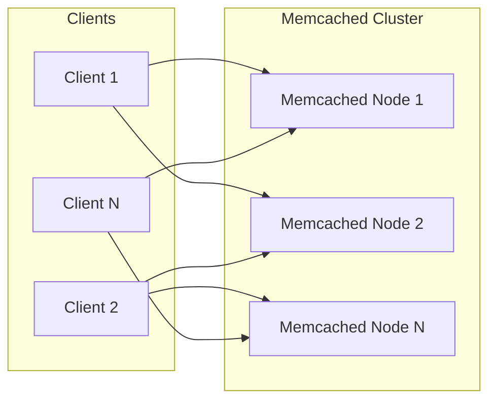

# Memcached

## Definition
Memcached is a simple, high-performance distributed memory object caching system. It's designed for speed and simplicity — a key-value store with minimal features but maximum throughput.



## Real-World Example
**Facebook**: Uses Memcached extensively, running thousands of servers with hundreds of TB of cache. They modified Memcached to support their social graph workload, handling billions of requests per second.

## Memcached vs Redis

| Feature | Memcached | Redis |
|---------|-----------|-------|
| Data types | Strings only | Strings, lists, sets, hashes, streams |
| Persistence | None | RDB/AOF |
| Replication | None | Built-in (replica sets) |
| Max value size | 1MB | 512MB |
| Multi-core | Multi-threaded | Single-threaded |
| Clustering | Client-side | Client + Cluster |
| Memory management | SLAB allocator | Jemalloc |
| Operations/sec | ~500K-1M | ~100K-500K |

## Use Cases

```
✅ Memcached excels at:
  - Simple key-value caching
  - Database query result caching
  - Session storage (simple)
  - API response caching
  - HTML fragment caching

❌ Not suitable for:
  - Data structures (lists, sets)
  - Persistent storage
  - Pub/sub messaging
  - Rate limiting (no atomic increment)
```

## Interview Questions
1. Compare Memcached and Redis for caching
2. How does Memcached handle memory allocation (slab allocator)?
3. Why would you choose Memcached over Redis?
4. What is Memcached's eviction strategy?
5. How do you cluster Memcached?
