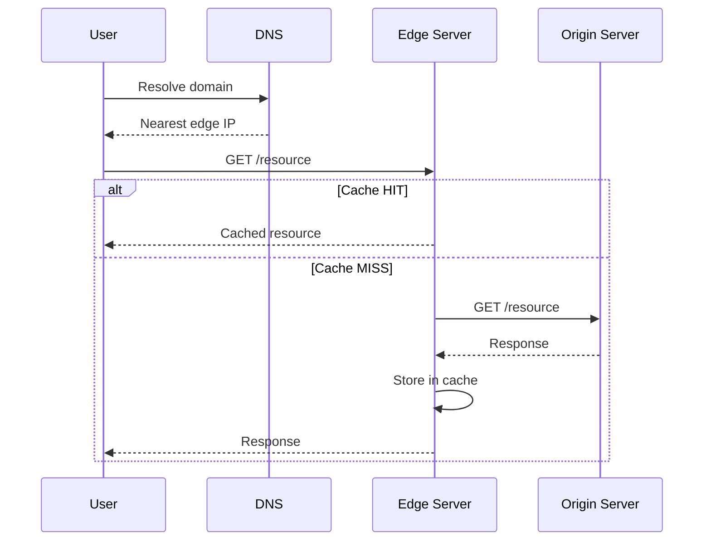

# CDN Caching

## Definition
CDN caching stores static and dynamic content at edge locations worldwide, bringing data closer to users and reducing load on origin servers.



## Real-World Example
**Netflix**: Uses Open Connect CDN appliances inside ISP networks. Popular content is cached at ISP-level, eliminating cross-network traffic and providing near-instant startup for 260M+ subscribers.

## How CDN Cache Works

```
User Request ──► DNS resolves to nearest Edge
                     │
                     ▼
              Edge Server
                  │
           ┌──────┴──────┐
           │              │
         Cache?        Cache?
         HIT            MISS
           │              │
           ▼              ▼
     Serve from      Request Origin
     Edge            Store in Edge
                     Serve to User
```

## Cache Control Headers

```http
# Cache aggressively (static assets)
Cache-Control: public, max-age=31536000, immutable

# Cache short duration (API response)
Cache-Control: public, max-age=300, s-maxage=600

# No cache (dynamic content)
Cache-Control: no-cache, no-store, must-revalidate

# CDN only (not browser)
Cache-Control: s-maxage=3600
```


## Interview Questions
1. How does CDN caching differ from browser caching?
2. What are cache tags/host keys and how are they used?
3. How do you handle cache invalidation across a CDN?
4. Design a CDN caching strategy for a news site with frequent updates
5. How does origin shield protect your server?
